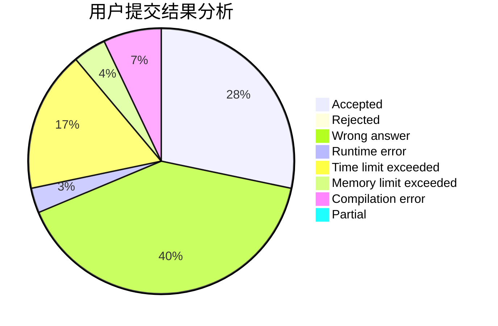
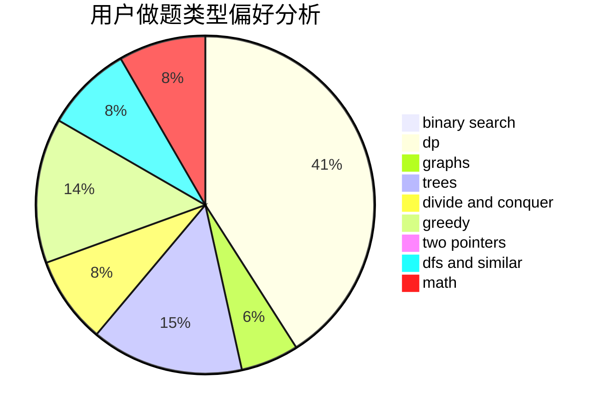

# Mixi

<!-- tabs:start -->

#### **用户提交结果分析**

#### **用户做题类型偏好分析**

<!-- tabs:end -->
# 推荐题目
[1355A](https://codeforces.com/contest/1355/problem/A)
[12471](https://codeforces.com/contest/1247/problem/1)
[254A](https://codeforces.com/contest/254/problem/A)
[911D](https://codeforces.com/contest/911/problem/D)
[1091H](https://codeforces.com/contest/1091/problem/H)
[497E](https://codeforces.com/contest/497/problem/E)
[828D](https://codeforces.com/contest/828/problem/D)
[1169A](https://codeforces.com/contest/1169/problem/A)
[1053B](https://codeforces.com/contest/1053/problem/B)
[1501F](https://codeforces.com/contest/1501/problem/F)
