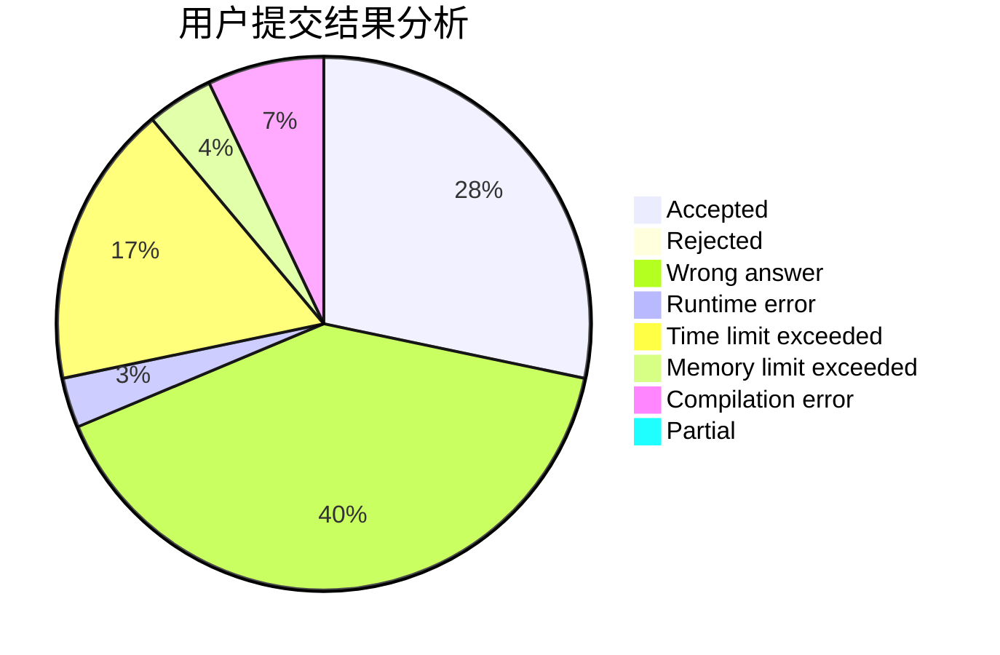
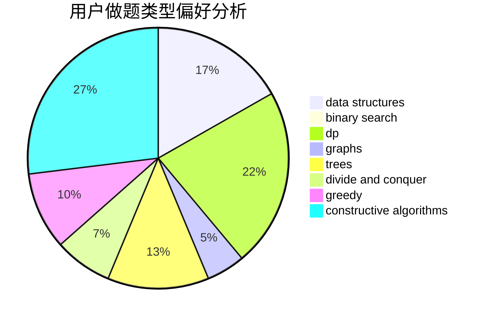
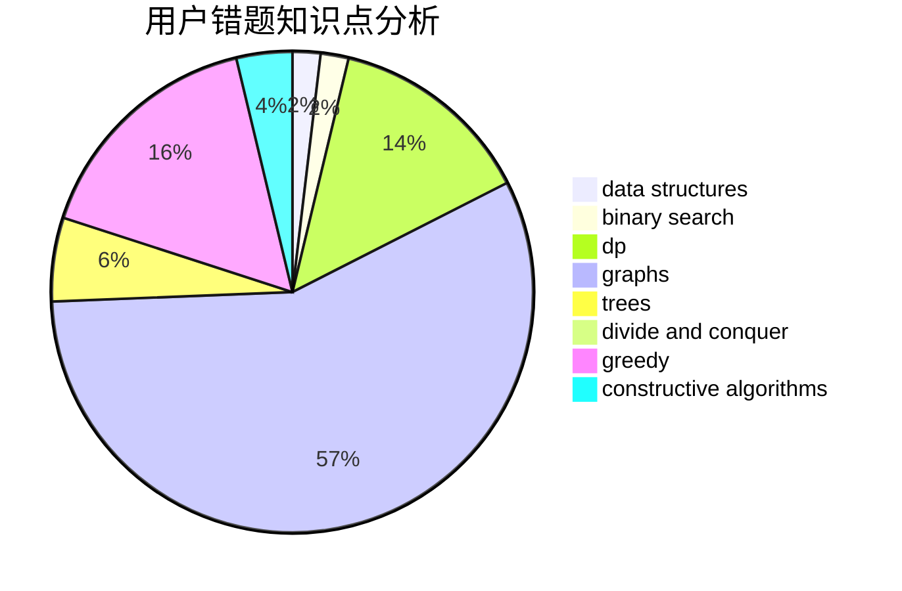

# Mixi

<!-- tabs:start -->

#### **用户提交结果分析**

#### **用户做题类型偏好分析**

#### **用户错题知识点分析**

<!-- tabs:end -->
# 推荐题目
[1355A](https://codeforces.com/contest/1355/problem/A)		brute force,
                        implementation,
                        math		  
[12471](https://codeforces.com/contest/1247/problem/1)		dsu,graphs,sortings,trees		  
[254A](https://codeforces.com/contest/254/problem/A)		constructive algorithms,
                        sortings		  
[911D](https://codeforces.com/contest/911/problem/D)		brute force,
                        math		  
[1091H](https://codeforces.com/contest/1091/problem/H)		games		  
[497E](https://codeforces.com/contest/497/problem/E)		dp,
                        matrices		  
[828D](https://codeforces.com/contest/828/problem/D)		dsu,graphs,sortings,trees		  
[1169A](https://codeforces.com/contest/1169/problem/A)		implementation,
                        math		  
[1053B](https://codeforces.com/contest/1053/problem/B)		dsu,graphs,sortings,trees		  
[1501F](https://codeforces.com/contest/1501/problem/F)		dsu,graphs,sortings,trees		  
