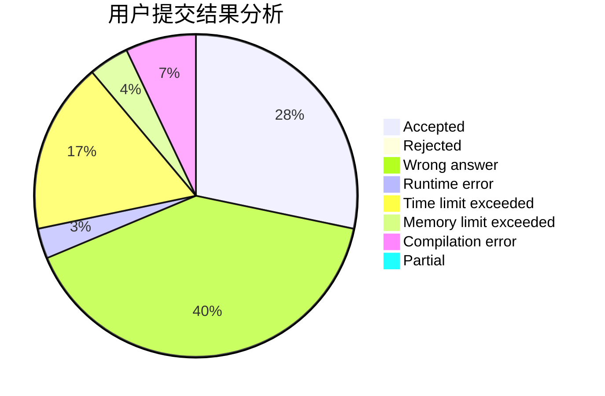
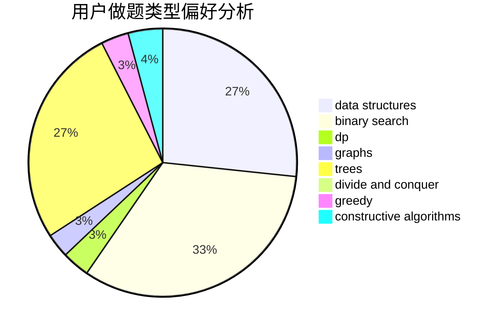
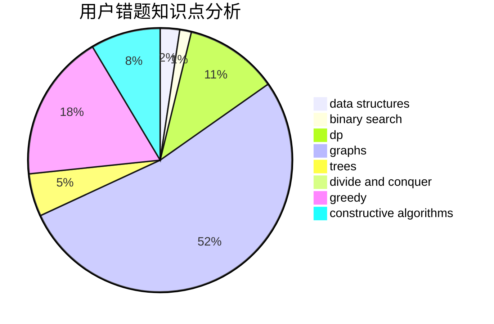

# Mixi

<!-- tabs:start -->

#### **用户提交结果分析**

#### **用户做题类型偏好分析**

#### **用户错题知识点分析**

<!-- tabs:end -->
# 推荐题目
[1348C](https://codeforces.com/contest/1348/problem/C)		constructive algorithms,
                        greedy,
                        sortings,
                        strings		  
[1241C](https://codeforces.com/contest/1241/problem/C)		dsu,graphs,sortings,trees		  
[232B](https://codeforces.com/contest/232/problem/B)		bitmasks,
                        combinatorics,
                        dp,
                        math		  
[893D](https://codeforces.com/contest/893/problem/D)		data structures,
                        dp,
                        greedy,
                        implementation		  
[1091E](https://codeforces.com/contest/1091/problem/E)		binary search,
                        data structures,
                        graphs,
                        greedy,
                        implementation,
                        math,
                        sortings		  
[477E](https://codeforces.com/contest/477/problem/E)		data structures		  
[810D](https://codeforces.com/contest/810/problem/D)		dsu,graphs,sortings,trees		  
[1166B](https://codeforces.com/contest/1166/problem/B)		constructive algorithms,
                        math,
                        number theory		  
[1051F](https://codeforces.com/contest/1051/problem/F)		graphs,
                        shortest paths,
                        trees		  
[1493F](https://codeforces.com/contest/1493/problem/F)		bitmasks,
                        interactive,
                        number theory		  
