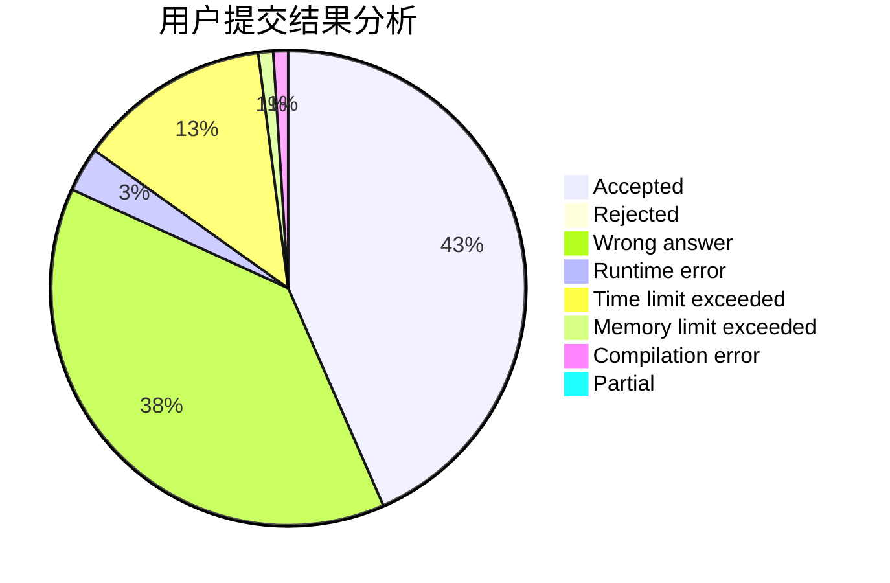
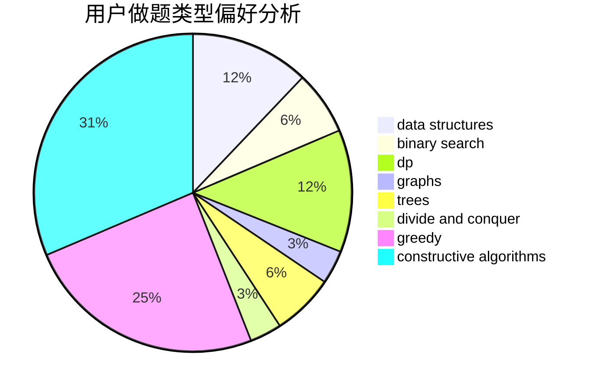
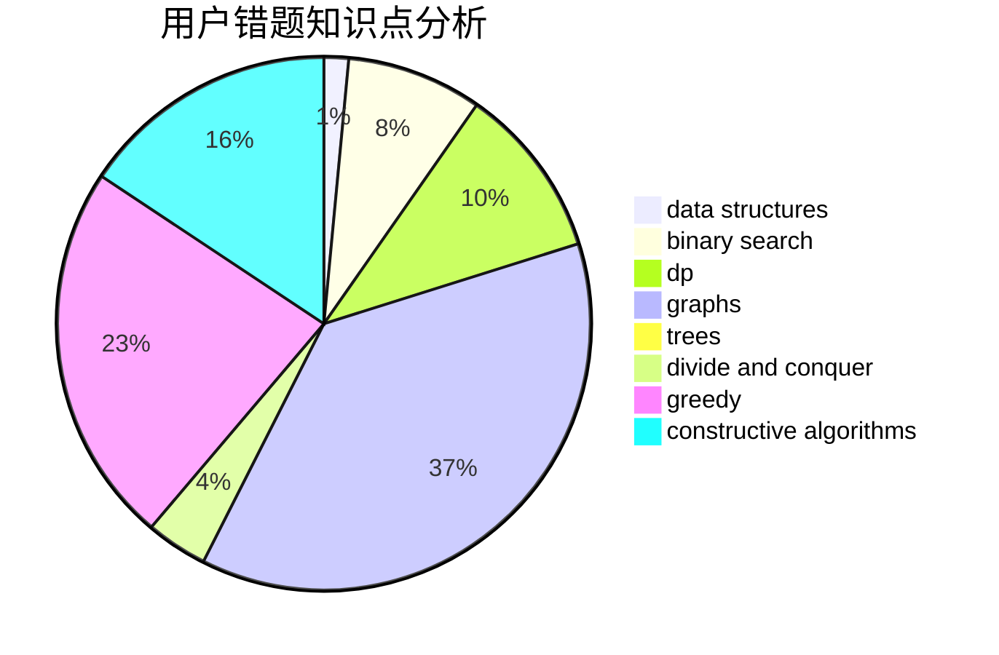

# MoRanSky

<!-- tabs:start -->

#### **用户提交结果分析**

#### **用户做题类型偏好分析**

#### **用户错题知识点分析**

<!-- tabs:end -->
# 推荐题目
[915C](https://codeforces.com/contest/915/problem/C)		dp,
                        greedy		  
[171C](https://codeforces.com/contest/171/problem/C)		*special problem,
                        implementation		  
[165E](https://codeforces.com/contest/165/problem/E)		bitmasks,
                        brute force,
                        dfs and similar,
                        dp		  
[877D](https://codeforces.com/contest/877/problem/D)		data structures,
                        dfs and similar,
                        graphs,
                        shortest paths		  
[1305F](https://codeforces.com/contest/1305/problem/F)		math,
                        number theory,
                        probabilities		  
[1011A](https://codeforces.com/contest/1011/problem/A)		greedy,
                        implementation,
                        sortings		  
[1070C](https://codeforces.com/contest/1070/problem/C)		data structures,
                        greedy		  
[871E](https://codeforces.com/contest/871/problem/E)		graphs,
                        greedy,
                        trees		  
[1148E](https://codeforces.com/contest/1148/problem/E)		constructive algorithms,
                        greedy,
                        math,
                        sortings,
                        two pointers		  
[1223E](https://codeforces.com/contest/1223/problem/E)		dp,
                        sortings,
                        trees		  
