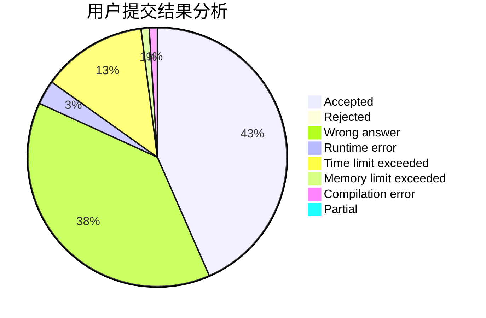
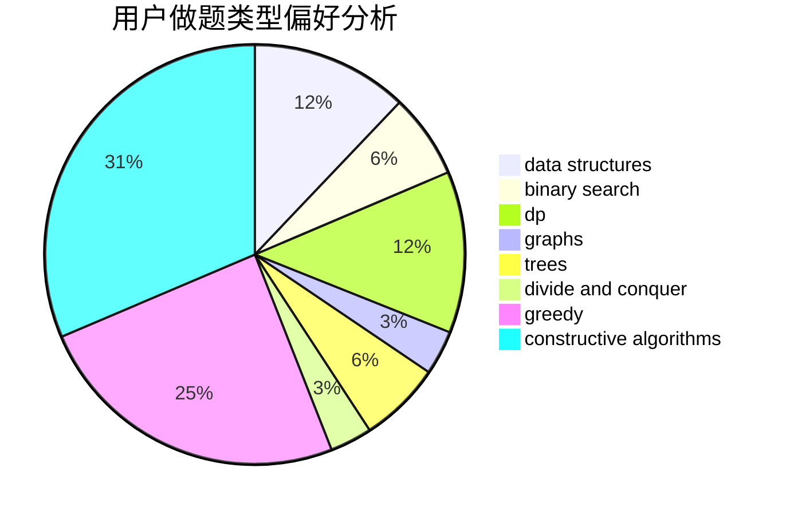
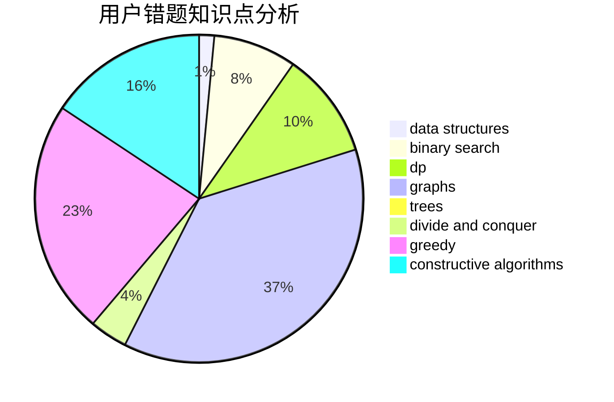

# MoRanSky
<!-- tabs:start -->
#### **用户提交结果分析**

#### **用户做题类型偏好分析**

#### **用户错题知识点分析**

<!-- tabs:end -->
# 推荐题目
[MADMAX](http://codeforces.com/problemset/problem/917/B)		dfs and similar,
                        dp,
                        games,
                        graphs		  
[Permute Digits](http://codeforces.com/problemset/problem/915/C)		dp,
                        greedy		  
[Olya and Energy Drinks](http://codeforces.com/problemset/problem/877/D)		data structures,
                        dfs and similar,
                        graphs,
                        shortest paths		  
[Restore the Tree](http://codeforces.com/problemset/problem/871/E)		graphs,
                        greedy,
                        trees		  
[A Piece of Cake](http://codeforces.com/problemset/problem/171/C)		*special problem,
                        implementation		  
[Non-Coprime Partition](http://codeforces.com/problemset/problem/1038/B)		constructive algorithms,
                        math		  
[Pigeon d'Or](http://codeforces.com/problemset/problem/1145/D)		implementation		  
[Devu and his Brother](http://codeforces.com/problemset/problem/439/D)		binary search,
                        sortings,
                        ternary search,
                        two pointers		  
[Xor-MST](http://codeforces.com/problemset/problem/888/G)		bitmasks,
                        constructive algorithms,
                        data structures		  
[Teams Formation](http://codeforces.com/problemset/problem/878/B)		data structures,
                        implementation		  
<!-- tabs:start -->
#### **data structures**
[MADMAX](http://codeforces.com/problemset/problem/877/D)		data structures,
                        dfs and similar,
                        graphs,
                        shortest paths		  
[Permute Digits](http://codeforces.com/problemset/problem/888/G)		bitmasks,
                        constructive algorithms,
                        data structures		  
[Olya and Energy Drinks](http://codeforces.com/problemset/problem/878/B)		data structures,
                        implementation		  
[Restore the Tree](http://codeforces.com/problemset/problem/1335/E2)		brute force,
                        data structures,
                        dp,
                        two pointers		  
[A Piece of Cake](http://codeforces.com/problemset/problem/1070/C)		data structures,
                        greedy		  
[Non-Coprime Partition](http://codeforces.com/problemset/problem/1265/B)		data structures,
                        implementation,
                        math,
                        two pointers		  
[Pigeon d'Or](http://codeforces.com/problemset/problem/1430/D)		binary search,
                        data structures,
                        greedy,
                        two pointers		  
[Devu and his Brother](http://codeforces.com/problemset/problem/741/D)		data structures,
                        dfs and similar,
                        trees		  
[Xor-MST](http://codeforces.com/problemset/problem/1492/C)		binary search,
                        data structures,
                        dp,
                        greedy,
                        two pointers		  
[Teams Formation](http://codeforces.com/problemset/problem/1490/G)		binary search,
                        data structures,
                        math		  
#### **binary search**
[MADMAX](http://codeforces.com/problemset/problem/439/D)		binary search,
                        sortings,
                        ternary search,
                        two pointers		  
[Permute Digits](https://codeforces.com/contest/591/problem/D)		binary search,
                        geometry,
                        math		  
[Olya and Energy Drinks](http://codeforces.com/problemset/problem/1430/D)		binary search,
                        data structures,
                        greedy,
                        two pointers		  
[Restore the Tree](http://codeforces.com/problemset/problem/653/D)		binary search,
                        flows,
                        graphs		  
[A Piece of Cake](http://codeforces.com/problemset/problem/1492/C)		binary search,
                        data structures,
                        dp,
                        greedy,
                        two pointers		  
[Non-Coprime Partition](http://codeforces.com/problemset/problem/1463/D)		binary search,
                        constructive algorithms,
                        greedy,
                        two pointers		  
[Pigeon d'Or](http://codeforces.com/problemset/problem/1490/G)		binary search,
                        data structures,
                        math		  
[Devu and his Brother](http://codeforces.com/problemset/problem/1479/D)		binary search,
                        bitmasks,
                        brute force,
                        data structures,
                        probabilities,
                        trees		  
[Xor-MST](http://codeforces.com/problemset/problem/1436/E)		binary search,
                        data structures,
                        two pointers		  
[Teams Formation](http://codeforces.com/problemset/problem/1461/D)		binary search,
                        brute force,
                        data structures,
                        divide and conquer,
                        implementation,
                        sortings		  
#### **dp**
[MADMAX](http://codeforces.com/problemset/problem/917/B)		dfs and similar,
                        dp,
                        games,
                        graphs		  
[Permute Digits](http://codeforces.com/problemset/problem/915/C)		dp,
                        greedy		  
[Olya and Energy Drinks](http://codeforces.com/problemset/problem/219/C)		brute force,
                        dp,
                        greedy		  
[Restore the Tree](http://codeforces.com/problemset/problem/1335/E2)		brute force,
                        data structures,
                        dp,
                        two pointers		  
[A Piece of Cake](http://codeforces.com/problemset/problem/809/C)		combinatorics,
                        divide and conquer,
                        dp		  
[Non-Coprime Partition](http://codeforces.com/problemset/problem/1188/C)		dp		  
[Pigeon d'Or](http://codeforces.com/problemset/problem/1223/E)		dp,
                        sortings,
                        trees		  
[Devu and his Brother](http://codeforces.com/problemset/problem/165/E)		bitmasks,
                        brute force,
                        dfs and similar,
                        dp		  
[Xor-MST](http://codeforces.com/problemset/problem/1492/C)		binary search,
                        data structures,
                        dp,
                        greedy,
                        two pointers		  
[Teams Formation](https://codeforces.com/contest/1457/problem/C)		brute force,
                        dp,
                        implementation		  
#### **graph**
[MADMAX](http://codeforces.com/problemset/problem/917/B)		dfs and similar,
                        dp,
                        games,
                        graphs		  
[Permute Digits](http://codeforces.com/problemset/problem/877/D)		data structures,
                        dfs and similar,
                        graphs,
                        shortest paths		  
[Olya and Energy Drinks](http://codeforces.com/problemset/problem/871/E)		graphs,
                        greedy,
                        trees		  
[Restore the Tree](http://codeforces.com/problemset/problem/653/D)		binary search,
                        flows,
                        graphs		  
[A Piece of Cake](http://codeforces.com/problemset/problem/427/C)		dfs and similar,
                        graphs,
                        two pointers		  
[Non-Coprime Partition](http://codeforces.com/problemset/problem/1487/C)		brute force,
                        constructive algorithms,
                        dfs and similar,
                        graphs,
                        greedy,
                        implementation,
                        math		  
[Pigeon d'Or](http://codeforces.com/problemset/problem/1437/C)		dp,
                        flows,
                        graph matchings,
                        greedy,
                        math,
                        sortings		  
[Devu and his Brother](http://codeforces.com/problemset/problem/1470/D)		constructive algorithms,
                        dfs and similar,
                        graph matchings,
                        graphs,
                        greedy		  
[Xor-MST](http://codeforces.com/problemset/problem/1476/C)		dp,
                        graphs,
                        greedy		  
[Teams Formation](http://codeforces.com/problemset/problem/1304/D)		constructive algorithms,
                        graphs,
                        greedy,
                        two pointers		  
#### **trees**
[MADMAX](http://codeforces.com/problemset/problem/871/E)		graphs,
                        greedy,
                        trees		  
[Permute Digits](http://codeforces.com/problemset/problem/1223/E)		dp,
                        sortings,
                        trees		  
[Olya and Energy Drinks](http://codeforces.com/problemset/problem/741/D)		data structures,
                        dfs and similar,
                        trees		  
[Restore the Tree](http://codeforces.com/problemset/problem/1479/D)		binary search,
                        bitmasks,
                        brute force,
                        data structures,
                        probabilities,
                        trees		  
[A Piece of Cake](http://codeforces.com/problemset/problem/1511/C)		brute force,
                        data structures,
                        implementation,
                        trees		  
[Non-Coprime Partition](http://codeforces.com/problemset/problem/1499/F)		combinatorics,
                        dfs and similar,
                        dp,
                        trees		  
[Pigeon d'Or](http://codeforces.com/problemset/problem/1491/E)		brute force,
                        dfs and similar,
                        divide and conquer,
                        number theory,
                        trees		  
[Devu and his Brother](http://codeforces.com/problemset/problem/1466/D)		data structures,
                        greedy,
                        sortings,
                        trees		  
[Xor-MST](http://codeforces.com/problemset/problem/1495/D)		combinatorics,
                        dfs and similar,
                        graphs,
                        math,
                        shortest paths,
                        trees		  
[Teams Formation](http://codeforces.com/problemset/problem/1303/G)		data structures,
                        divide and conquer,
                        geometry,
                        trees		  
#### **divide and conquer**
[MADMAX](http://codeforces.com/problemset/problem/809/C)		combinatorics,
                        divide and conquer,
                        dp		  
[Permute Digits](http://codeforces.com/problemset/problem/1461/D)		binary search,
                        brute force,
                        data structures,
                        divide and conquer,
                        implementation,
                        sortings		  
[Olya and Energy Drinks](http://codeforces.com/problemset/problem/1466/G)		combinatorics,
                        divide and conquer,
                        hashing,
                        math,
                        string suffix structures,
                        strings		  
[Restore the Tree](http://codeforces.com/problemset/problem/1490/D)		dfs and similar,
                        divide and conquer,
                        implementation		  
[A Piece of Cake](https://codeforces.com/contest/1483/problem/C)		data structures,
                        divide and conquer,
                        dp		  
[Non-Coprime Partition](http://codeforces.com/problemset/problem/1491/E)		brute force,
                        dfs and similar,
                        divide and conquer,
                        number theory,
                        trees		  
[Pigeon d'Or](http://codeforces.com/problemset/problem/1303/G)		data structures,
                        divide and conquer,
                        geometry,
                        trees		  
[Devu and his Brother](http://codeforces.com/problemset/problem/1494/D)		constructive algorithms,
                        data structures,
                        dfs and similar,
                        divide and conquer,
                        dsu,
                        greedy,
                        sortings,
                        trees		  
[Xor-MST](http://codeforces.com/problemset/problem/1482/E)		data structures,
                        divide and conquer,
                        dp		  
[Teams Formation](http://codeforces.com/problemset/problem/566/C)		dfs and similar,
                        divide and conquer,
                        trees		  
#### **greedy**
[MADMAX](http://codeforces.com/problemset/problem/915/C)		dp,
                        greedy		  
[Permute Digits](http://codeforces.com/problemset/problem/871/E)		graphs,
                        greedy,
                        trees		  
[Olya and Energy Drinks](http://codeforces.com/problemset/problem/479/B)		brute force,
                        constructive algorithms,
                        greedy,
                        implementation,
                        sortings		  
[Restore the Tree](http://codeforces.com/problemset/problem/219/C)		brute force,
                        dp,
                        greedy		  
[A Piece of Cake](http://codeforces.com/problemset/problem/1203/D1)		greedy,
                        implementation		  
[Non-Coprime Partition](http://codeforces.com/problemset/problem/337/A)		greedy		  
[Pigeon d'Or](http://codeforces.com/problemset/problem/1070/C)		data structures,
                        greedy		  
[Devu and his Brother](http://codeforces.com/problemset/problem/1011/A)		greedy,
                        implementation,
                        sortings		  
[Xor-MST](http://codeforces.com/problemset/problem/1148/E)		constructive algorithms,
                        greedy,
                        math,
                        sortings,
                        two pointers		  
[Teams Formation](http://codeforces.com/problemset/problem/1430/D)		binary search,
                        data structures,
                        greedy,
                        two pointers		  
#### **constructive algorithms**
[MADMAX](http://codeforces.com/problemset/problem/1038/B)		constructive algorithms,
                        math		  
[Permute Digits](http://codeforces.com/problemset/problem/888/G)		bitmasks,
                        constructive algorithms,
                        data structures		  
[Olya and Energy Drinks](http://codeforces.com/problemset/problem/479/B)		brute force,
                        constructive algorithms,
                        greedy,
                        implementation,
                        sortings		  
[Restore the Tree](http://codeforces.com/problemset/problem/347/A)		constructive algorithms,
                        implementation,
                        sortings		  
[A Piece of Cake](http://codeforces.com/problemset/problem/1148/E)		constructive algorithms,
                        greedy,
                        math,
                        sortings,
                        two pointers		  
[Non-Coprime Partition](http://codeforces.com/problemset/problem/804/A)		constructive algorithms,
                        greedy,
                        math		  
[Pigeon d'Or](http://codeforces.com/problemset/problem/1426/E)		brute force,
                        constructive algorithms,
                        flows,
                        greedy,
                        math		  
[Devu and his Brother](http://codeforces.com/problemset/problem/1493/A)		constructive algorithms,
                        greedy		  
[Xor-MST](http://codeforces.com/problemset/problem/1463/D)		binary search,
                        constructive algorithms,
                        greedy,
                        two pointers		  
[Teams Formation](https://codeforces.com/contest/1456/problem/B)		bitmasks,
                        brute force,
                        constructive algorithms		  
#### **sortings**
[MADMAX](http://codeforces.com/problemset/problem/439/D)		binary search,
                        sortings,
                        ternary search,
                        two pointers		  
[Permute Digits](http://codeforces.com/problemset/problem/479/B)		brute force,
                        constructive algorithms,
                        greedy,
                        implementation,
                        sortings		  
[Olya and Energy Drinks](http://codeforces.com/problemset/problem/347/A)		constructive algorithms,
                        implementation,
                        sortings		  
[Restore the Tree](http://codeforces.com/problemset/problem/1011/A)		greedy,
                        implementation,
                        sortings		  
[A Piece of Cake](http://codeforces.com/problemset/problem/1148/E)		constructive algorithms,
                        greedy,
                        math,
                        sortings,
                        two pointers		  
[Non-Coprime Partition](http://codeforces.com/problemset/problem/1223/E)		dp,
                        sortings,
                        trees		  
[Pigeon d'Or](http://codeforces.com/problemset/problem/1296/D)		greedy,
                        sortings		  
[Devu and his Brother](https://codeforces.com/contest/1496/problem/C)		geometry,
                        greedy,
                        math,
                        sortings		  
[Xor-MST](http://codeforces.com/problemset/problem/1495/A)		geometry,
                        greedy,
                        math,
                        sortings		  
[Teams Formation](http://codeforces.com/problemset/problem/1497/A)		brute force,
                        data structures,
                        greedy,
                        sortings		  
<!-- tabs:end -->
