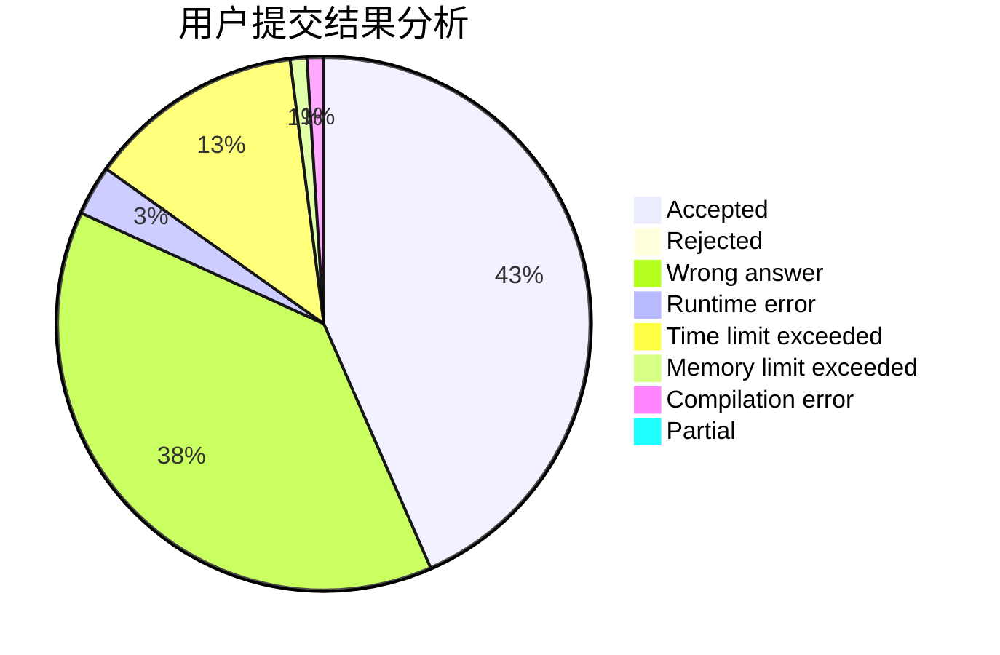
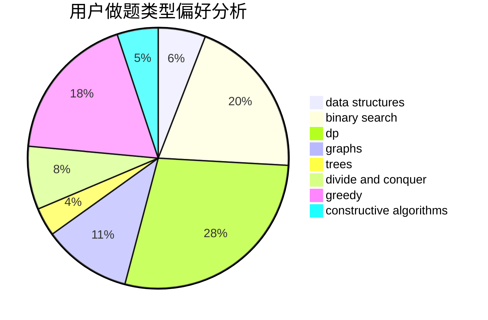
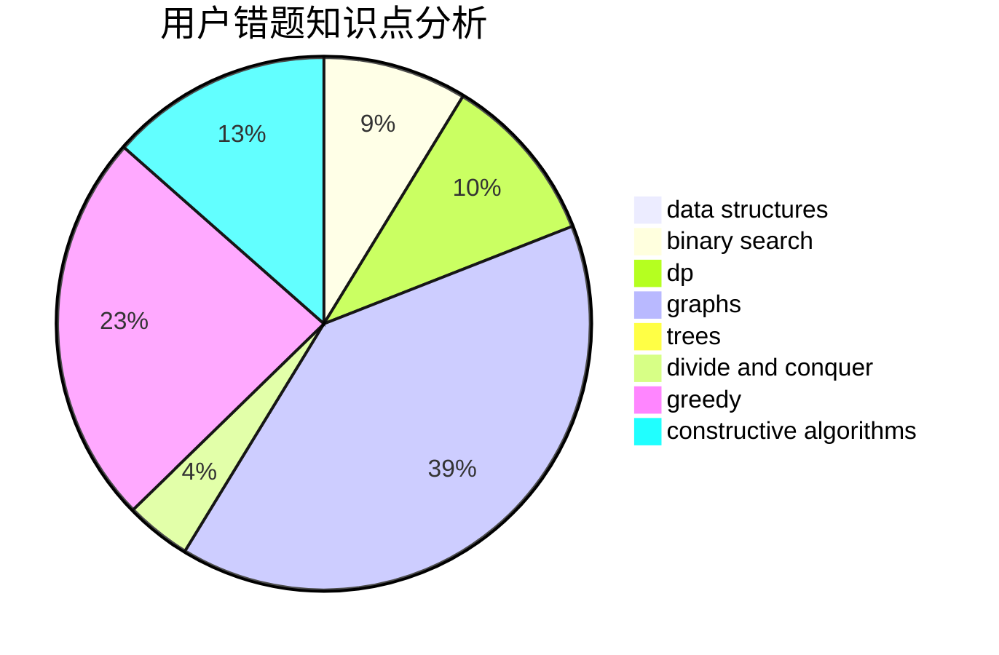

# MoRanSky

<!-- tabs:start -->

#### **用户提交结果分析**

#### **用户做题类型偏好分析**

#### **用户错题知识点分析**

<!-- tabs:end -->
# 推荐题目
[935B](https://codeforces.com/contest/935/problem/B)		implementation		  
[198C](https://codeforces.com/contest/198/problem/C)		binary search,
                        geometry		  
[190E](https://codeforces.com/contest/190/problem/E)		data structures,
                        dsu,
                        graphs,
                        hashing,
                        sortings		  
[898C](https://codeforces.com/contest/898/problem/C)		implementation,
                        strings		  
[1314E](https://codeforces.com/contest/1314/problem/E)		dsu,graphs,sortings,trees		  
[1011D](https://codeforces.com/contest/1011/problem/D)		dsu,graphs,sortings,trees		  
[1070F](https://codeforces.com/contest/1070/problem/F)		greedy		  
[893B](https://codeforces.com/contest/893/problem/B)		brute force,
                        implementation		  
[114E](https://codeforces.com/contest/114/problem/E)		dsu,graphs,sortings,trees		  
[1230D](https://codeforces.com/contest/1230/problem/D)		dsu,graphs,sortings,trees		  
