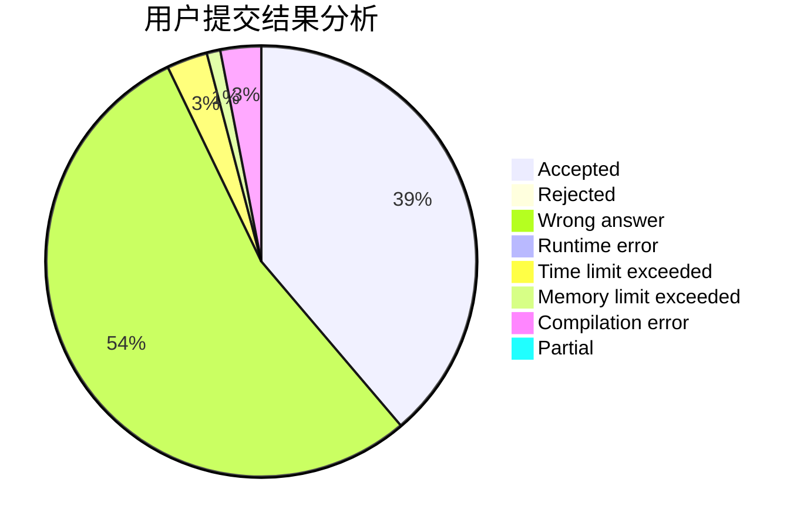
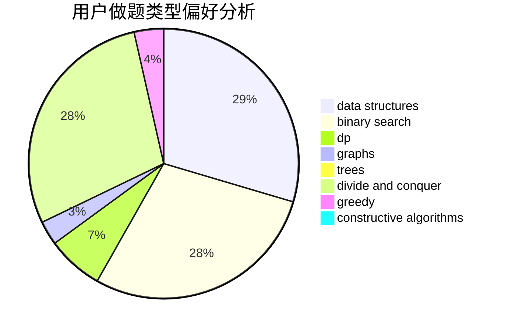
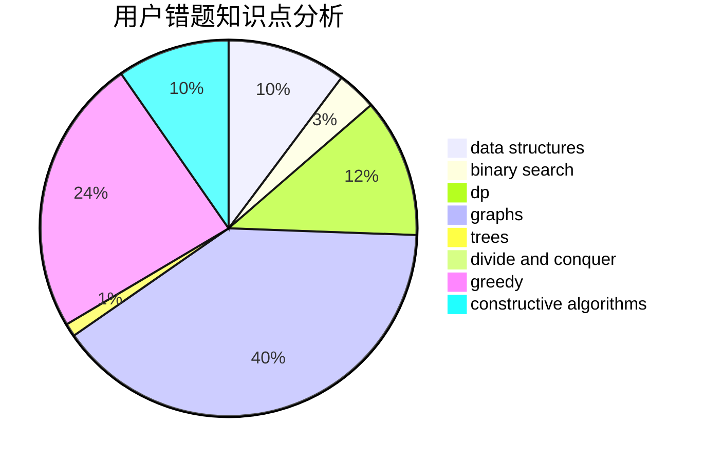

# MojeDes

<!-- tabs:start -->

#### **用户提交结果分析**

#### **用户做题类型偏好分析**

#### **用户错题知识点分析**

<!-- tabs:end -->
# 推荐题目
[25E](https://codeforces.com/contest/25/problem/E)		hashing,
                        strings		  
[815B](https://codeforces.com/contest/815/problem/B)		brute force,
                        combinatorics,
                        constructive algorithms,
                        math		  
[462C](https://codeforces.com/contest/462/problem/C)		dsu,graphs,sortings,trees		  
[582B](https://codeforces.com/contest/582/problem/B)		constructive algorithms,
                        dp,
                        matrices		  
[1093D](https://codeforces.com/contest/1093/problem/D)		dfs and similar,
                        graphs		  
[900D](https://codeforces.com/contest/900/problem/D)		bitmasks,
                        combinatorics,
                        dp,
                        math,
                        number theory		  
[898D](https://codeforces.com/contest/898/problem/D)		greedy		  
[312C](https://codeforces.com/contest/312/problem/C)		dsu,graphs,sortings,trees		  
[224B](https://codeforces.com/contest/224/problem/B)		bitmasks,
                        implementation,
                        two pointers		  
[1491H](https://codeforces.com/contest/1491/problem/H)		data structures,
                        trees		  
