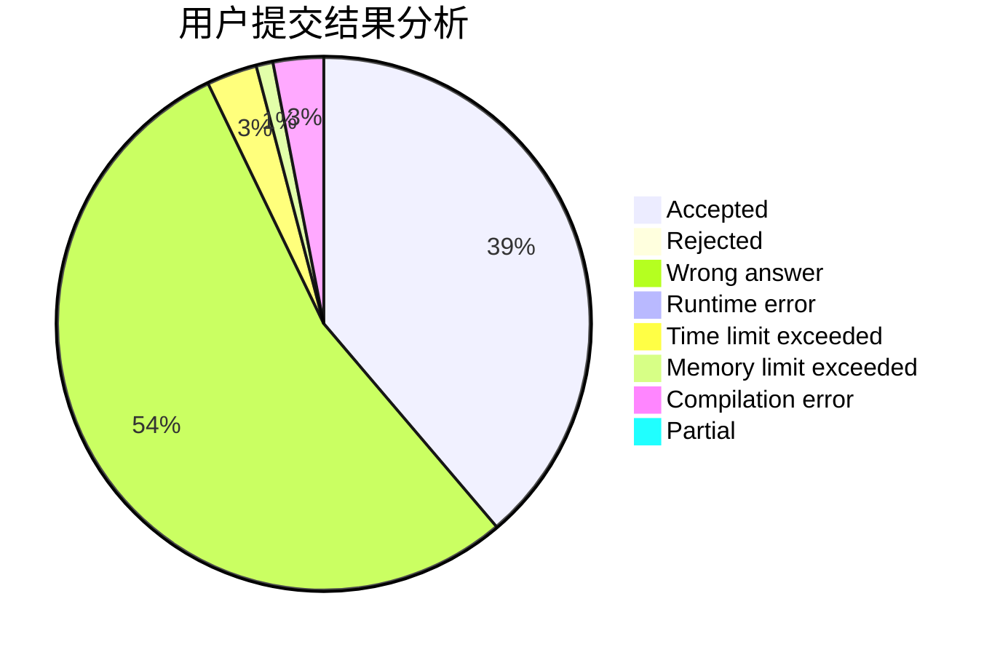
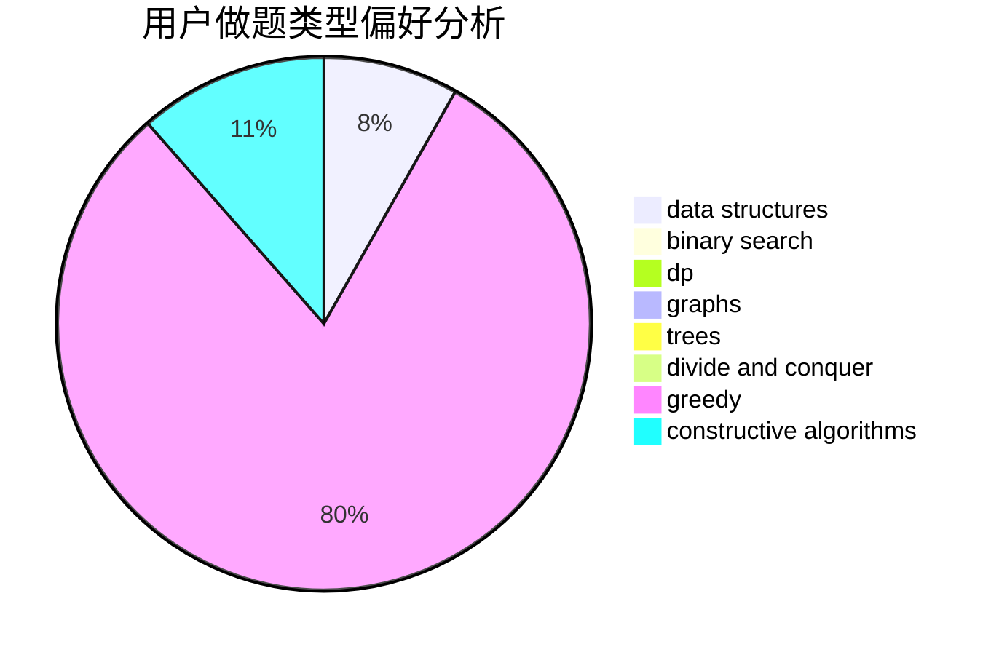
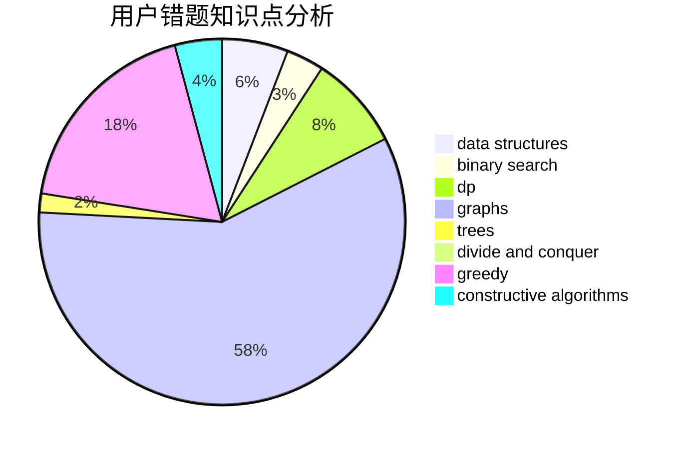

# MojeDes

<!-- tabs:start -->

#### **用户提交结果分析**

#### **用户做题类型偏好分析**

#### **用户错题知识点分析**

<!-- tabs:end -->
# 推荐题目
[277E](https://codeforces.com/contest/277/problem/E)		flows,
                        trees		  
[834B](https://codeforces.com/contest/834/problem/B)		data structures,
                        implementation		  
[482C](https://codeforces.com/contest/482/problem/C)		bitmasks,
                        dp,
                        probabilities		  
[603B](https://codeforces.com/contest/603/problem/B)		combinatorics,
                        dfs and similar,
                        dsu,
                        math,
                        number theory		  
[1093G](https://codeforces.com/contest/1093/problem/G)		bitmasks,
                        data structures		  
[917B](https://codeforces.com/contest/917/problem/B)		dfs and similar,
                        dp,
                        games,
                        graphs		  
[914F](https://codeforces.com/contest/914/problem/F)		bitmasks,
                        brute force,
                        data structures,
                        string suffix structures,
                        strings		  
[337B](https://codeforces.com/contest/337/problem/B)		greedy,
                        math,
                        number theory		  
[243B](https://codeforces.com/contest/243/problem/B)		graphs,
                        sortings		  
[14E](https://codeforces.com/contest/14/problem/E)		dp		  
