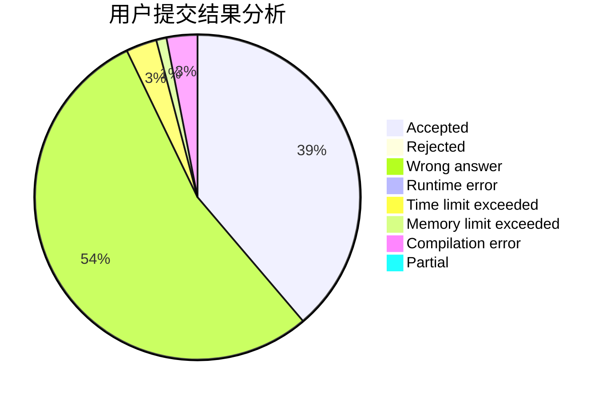
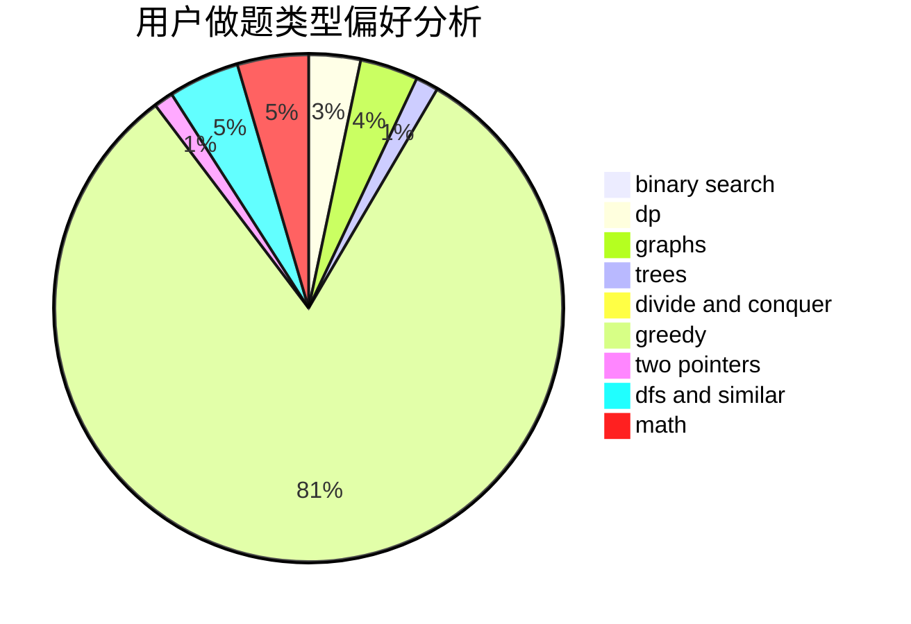

# MojeDes

<!-- tabs:start -->

#### **用户提交结果分析**

#### **用户做题类型偏好分析**

<!-- tabs:end -->
# 推荐题目
[277E](https://codeforces.com/contest/277/problem/E)
[834B](https://codeforces.com/contest/834/problem/B)
[482C](https://codeforces.com/contest/482/problem/C)
[603B](https://codeforces.com/contest/603/problem/B)
[1093G](https://codeforces.com/contest/1093/problem/G)
[917B](https://codeforces.com/contest/917/problem/B)
[914F](https://codeforces.com/contest/914/problem/F)
[337B](https://codeforces.com/contest/337/problem/B)
[243B](https://codeforces.com/contest/243/problem/B)
[14E](https://codeforces.com/contest/14/problem/E)
