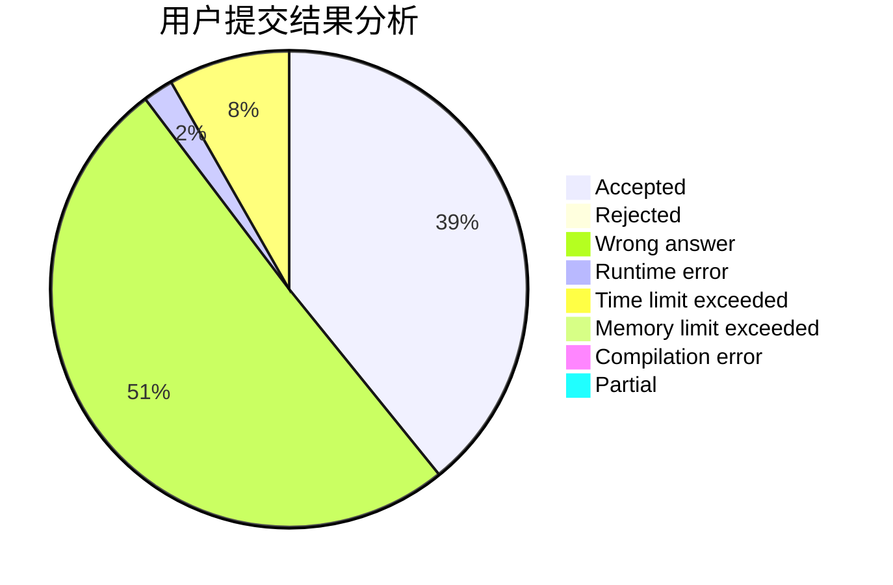
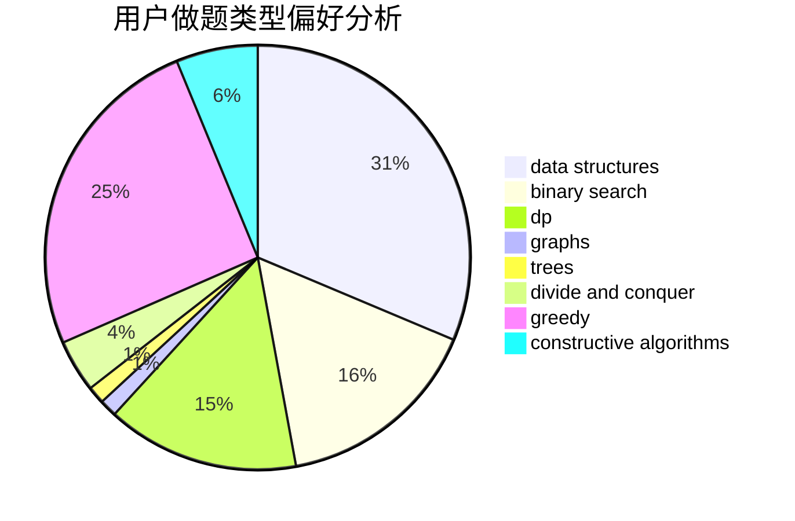
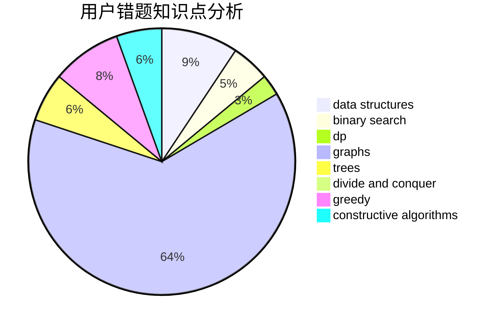

# MoliH97

<!-- tabs:start -->

#### **用户提交结果分析**

#### **用户做题类型偏好分析**

#### **用户错题知识点分析**

<!-- tabs:end -->
# 推荐题目
[1437F](https://codeforces.com/contest/1437/problem/F)		combinatorics,
                        dp,
                        math,
                        two pointers		  
[887B](https://codeforces.com/contest/887/problem/B)		brute force,
                        implementation		  
[156C](https://codeforces.com/contest/156/problem/C)		combinatorics,
                        dp		  
[1300C](https://codeforces.com/contest/1300/problem/C)		dsu,graphs,sortings,trees		  
[1272C](https://codeforces.com/contest/1272/problem/C)		combinatorics,
                        dp,
                        implementation		  
[1263E](https://codeforces.com/contest/1263/problem/E)		data structures,
                        implementation		  
[908F](https://codeforces.com/contest/908/problem/F)		graphs,
                        greedy,
                        implementation		  
[758A](https://codeforces.com/contest/758/problem/A)		implementation,
                        math		  
[519E](https://codeforces.com/contest/519/problem/E)		binary search,
                        data structures,
                        dfs and similar,
                        dp,
                        trees		  
[1015E2](https://codeforces.com/contest/1015E/problem/2)		binary search,
                        dp,
                        greedy		  
