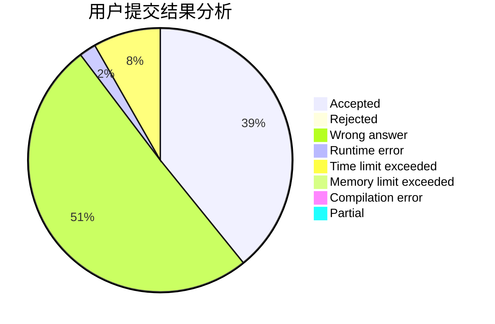
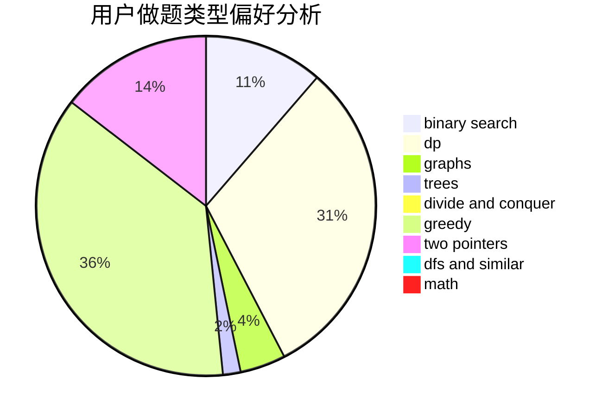

# MoliH97

<!-- tabs:start -->

#### **用户提交结果分析**

#### **用户做题类型偏好分析**

<!-- tabs:end -->
# 推荐题目
[1447C](https://codeforces.com/contest/1447/problem/C)
[906C](https://codeforces.com/contest/906/problem/C)
[1771](https://codeforces.com/contest/177/problem/1)
[1310A](https://codeforces.com/contest/1310/problem/A)
[1281E](https://codeforces.com/contest/1281/problem/E)
[1269C](https://codeforces.com/contest/1269/problem/C)
[923A](https://codeforces.com/contest/923/problem/A)
[777B](https://codeforces.com/contest/777/problem/B)
[545A](https://codeforces.com/contest/545/problem/A)
[1016B](https://codeforces.com/contest/1016/problem/B)
