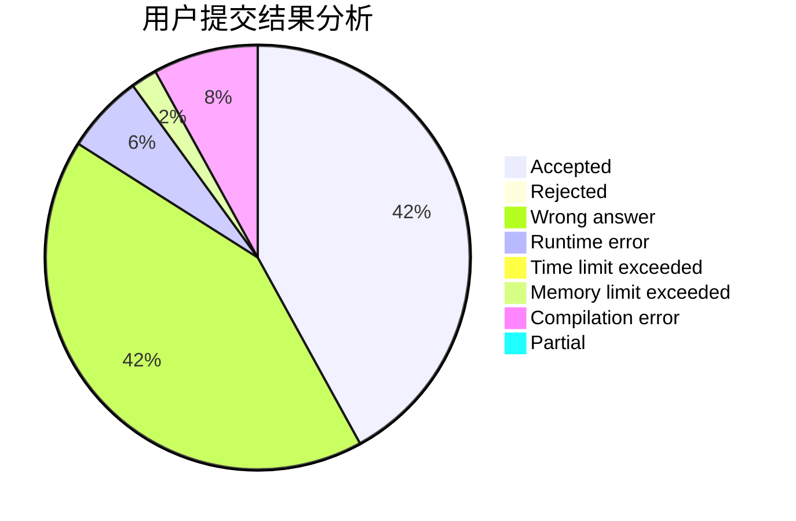
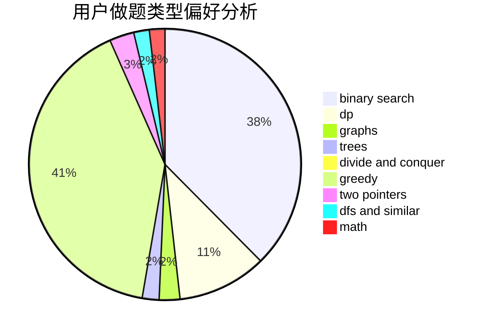

# MolotovM

<!-- tabs:start -->

#### **用户提交结果分析**

#### **用户做题类型偏好分析**

<!-- tabs:end -->
# 推荐题目
[1493C](https://codeforces.com/contest/1493/problem/C)
[1305C](https://codeforces.com/contest/1305/problem/C)
[1238C](https://codeforces.com/contest/1238/problem/C)
[1148B](https://codeforces.com/contest/1148/problem/B)
[1260A](https://codeforces.com/contest/1260/problem/A)
[370A](https://codeforces.com/contest/370/problem/A)
[12871](https://codeforces.com/contest/1287/problem/1)
[1098E](https://codeforces.com/contest/1098/problem/E)
[618A](https://codeforces.com/contest/618/problem/A)
[796D](https://codeforces.com/contest/796/problem/D)
