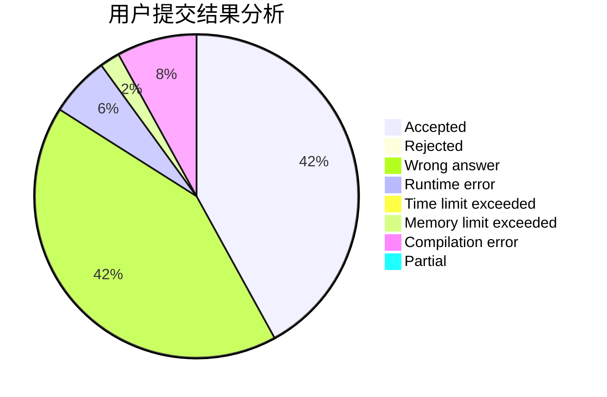
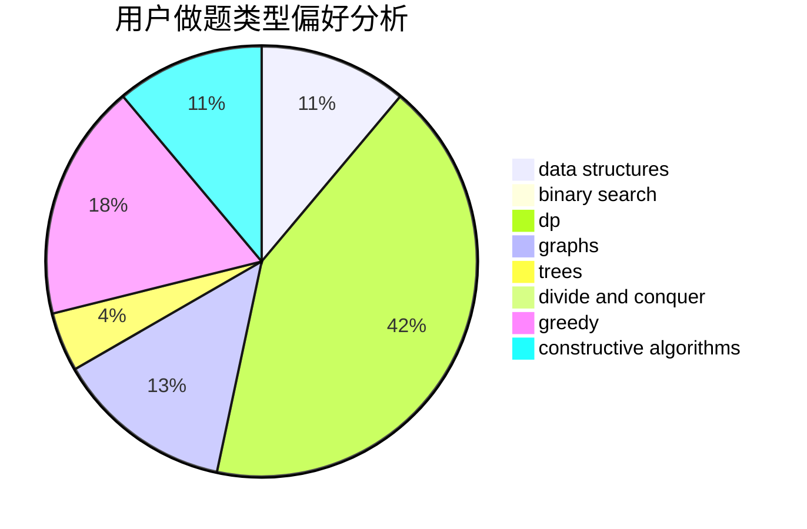

# MolotovM

<!-- tabs:start -->

#### **用户提交结果分析**

#### **用户做题类型偏好分析**

#### **用户错题知识点分析**

<!-- tabs:end -->
# 推荐题目
[1493C](https://codeforces.com/contest/1493/problem/C)		binary search,
                        brute force,
                        constructive algorithms,
                        greedy,
                        strings		  
[1305C](https://codeforces.com/contest/1305/problem/C)		brute force,
                        combinatorics,
                        math,
                        number theory		  
[1238C](https://codeforces.com/contest/1238/problem/C)		dp,
                        greedy,
                        math		  
[1148B](https://codeforces.com/contest/1148/problem/B)		binary search,
                        brute force,
                        two pointers		  
[1260A](https://codeforces.com/contest/1260/problem/A)		math		  
[370A](https://codeforces.com/contest/370/problem/A)		graphs,
                        math,
                        shortest paths		  
[12871](https://codeforces.com/contest/1287/problem/1)		dsu,graphs,sortings,trees		  
[1098E](https://codeforces.com/contest/1098/problem/E)		binary search,
                        implementation,
                        math,
                        number theory		  
[618A](https://codeforces.com/contest/618/problem/A)		implementation		  
[796D](https://codeforces.com/contest/796/problem/D)		constructive algorithms,
                        dfs and similar,
                        dp,
                        graphs,
                        shortest paths,
                        trees		  
