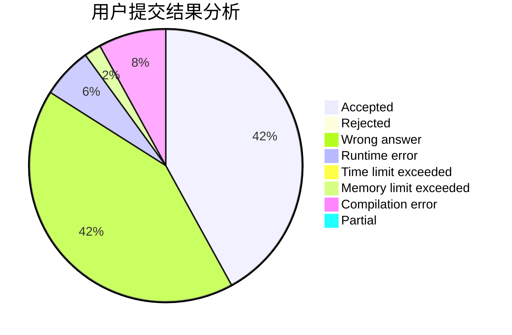
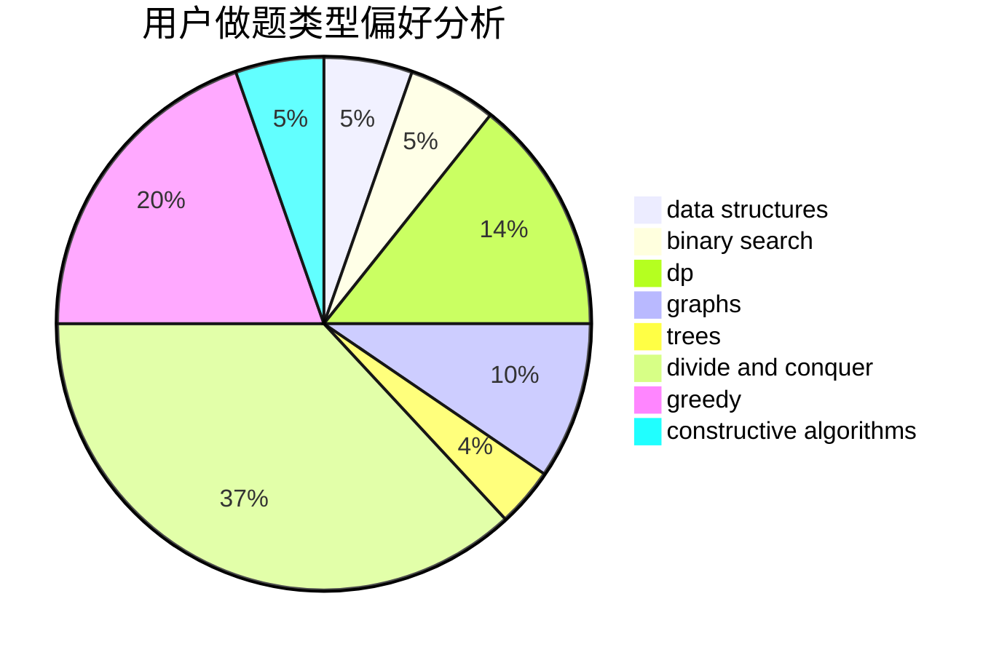

# MolotovM

<!-- tabs:start -->

#### **用户提交结果分析**

#### **用户做题类型偏好分析**

#### **用户错题知识点分析**

<!-- tabs:end -->
# 推荐题目
[1486A](https://codeforces.com/contest/1486/problem/A)		greedy,
                        implementation		  
[1298D](https://codeforces.com/contest/1298/problem/D)		dsu,graphs,sortings,trees		  
[122B](https://codeforces.com/contest/122/problem/B)		brute force,
                        implementation		  
[1146B](https://codeforces.com/contest/1146/problem/B)		implementation,
                        strings		  
[1252K](https://codeforces.com/contest/1252/problem/K)		data structures,
                        math,
                        matrices		  
[343E](https://codeforces.com/contest/343/problem/E)		brute force,
                        dfs and similar,
                        divide and conquer,
                        flows,
                        graphs,
                        greedy,
                        trees		  
[1280F](https://codeforces.com/contest/1280/problem/F)		combinatorics,
                        constructive algorithms,
                        math		  
[1098B](https://codeforces.com/contest/1098/problem/B)		brute force,
                        constructive algorithms,
                        greedy,
                        math		  
[599E](https://codeforces.com/contest/599/problem/E)		bitmasks,
                        dp,
                        trees		  
[778C](https://codeforces.com/contest/778/problem/C)		brute force,
                        dfs and similar,
                        dsu,
                        hashing,
                        strings,
                        trees		  
