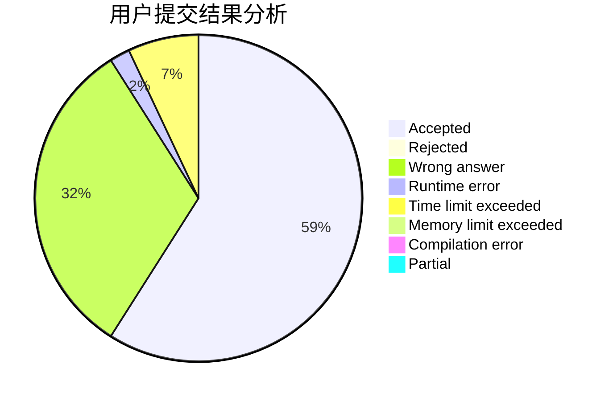
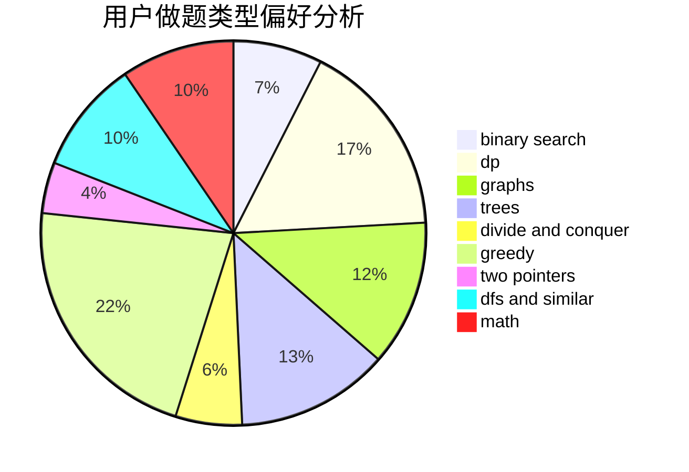

# Momosama

<!-- tabs:start -->

#### **用户提交结果分析**

#### **用户做题类型偏好分析**

<!-- tabs:end -->
# 推荐题目
[266B](https://codeforces.com/contest/266/problem/B)
[1148B](https://codeforces.com/contest/1148/problem/B)
[1067B](https://codeforces.com/contest/1067/problem/B)
[1302F](https://codeforces.com/contest/1302/problem/F)
[1013E](https://codeforces.com/contest/1013/problem/E)
[1248E](https://codeforces.com/contest/1248/problem/E)
[1082F](https://codeforces.com/contest/1082/problem/F)
[554A](https://codeforces.com/contest/554/problem/A)
[1093G](https://codeforces.com/contest/1093/problem/G)
[405D](https://codeforces.com/contest/405/problem/D)
