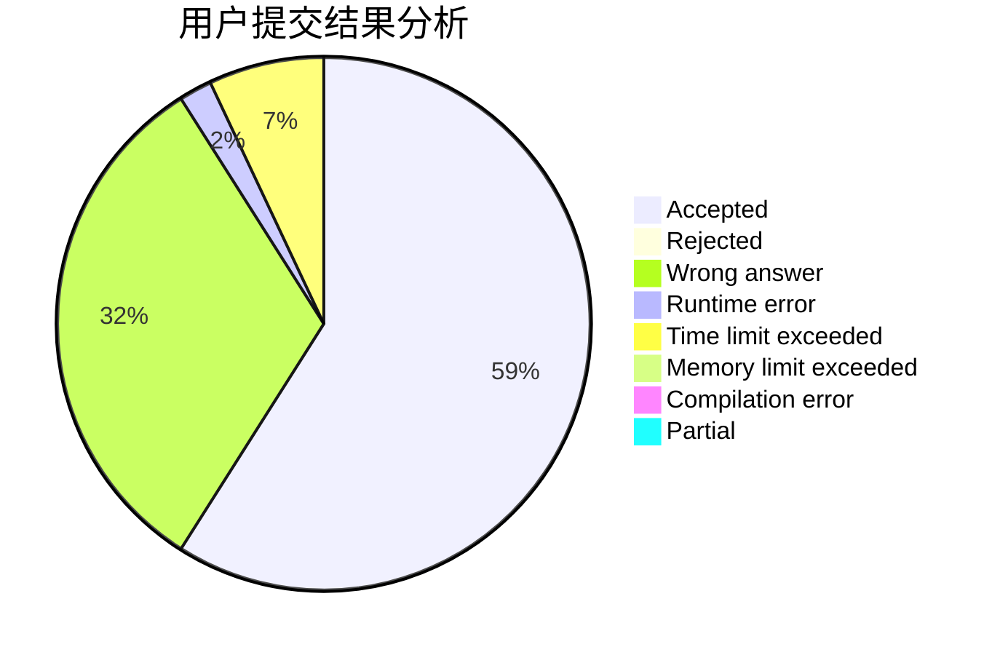
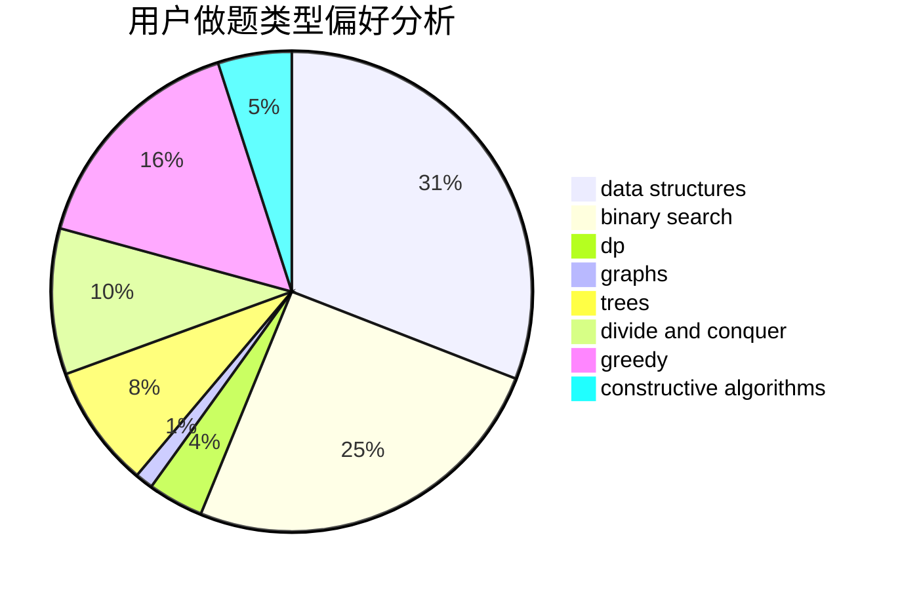
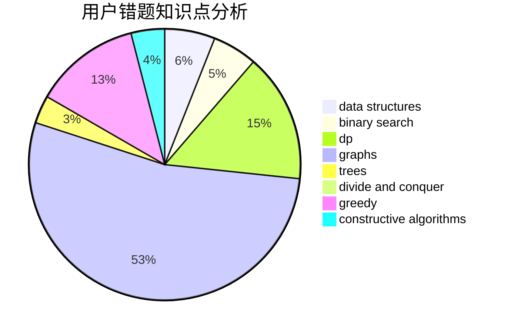

# Momosama
<!-- tabs:start -->
#### **用户提交结果分析**

#### **用户做题类型偏好分析**

#### **用户错题知识点分析**

<!-- tabs:end -->
# 推荐题目
[Hate "A"](http://codeforces.com/problemset/problem/1146/B)		implementation,
                        strings		  
[Queries for Number of Palindromes](http://codeforces.com/problemset/problem/245/H)		dp,
                        hashing,
                        strings		  
[And](http://codeforces.com/problemset/problem/1013/B)		greedy		  
[Binary Numbers AND Sum](http://codeforces.com/problemset/problem/1066/E)		data structures,
                        implementation,
                        math		  
[The Modcrab](http://codeforces.com/problemset/problem/903/B)		greedy,
                        implementation		  
[Mike and Frog](https://codeforces.com/contest/548/problem/C)		brute force,
                        greedy,
                        implementation,
                        math		  
[Minimal Subset Difference](https://codeforces.com/contest/956/problem/F)		dp		  
[Make a Square](http://codeforces.com/problemset/problem/962/C)		brute force,
                        implementation,
                        math		  
[0-1 MST](https://codeforces.com/contest/1243/problem/D)		dfs and similar,
                        dsu,
                        graphs,
                        sortings		  
[Word Correction](http://codeforces.com/problemset/problem/938/A)		implementation		  
<!-- tabs:start -->
#### **data structures**
[Hate "A"](http://codeforces.com/problemset/problem/1066/E)		data structures,
                        implementation,
                        math		  
[Queries for Number of Palindromes](http://codeforces.com/problemset/problem/932/B)		binary search,
                        data structures,
                        dfs and similar		  
[And](http://codeforces.com/problemset/problem/1209/G2)		data structures		  
[Binary Numbers AND Sum](http://codeforces.com/problemset/problem/1190/D)		data structures,
                        divide and conquer,
                        sortings,
                        two pointers		  
[The Modcrab](http://codeforces.com/problemset/problem/639/F)		data structures,
                        dfs and similar,
                        graphs,
                        trees		  
[Mike and Frog](http://codeforces.com/problemset/problem/319/E)		data structures		  
[Minimal Subset Difference](http://codeforces.com/problemset/problem/1313/C1)		brute force,
                        data structures,
                        dp,
                        greedy		  
[Make a Square](http://codeforces.com/problemset/problem/1204/D2)		data structures,
                        greedy,
                        math,
                        strings		  
[0-1 MST](http://codeforces.com/problemset/problem/817/E)		bitmasks,
                        data structures,
                        trees		  
[Word Correction](http://codeforces.com/problemset/problem/1511/C)		brute force,
                        data structures,
                        implementation,
                        trees		  
#### **binary search**
[Hate "A"](http://codeforces.com/problemset/problem/932/B)		binary search,
                        data structures,
                        dfs and similar		  
[Queries for Number of Palindromes](http://codeforces.com/problemset/problem/804/D)		binary search,
                        brute force,
                        dfs and similar,
                        dp,
                        sortings,
                        trees		  
[And](http://codeforces.com/problemset/problem/1492/C)		binary search,
                        data structures,
                        dp,
                        greedy,
                        two pointers		  
[Binary Numbers AND Sum](http://codeforces.com/problemset/problem/1463/D)		binary search,
                        constructive algorithms,
                        greedy,
                        two pointers		  
[The Modcrab](http://codeforces.com/problemset/problem/1490/G)		binary search,
                        data structures,
                        math		  
[Mike and Frog](http://codeforces.com/problemset/problem/1479/D)		binary search,
                        bitmasks,
                        brute force,
                        data structures,
                        probabilities,
                        trees		  
[Minimal Subset Difference](http://codeforces.com/problemset/problem/1436/E)		binary search,
                        data structures,
                        two pointers		  
[Make a Square](http://codeforces.com/problemset/problem/1461/D)		binary search,
                        brute force,
                        data structures,
                        divide and conquer,
                        implementation,
                        sortings		  
[0-1 MST](http://codeforces.com/problemset/problem/1493/C)		binary search,
                        brute force,
                        constructive algorithms,
                        greedy,
                        strings		  
[Word Correction](http://codeforces.com/problemset/problem/1487/D)		binary search,
                        brute force,
                        math,
                        number theory		  
#### **dp**
[Hate "A"](http://codeforces.com/problemset/problem/245/H)		dp,
                        hashing,
                        strings		  
[Queries for Number of Palindromes](https://codeforces.com/contest/956/problem/F)		dp		  
[And](http://codeforces.com/problemset/problem/377/C)		bitmasks,
                        dp,
                        games		  
[Binary Numbers AND Sum](http://codeforces.com/problemset/problem/533/B)		dfs and similar,
                        dp,
                        graphs,
                        strings,
                        trees		  
[The Modcrab](http://codeforces.com/problemset/problem/1469/B)		dp,
                        greedy		  
[Mike and Frog](http://codeforces.com/problemset/problem/1442/A)		constructive algorithms,
                        dp,
                        greedy		  
[Minimal Subset Difference](http://codeforces.com/problemset/problem/804/D)		binary search,
                        brute force,
                        dfs and similar,
                        dp,
                        sortings,
                        trees		  
[Make a Square](http://codeforces.com/problemset/problem/1354/E)		dfs and similar,
                        dp,
                        graphs		  
[0-1 MST](http://codeforces.com/problemset/problem/1313/C1)		brute force,
                        data structures,
                        dp,
                        greedy		  
[Word Correction](http://codeforces.com/problemset/problem/1472/C)		dp,
                        graphs		  
#### **graph**
[Hate "A"](https://codeforces.com/contest/1243/problem/D)		dfs and similar,
                        dsu,
                        graphs,
                        sortings		  
[Queries for Number of Palindromes](http://codeforces.com/problemset/problem/533/B)		dfs and similar,
                        dp,
                        graphs,
                        strings,
                        trees		  
[And](http://codeforces.com/problemset/problem/1093/D)		dfs and similar,
                        graphs		  
[Binary Numbers AND Sum](http://codeforces.com/problemset/problem/639/F)		data structures,
                        dfs and similar,
                        graphs,
                        trees		  
[The Modcrab](http://codeforces.com/problemset/problem/1354/E)		dfs and similar,
                        dp,
                        graphs		  
[Mike and Frog](http://codeforces.com/problemset/problem/1472/C)		dp,
                        graphs		  
[Minimal Subset Difference](http://codeforces.com/problemset/problem/1487/C)		brute force,
                        constructive algorithms,
                        dfs and similar,
                        graphs,
                        greedy,
                        implementation,
                        math		  
[Make a Square](http://codeforces.com/problemset/problem/1437/C)		dp,
                        flows,
                        graph matchings,
                        greedy,
                        math,
                        sortings		  
[0-1 MST](http://codeforces.com/problemset/problem/1470/D)		constructive algorithms,
                        dfs and similar,
                        graph matchings,
                        graphs,
                        greedy		  
[Word Correction](http://codeforces.com/problemset/problem/1476/C)		dp,
                        graphs,
                        greedy		  
#### **trees**
[Hate "A"](http://codeforces.com/problemset/problem/533/B)		dfs and similar,
                        dp,
                        graphs,
                        strings,
                        trees		  
[Queries for Number of Palindromes](http://codeforces.com/problemset/problem/1363/C)		games,
                        trees		  
[And](http://codeforces.com/problemset/problem/696/B)		dfs and similar,
                        math,
                        probabilities,
                        trees		  
[Binary Numbers AND Sum](http://codeforces.com/problemset/problem/639/F)		data structures,
                        dfs and similar,
                        graphs,
                        trees		  
[The Modcrab](http://codeforces.com/problemset/problem/804/D)		binary search,
                        brute force,
                        dfs and similar,
                        dp,
                        sortings,
                        trees		  
[Mike and Frog](http://codeforces.com/problemset/problem/817/E)		bitmasks,
                        data structures,
                        trees		  
[Minimal Subset Difference](http://codeforces.com/problemset/problem/1511/C)		brute force,
                        data structures,
                        implementation,
                        trees		  
[Make a Square](http://codeforces.com/problemset/problem/1479/D)		binary search,
                        bitmasks,
                        brute force,
                        data structures,
                        probabilities,
                        trees		  
[0-1 MST](http://codeforces.com/problemset/problem/1511/C)		brute force,
                        data structures,
                        implementation,
                        trees		  
[Word Correction](http://codeforces.com/problemset/problem/1499/F)		combinatorics,
                        dfs and similar,
                        dp,
                        trees		  
#### **divide and conquer**
[Hate "A"](http://codeforces.com/problemset/problem/1190/D)		data structures,
                        divide and conquer,
                        sortings,
                        two pointers		  
[Queries for Number of Palindromes](http://codeforces.com/problemset/problem/1461/D)		binary search,
                        brute force,
                        data structures,
                        divide and conquer,
                        implementation,
                        sortings		  
[And](http://codeforces.com/problemset/problem/1466/G)		combinatorics,
                        divide and conquer,
                        hashing,
                        math,
                        string suffix structures,
                        strings		  
[Binary Numbers AND Sum](http://codeforces.com/problemset/problem/1490/D)		dfs and similar,
                        divide and conquer,
                        implementation		  
[The Modcrab](https://codeforces.com/contest/1483/problem/C)		data structures,
                        divide and conquer,
                        dp		  
[Mike and Frog](http://codeforces.com/problemset/problem/1491/E)		brute force,
                        dfs and similar,
                        divide and conquer,
                        number theory,
                        trees		  
[Minimal Subset Difference](http://codeforces.com/problemset/problem/1303/G)		data structures,
                        divide and conquer,
                        geometry,
                        trees		  
[Make a Square](http://codeforces.com/problemset/problem/1494/D)		constructive algorithms,
                        data structures,
                        dfs and similar,
                        divide and conquer,
                        dsu,
                        greedy,
                        sortings,
                        trees		  
[0-1 MST](http://codeforces.com/problemset/problem/1482/E)		data structures,
                        divide and conquer,
                        dp		  
[Word Correction](http://codeforces.com/problemset/problem/566/C)		dfs and similar,
                        divide and conquer,
                        trees		  
#### **greedy**
[Hate "A"](http://codeforces.com/problemset/problem/1013/B)		greedy		  
[Queries for Number of Palindromes](http://codeforces.com/problemset/problem/903/B)		greedy,
                        implementation		  
[And](https://codeforces.com/contest/548/problem/C)		brute force,
                        greedy,
                        implementation,
                        math		  
[Binary Numbers AND Sum](http://codeforces.com/problemset/problem/1082/C)		greedy,
                        sortings		  
[The Modcrab](http://codeforces.com/problemset/problem/1469/B)		dp,
                        greedy		  
[Mike and Frog](http://codeforces.com/problemset/problem/1442/A)		constructive algorithms,
                        dp,
                        greedy		  
[Minimal Subset Difference](http://codeforces.com/problemset/problem/962/B)		constructive algorithms,
                        greedy,
                        implementation		  
[Make a Square](http://codeforces.com/problemset/problem/735/C)		combinatorics,
                        constructive algorithms,
                        greedy,
                        math		  
[0-1 MST](http://codeforces.com/problemset/problem/1447/B)		greedy,
                        math		  
[Word Correction](http://codeforces.com/problemset/problem/584/C)		constructive algorithms,
                        greedy,
                        strings		  
#### **constructive algorithms**
[Hate "A"](http://codeforces.com/problemset/problem/720/C)		constructive algorithms		  
[Queries for Number of Palindromes](http://codeforces.com/problemset/problem/1442/A)		constructive algorithms,
                        dp,
                        greedy		  
[And](http://codeforces.com/problemset/problem/962/B)		constructive algorithms,
                        greedy,
                        implementation		  
[Binary Numbers AND Sum](http://codeforces.com/problemset/problem/735/C)		combinatorics,
                        constructive algorithms,
                        greedy,
                        math		  
[The Modcrab](http://codeforces.com/problemset/problem/128/B)		brute force,
                        constructive algorithms,
                        hashing,
                        implementation,
                        string suffix structures,
                        strings		  
[Mike and Frog](http://codeforces.com/problemset/problem/42/C)		brute force,
                        constructive algorithms		  
[Minimal Subset Difference](http://codeforces.com/problemset/problem/804/E)		constructive algorithms		  
[Make a Square](http://codeforces.com/problemset/problem/1148/F)		bitmasks,
                        constructive algorithms		  
[0-1 MST](http://codeforces.com/problemset/problem/584/C)		constructive algorithms,
                        greedy,
                        strings		  
[Word Correction](http://codeforces.com/problemset/problem/1450/F)		constructive algorithms,
                        greedy		  
#### **sortings**
[Hate "A"](https://codeforces.com/contest/1243/problem/D)		dfs and similar,
                        dsu,
                        graphs,
                        sortings		  
[Queries for Number of Palindromes](http://codeforces.com/problemset/problem/1082/C)		greedy,
                        sortings		  
[And](http://codeforces.com/problemset/problem/1294/B)		implementation,
                        sortings		  
[Binary Numbers AND Sum](http://codeforces.com/problemset/problem/1190/D)		data structures,
                        divide and conquer,
                        sortings,
                        two pointers		  
[The Modcrab](http://codeforces.com/problemset/problem/804/D)		binary search,
                        brute force,
                        dfs and similar,
                        dp,
                        sortings,
                        trees		  
[Mike and Frog](https://codeforces.com/contest/1496/problem/C)		geometry,
                        greedy,
                        math,
                        sortings		  
[Minimal Subset Difference](http://codeforces.com/problemset/problem/1495/A)		geometry,
                        greedy,
                        math,
                        sortings		  
[Make a Square](http://codeforces.com/problemset/problem/1497/A)		brute force,
                        data structures,
                        greedy,
                        sortings		  
[0-1 MST](http://codeforces.com/problemset/problem/1427/A)		math,
                        sortings		  
[Word Correction](http://codeforces.com/problemset/problem/1461/D)		binary search,
                        brute force,
                        data structures,
                        divide and conquer,
                        implementation,
                        sortings		  
<!-- tabs:end -->
