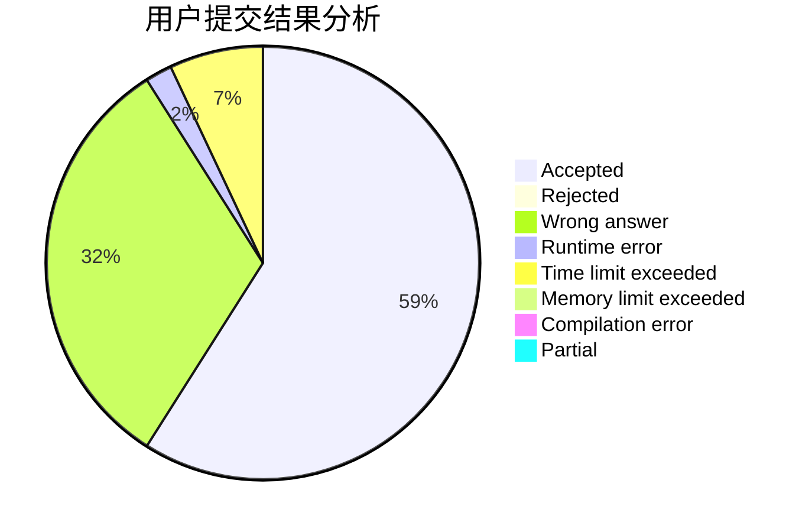
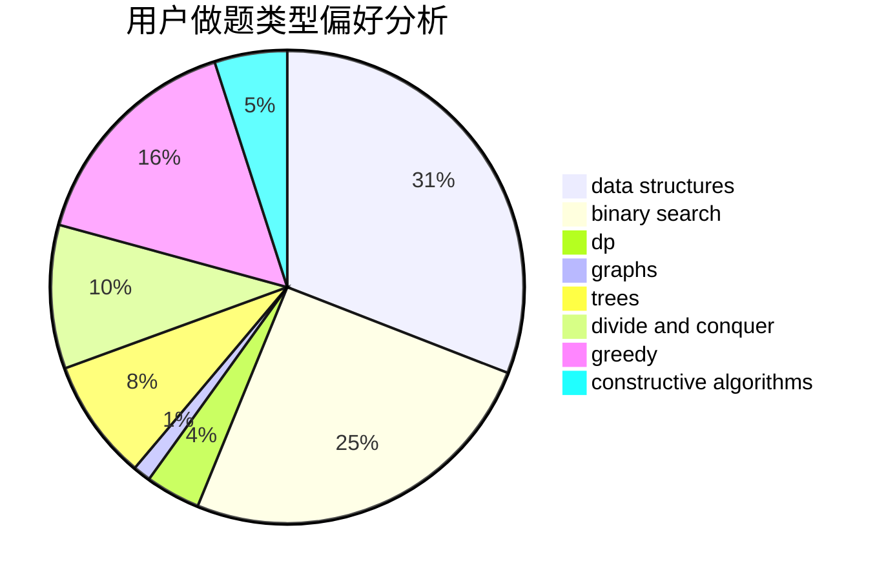
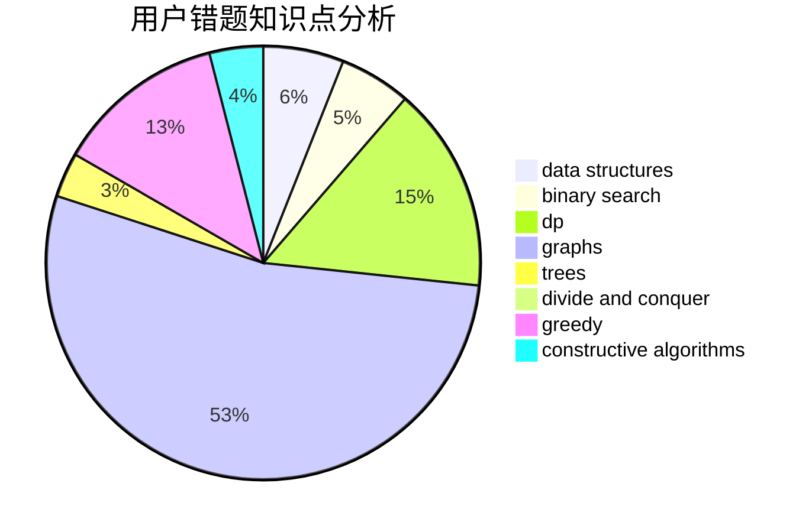

# Momosama

<!-- tabs:start -->

#### **用户提交结果分析**

#### **用户做题类型偏好分析**

#### **用户错题知识点分析**

<!-- tabs:end -->
# 推荐题目
[245H](https://codeforces.com/contest/245/problem/H)		dp,
                        hashing,
                        strings		  
[1146B](https://codeforces.com/contest/1146/problem/B)		implementation,
                        strings		  
[1066E](https://codeforces.com/contest/1066/problem/E)		data structures,
                        implementation,
                        math		  
[1295D](https://codeforces.com/contest/1295/problem/D)		math,
                        number theory		  
[1013B](https://codeforces.com/contest/1013/problem/B)		greedy		  
[1243D](https://codeforces.com/contest/1243/problem/D)		dsu,graphs,sortings,trees		  
[1082C](https://codeforces.com/contest/1082/problem/C)		greedy,
                        sortings		  
[533B](https://codeforces.com/contest/533/problem/B)		dfs and similar,
                        dp,
                        graphs,
                        strings,
                        trees		  
[1093D](https://codeforces.com/contest/1093/problem/D)		dfs and similar,
                        graphs		  
[377C](https://codeforces.com/contest/377/problem/C)		bitmasks,
                        dp,
                        games		  
