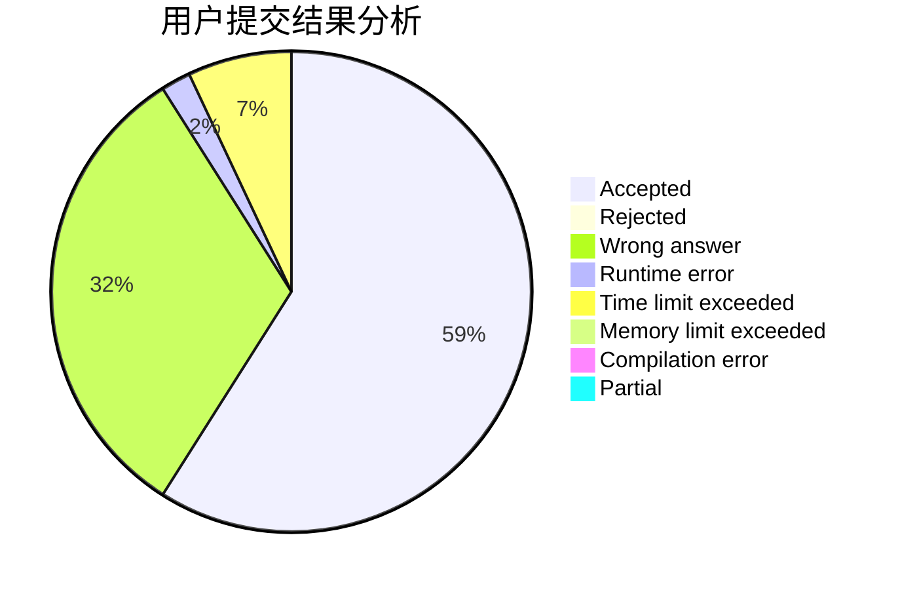
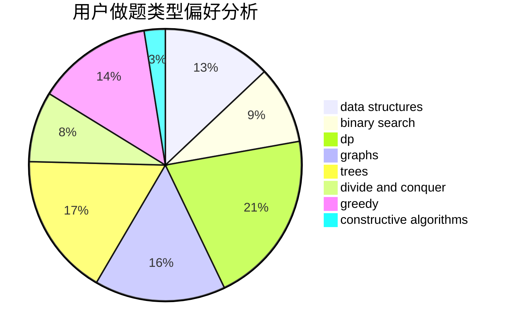
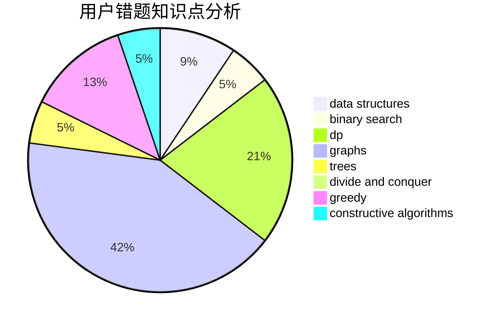

# Momosama

<!-- tabs:start -->

#### **用户提交结果分析**

#### **用户做题类型偏好分析**

#### **用户错题知识点分析**

<!-- tabs:end -->
# 推荐题目
[266B](https://codeforces.com/contest/266/problem/B)		constructive algorithms,
                        graph matchings,
                        implementation,
                        shortest paths		  
[1148B](https://codeforces.com/contest/1148/problem/B)		binary search,
                        brute force,
                        two pointers		  
[1067B](https://codeforces.com/contest/1067/problem/B)		dfs and similar,
                        graphs,
                        shortest paths		  
[1302F](https://codeforces.com/contest/1302/problem/F)		bitmasks,
                        brute force,
                        expression parsing		  
[1013E](https://codeforces.com/contest/1013/problem/E)		dsu,graphs,sortings,trees		  
[1248E](https://codeforces.com/contest/1248/problem/E)		dsu,graphs,sortings,trees		  
[1082F](https://codeforces.com/contest/1082/problem/F)		dp,
                        strings,
                        trees		  
[554A](https://codeforces.com/contest/554/problem/A)		brute force,
                        math,
                        strings		  
[1093G](https://codeforces.com/contest/1093/problem/G)		bitmasks,
                        data structures		  
[405D](https://codeforces.com/contest/405/problem/D)		greedy,
                        implementation,
                        math		  
