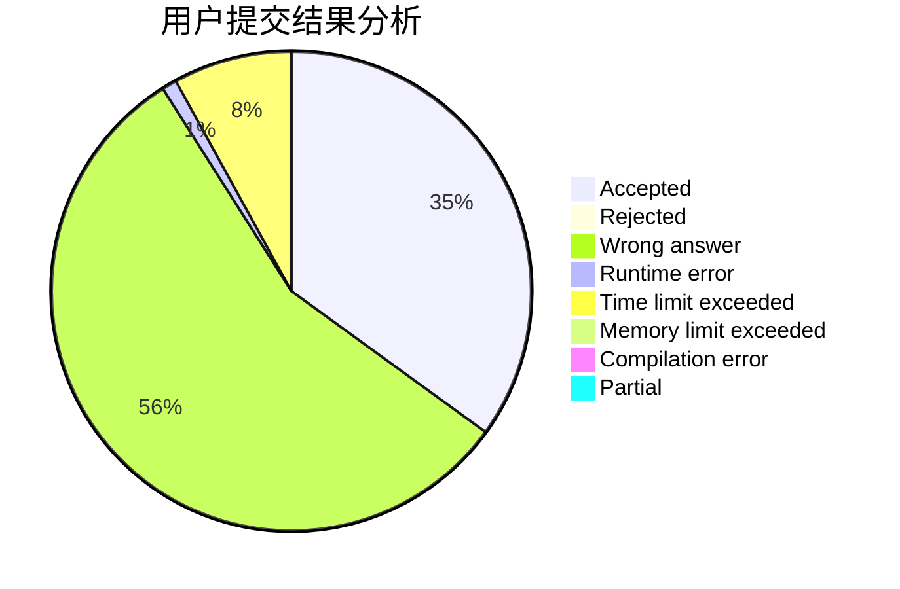
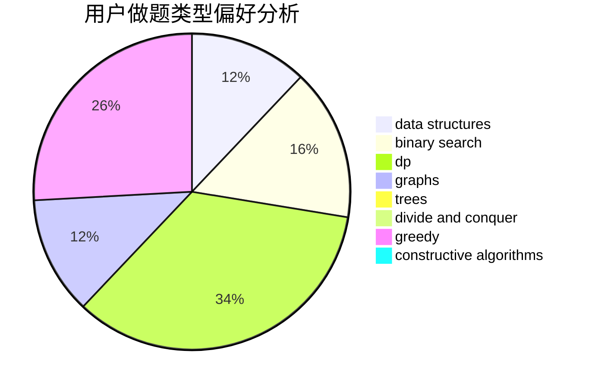

# 8421BCD

<!-- tabs:start -->

#### **用户提交结果分析**

#### **用户做题类型偏好分析**

#### **用户错题知识点分析**

<!-- tabs:end -->
# 推荐题目
[12471](https://codeforces.com/contest/1247/problem/1)		dsu,graphs,sortings,trees		  
[1147D](https://codeforces.com/contest/1147/problem/D)		dfs and similar,
                        graphs		  
[101D](https://codeforces.com/contest/101/problem/D)		dp,
                        greedy,
                        probabilities,
                        sortings,
                        trees		  
[1442D](https://codeforces.com/contest/1442/problem/D)		data structures,
                        divide and conquer,
                        dp,
                        greedy		  
[1442B](https://codeforces.com/contest/1442/problem/B)		combinatorics,
                        data structures,
                        dsu,
                        greedy,
                        implementation		  
[1442C](https://codeforces.com/contest/1442/problem/C)		dfs and similar,
                        graphs,
                        greedy,
                        shortest paths		  
[1407D](https://codeforces.com/contest/1407/problem/D)		data structures,
                        dp,
                        graphs		  
[1442F](https://codeforces.com/contest/1442/problem/F)		games,
                        interactive		  
[1442E](https://codeforces.com/contest/1442/problem/E)		binary search,
                        constructive algorithms,
                        dfs and similar,
                        dp,
                        greedy,
                        trees		  
[1443A](https://codeforces.com/contest/1443/problem/A)		constructive algorithms,
                        math		  
