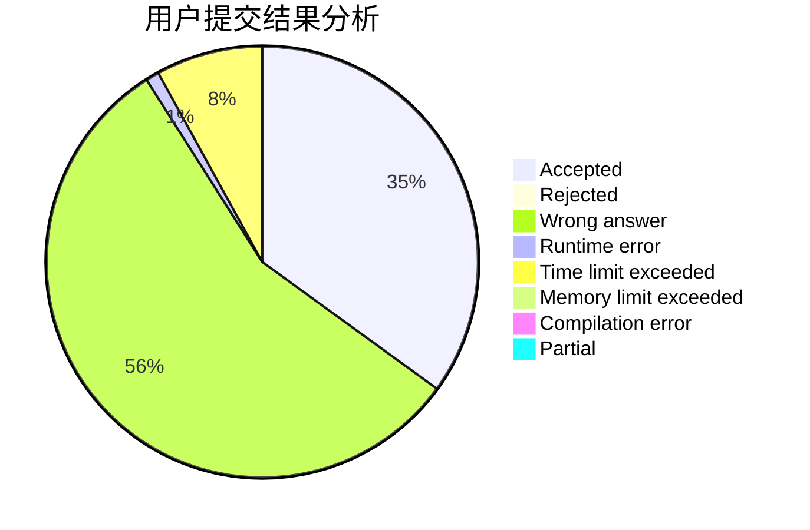
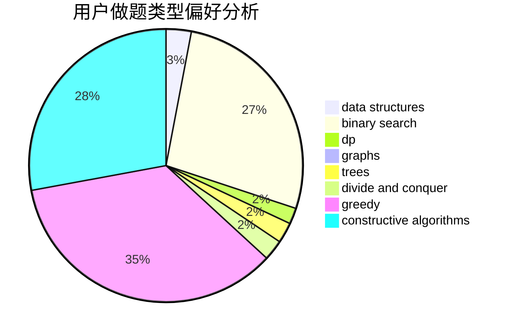

# 8421BCD

<!-- tabs:start -->

#### **用户提交结果分析**

#### **用户做题类型偏好分析**

#### **用户错题知识点分析**

<!-- tabs:end -->
# 推荐题目
[1241C](https://codeforces.com/contest/1241/problem/C)		dsu,graphs,sortings,trees		  
[1145C](https://codeforces.com/contest/1145/problem/C)		bitmasks,
                        brute force		  
[1019D](https://codeforces.com/contest/1019/problem/D)		binary search,
                        geometry,
                        sortings		  
[1432E](https://codeforces.com/contest/1432/problem/E)		dsu,graphs,sortings,trees		  
[1432C](https://codeforces.com/contest/1432/problem/C)		dsu,graphs,sortings,trees		  
[1432D](https://codeforces.com/contest/1432/problem/D)		dsu,graphs,sortings,trees		  
[1398E](https://codeforces.com/contest/1398/problem/E)		binary search,
                        data structures,
                        greedy,
                        implementation,
                        math,
                        sortings		  
[1433A](https://codeforces.com/contest/1433/problem/A)		implementation,
                        math		  
[1432F](https://codeforces.com/contest/1432/problem/F)		dsu,graphs,sortings,trees		  
[1433B](https://codeforces.com/contest/1433/problem/B)		greedy,
                        implementation		  
