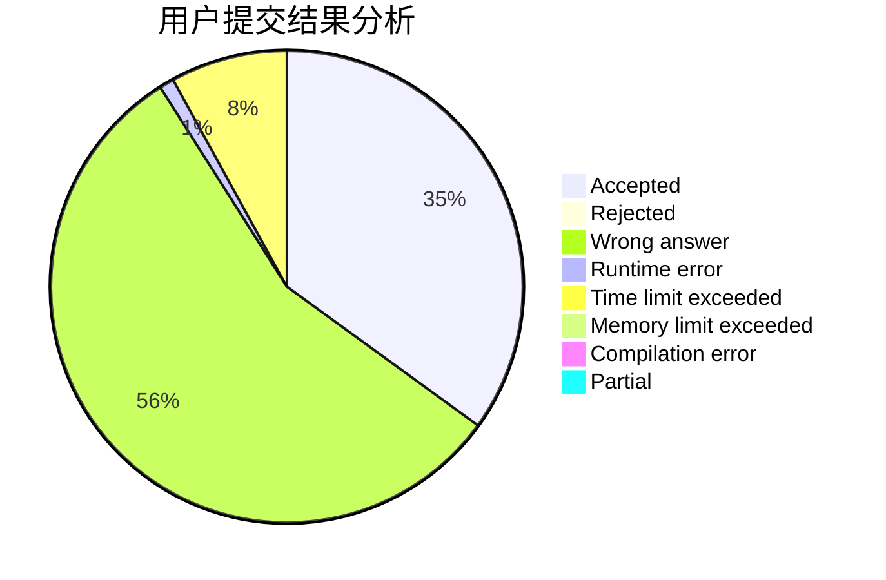
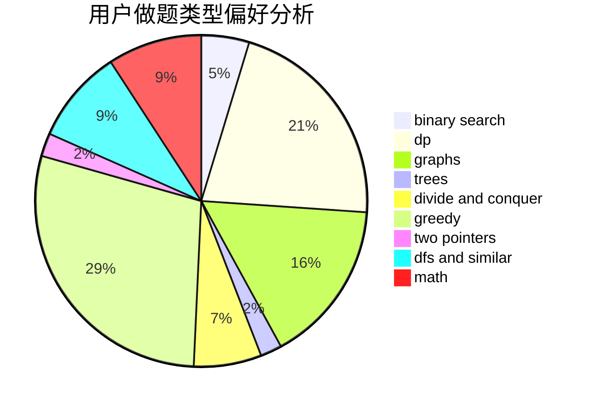

# 8421BCD

<!-- tabs:start -->

#### **用户提交结果分析**

#### **用户做题类型偏好分析**

<!-- tabs:end -->
# 推荐题目
[12471](https://codeforces.com/contest/1247/problem/1)
[1147D](https://codeforces.com/contest/1147/problem/D)
[101D](https://codeforces.com/contest/101/problem/D)
[1442D](https://codeforces.com/contest/1442/problem/D)
[1442B](https://codeforces.com/contest/1442/problem/B)
[1442C](https://codeforces.com/contest/1442/problem/C)
[1407D](https://codeforces.com/contest/1407/problem/D)
[1442F](https://codeforces.com/contest/1442/problem/F)
[1442E](https://codeforces.com/contest/1442/problem/E)
[1443A](https://codeforces.com/contest/1443/problem/A)
