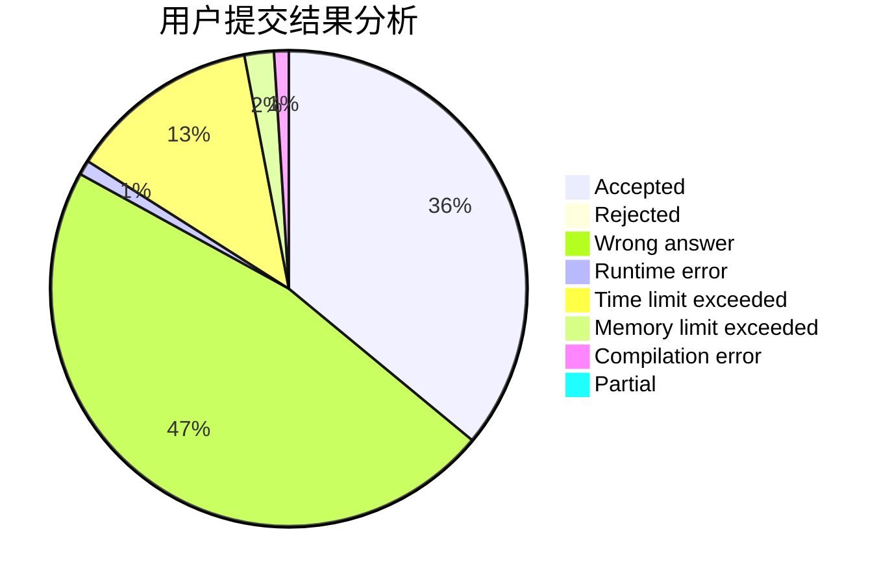
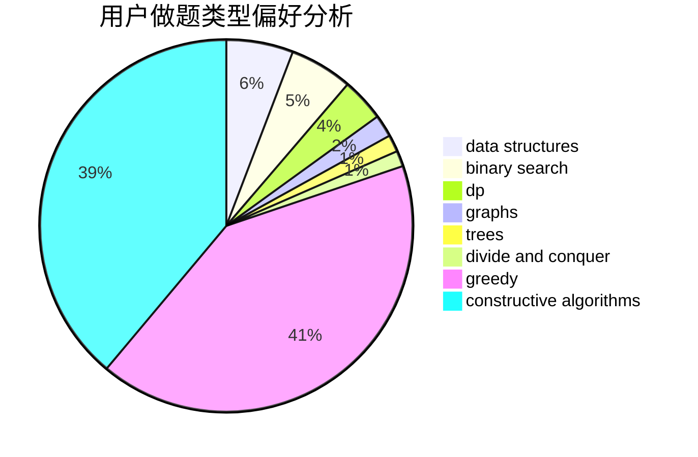

# MonkeyKing

<!-- tabs:start -->

#### **用户提交结果分析**

#### **用户做题类型偏好分析**

#### **用户错题知识点分析**

<!-- tabs:end -->
# 推荐题目
[568B](https://codeforces.com/contest/568/problem/B)		combinatorics,
                        dp,
                        math		  
[1314E](https://codeforces.com/contest/1314/problem/E)		dsu,graphs,sortings,trees		  
[38A](https://codeforces.com/contest/38/problem/A)		implementation		  
[666E](https://codeforces.com/contest/666/problem/E)		data structures,
                        string suffix structures		  
[510D](https://codeforces.com/contest/510/problem/D)		bitmasks,
                        brute force,
                        dp,
                        math		  
[908F](https://codeforces.com/contest/908/problem/F)		graphs,
                        greedy,
                        implementation		  
[1216F](https://codeforces.com/contest/1216/problem/F)		data structures,
                        dp,
                        greedy		  
[343B](https://codeforces.com/contest/343/problem/B)		data structures,
                        greedy,
                        implementation		  
[745C](https://codeforces.com/contest/745/problem/C)		dsu,graphs,sortings,trees		  
[985C](https://codeforces.com/contest/985/problem/C)		greedy		  
