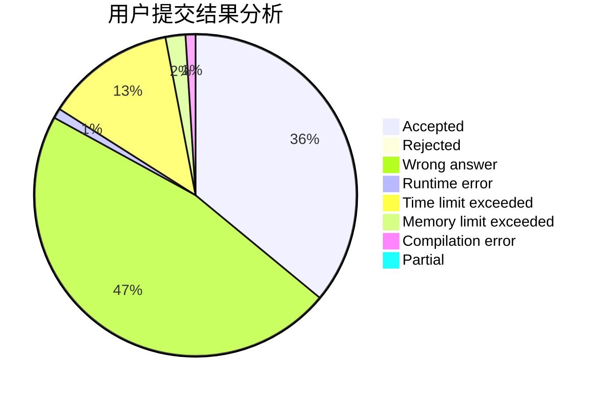
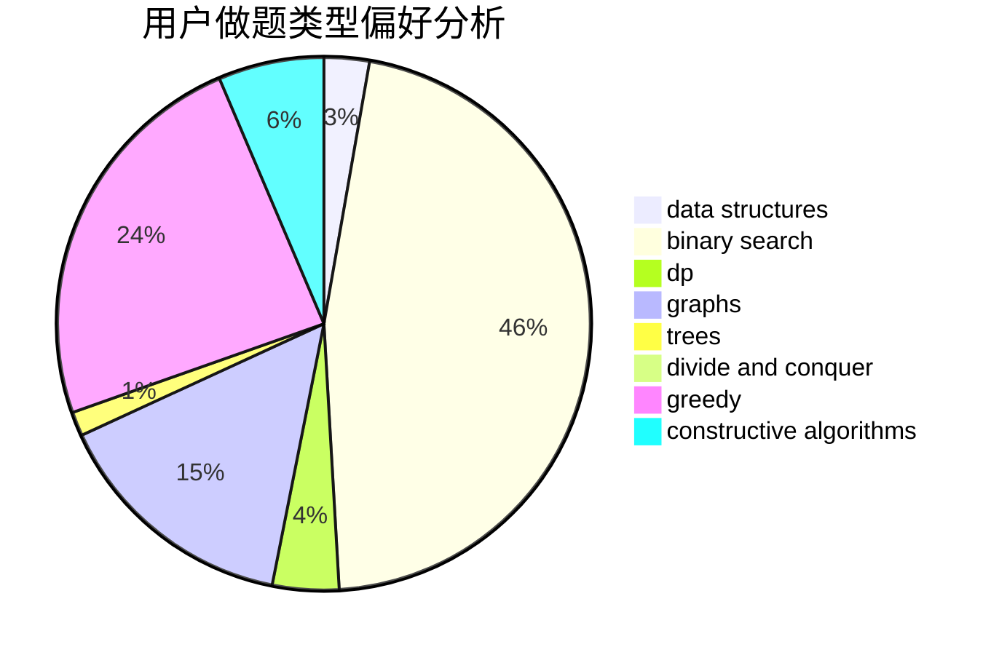
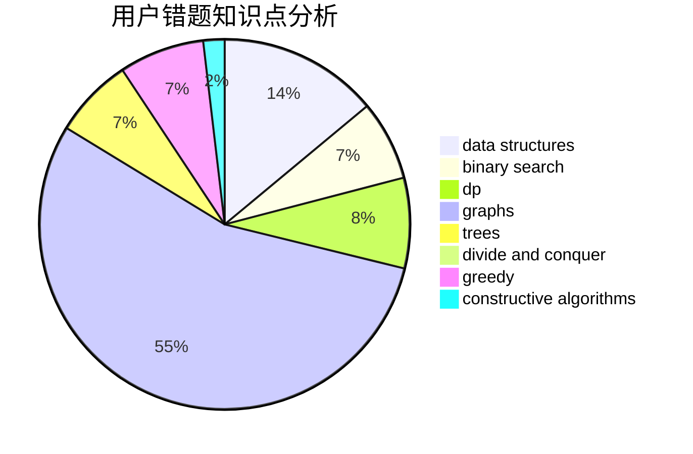

# MonkeyKing

<!-- tabs:start -->

#### **用户提交结果分析**

#### **用户做题类型偏好分析**

#### **用户错题知识点分析**

<!-- tabs:end -->
# 推荐题目
[544A](https://codeforces.com/contest/544/problem/A)		implementation,
                        strings		  
[1305F](https://codeforces.com/contest/1305/problem/F)		math,
                        number theory,
                        probabilities		  
[363B](https://codeforces.com/contest/363/problem/B)		brute force,
                        dp		  
[634B](https://codeforces.com/contest/634/problem/B)		dsu,graphs,sortings,trees		  
[490E](https://codeforces.com/contest/490/problem/E)		binary search,
                        brute force,
                        greedy,
                        implementation		  
[888G](https://codeforces.com/contest/888/problem/G)		bitmasks,
                        constructive algorithms,
                        data structures		  
[1210F2](https://codeforces.com/contest/1210F/problem/2)		brute force,
                        probabilities		  
[316E3](https://codeforces.com/contest/316E/problem/3)		data structures,
                        math		  
[727F](https://codeforces.com/contest/727/problem/F)		binary search,
                        dp,
                        greedy		  
[962D](https://codeforces.com/contest/962/problem/D)		data structures,
                        implementation		  
