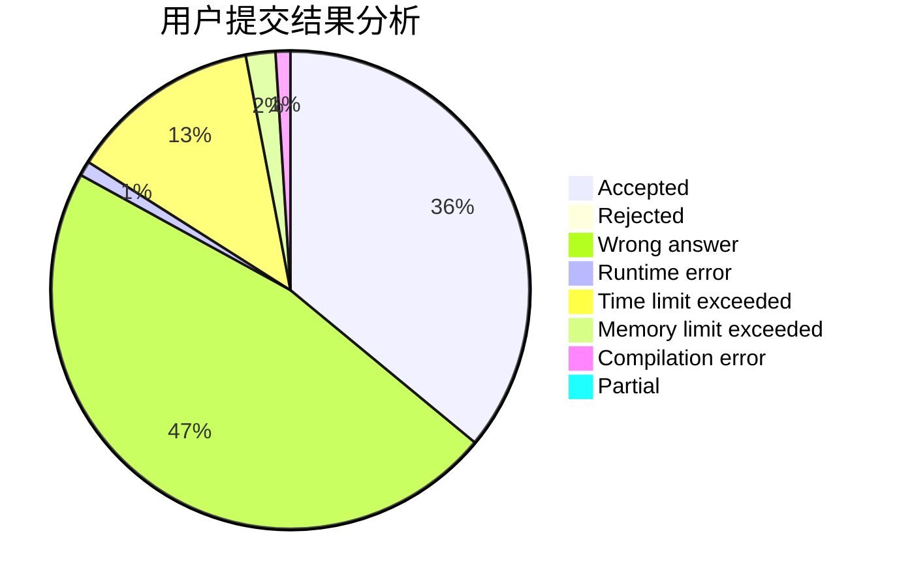
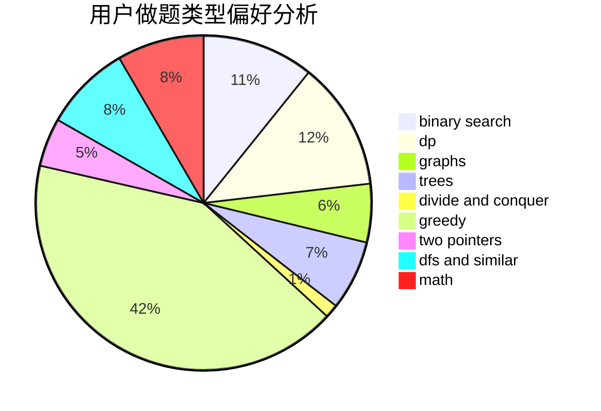

# MonkeyKing

<!-- tabs:start -->

#### **用户提交结果分析**

#### **用户做题类型偏好分析**

<!-- tabs:end -->
# 推荐题目
[568B](https://codeforces.com/contest/568/problem/B)
[1314E](https://codeforces.com/contest/1314/problem/E)
[38A](https://codeforces.com/contest/38/problem/A)
[666E](https://codeforces.com/contest/666/problem/E)
[510D](https://codeforces.com/contest/510/problem/D)
[908F](https://codeforces.com/contest/908/problem/F)
[1216F](https://codeforces.com/contest/1216/problem/F)
[343B](https://codeforces.com/contest/343/problem/B)
[745C](https://codeforces.com/contest/745/problem/C)
[985C](https://codeforces.com/contest/985/problem/C)
