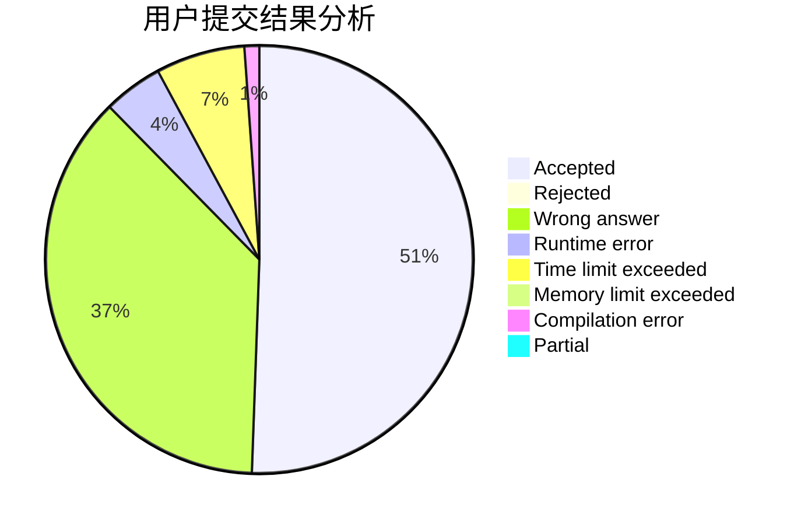
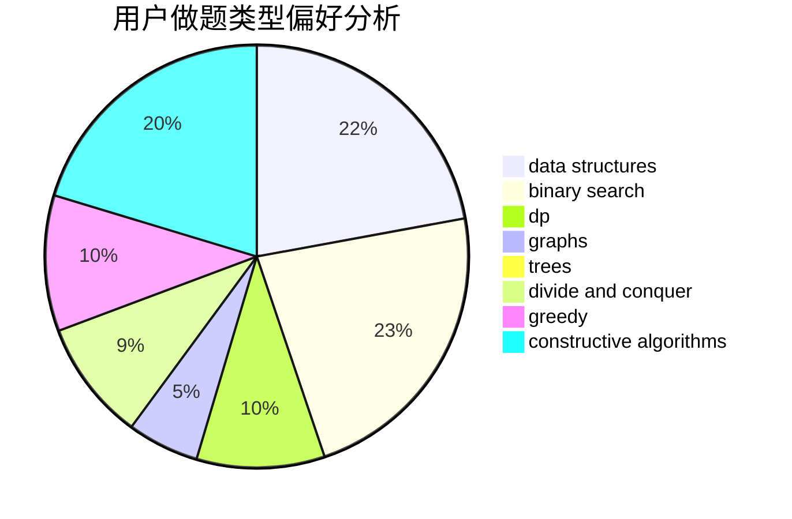
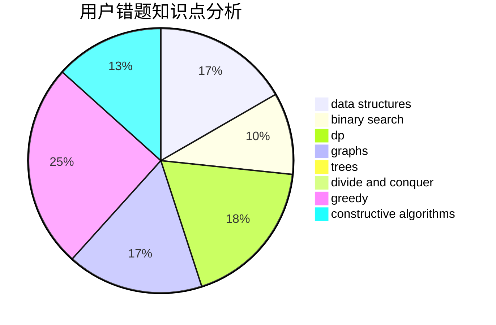

# Monster.

<!-- tabs:start -->

#### **用户提交结果分析**

#### **用户做题类型偏好分析**

#### **用户错题知识点分析**

<!-- tabs:end -->
# 推荐题目
[402C](https://codeforces.com/contest/402/problem/C)		brute force,
                        constructive algorithms,
                        graphs		  
[1245D](https://codeforces.com/contest/1245/problem/D)		dsu,
                        graphs,
                        greedy,
                        shortest paths,
                        trees		  
[1246F](https://codeforces.com/contest/1246/problem/F)		nan		  
[1139A](https://codeforces.com/contest/1139/problem/A)		implementation,
                        strings		  
[225C](https://codeforces.com/contest/225/problem/C)		dp,
                        matrices		  
[1176C](https://codeforces.com/contest/1176/problem/C)		dp,
                        greedy,
                        implementation		  
[729C](https://codeforces.com/contest/729/problem/C)		binary search,
                        greedy,
                        sortings		  
[1203F1](https://codeforces.com/contest/1203F/problem/1)		greedy		  
[504A](https://codeforces.com/contest/504/problem/A)		dsu,graphs,sortings,trees		  
[825F](https://codeforces.com/contest/825/problem/F)		dp,
                        hashing,
                        string suffix structures,
                        strings		  
