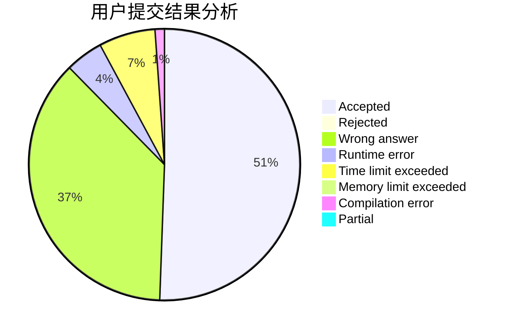
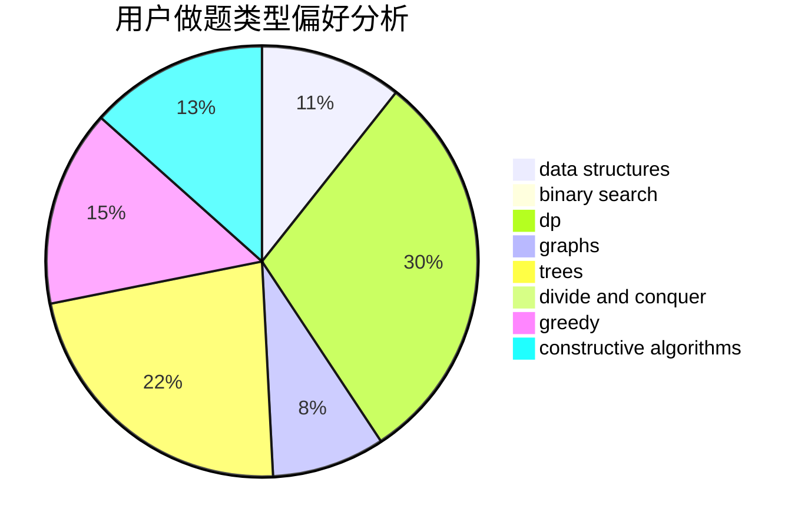
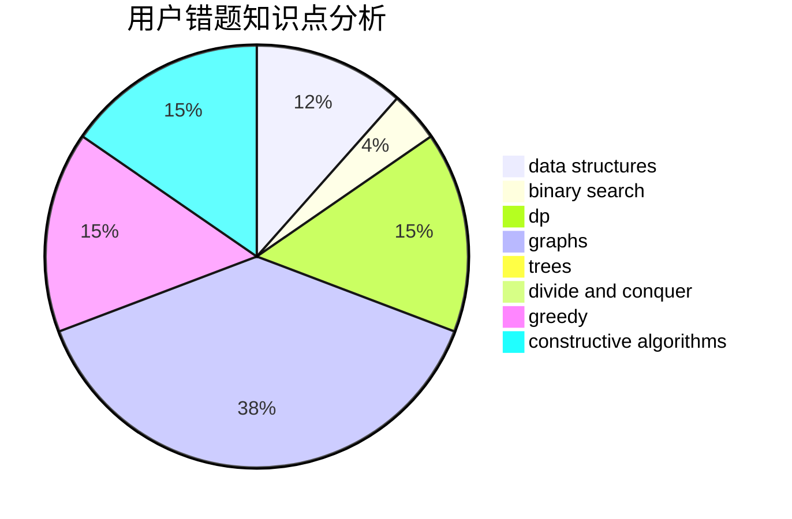

# Monster.

<!-- tabs:start -->

#### **用户提交结果分析**

#### **用户做题类型偏好分析**

#### **用户错题知识点分析**

<!-- tabs:end -->
# 推荐题目
[430C](https://codeforces.com/contest/430/problem/C)		dsu,graphs,sortings,trees		  
[1250F](https://codeforces.com/contest/1250/problem/F)		brute force,
                        implementation		  
[1250N](https://codeforces.com/contest/1250/problem/N)		dfs and similar,
                        graphs,
                        greedy		  
[1140E](https://codeforces.com/contest/1140/problem/E)		combinatorics,
                        divide and conquer,
                        dp		  
[243C](https://codeforces.com/contest/243/problem/C)		dfs and similar,
                        implementation		  
[1179D](https://codeforces.com/contest/1179/problem/D)		data structures,
                        dp,
                        trees		  
[746C](https://codeforces.com/contest/746/problem/C)		constructive algorithms,
                        implementation,
                        math		  
[1208D](https://codeforces.com/contest/1208/problem/D)		binary search,
                        data structures,
                        greedy,
                        implementation		  
[524E](https://codeforces.com/contest/524/problem/E)		data structures,
                        sortings		  
[845B](https://codeforces.com/contest/845/problem/B)		brute force,
                        greedy,
                        implementation		  
