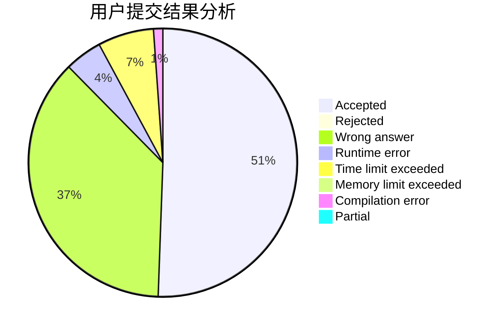
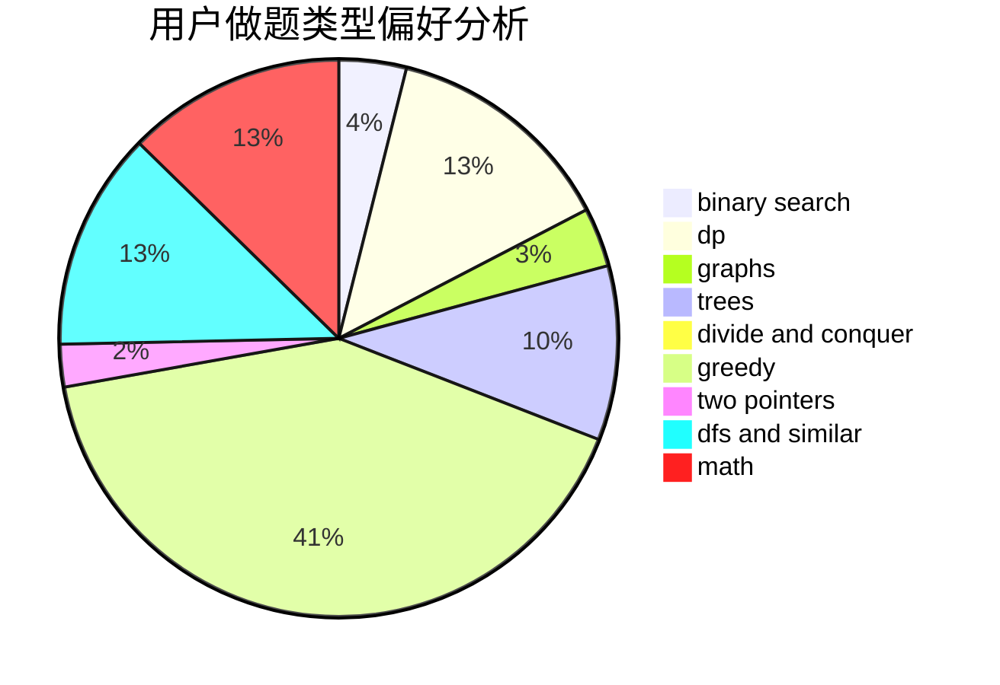

# Monster.

<!-- tabs:start -->

#### **用户提交结果分析**

#### **用户做题类型偏好分析**

<!-- tabs:end -->
# 推荐题目
[430C](https://codeforces.com/contest/430/problem/C)
[1250F](https://codeforces.com/contest/1250/problem/F)
[1250N](https://codeforces.com/contest/1250/problem/N)
[1140E](https://codeforces.com/contest/1140/problem/E)
[243C](https://codeforces.com/contest/243/problem/C)
[1179D](https://codeforces.com/contest/1179/problem/D)
[746C](https://codeforces.com/contest/746/problem/C)
[1208D](https://codeforces.com/contest/1208/problem/D)
[524E](https://codeforces.com/contest/524/problem/E)
[845B](https://codeforces.com/contest/845/problem/B)
