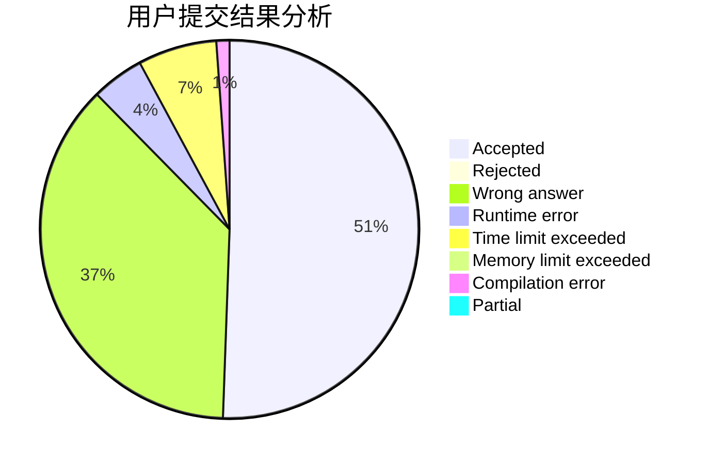
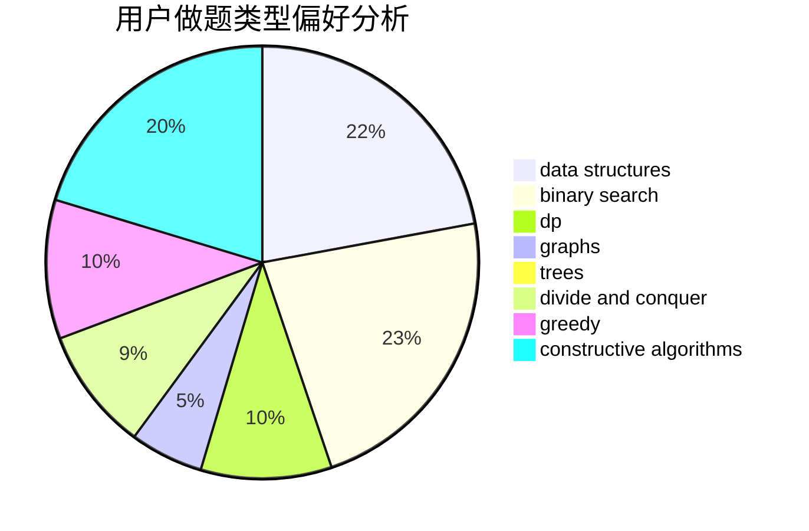
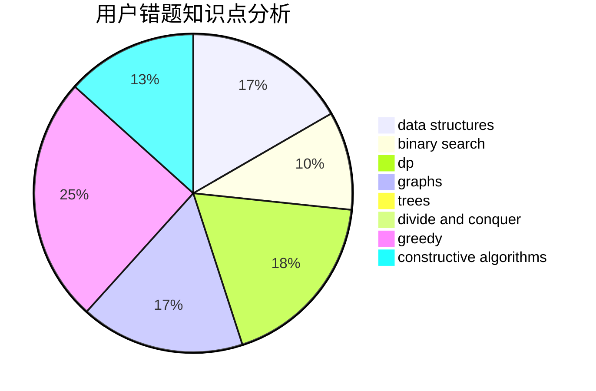

# Monster.
<!-- tabs:start -->
#### **用户提交结果分析**

#### **用户做题类型偏好分析**

#### **用户错题知识点分析**

<!-- tabs:end -->
# 推荐题目
[Searching for Graph](http://codeforces.com/problemset/problem/402/C)		brute force,
                        constructive algorithms,
                        graphs		  
[Elections](http://codeforces.com/problemset/problem/1043/A)		implementation,
                        math		  
[Bash's Big Day](http://codeforces.com/problemset/problem/757/B)		greedy,
                        math,
                        number theory		  
[Jury Size](http://codeforces.com/problemset/problem/254/B)		brute force,
                        implementation		  
[Barcode](http://codeforces.com/problemset/problem/225/C)		dp,
                        matrices		  
[Even Substrings](http://codeforces.com/problemset/problem/1139/A)		implementation,
                        strings		  
[Messy](https://codeforces.com/contest/1262/problem/C)		constructive algorithms		  
[Heidi Learns Hashing (Easy)](http://codeforces.com/problemset/problem/1184/A1)		brute force,
                        math,
                        number theory		  
[String Compression](http://codeforces.com/problemset/problem/825/F)		dp,
                        hashing,
                        string suffix structures,
                        strings		  
[Sagheer and Apple Tree](http://codeforces.com/problemset/problem/812/E)		games,
                        trees		  
<!-- tabs:start -->
#### **data structures**
[Searching for Graph](http://codeforces.com/problemset/problem/274/E)		data structures,
                        implementation		  
[Elections](https://codeforces.com/contest/504/problem/A)		constructive algorithms,
                        data structures,
                        greedy,
                        sortings,
                        trees		  
[Bash's Big Day](http://codeforces.com/problemset/problem/1252/C)		data structures,
                        implementation		  
[Jury Size](http://codeforces.com/problemset/problem/1388/D)		data structures,
                        dfs and similar,
                        graphs,
                        greedy,
                        implementation,
                        trees		  
[Barcode](http://codeforces.com/problemset/problem/193/D)		data structures		  
[Even Substrings](http://codeforces.com/problemset/problem/763/D)		data structures,
                        graphs,
                        hashing,
                        shortest paths,
                        trees		  
[Messy](http://codeforces.com/problemset/problem/1379/C)		binary search,
                        brute force,
                        data structures,
                        dfs and similar,
                        dp,
                        greedy,
                        sortings,
                        two pointers		  
[Heidi Learns Hashing (Easy)](http://codeforces.com/problemset/problem/1492/C)		binary search,
                        data structures,
                        dp,
                        greedy,
                        two pointers		  
[String Compression](http://codeforces.com/problemset/problem/1490/G)		binary search,
                        data structures,
                        math		  
[Sagheer and Apple Tree](http://codeforces.com/problemset/problem/1479/D)		binary search,
                        bitmasks,
                        brute force,
                        data structures,
                        probabilities,
                        trees		  
#### **binary search**
[Searching for Graph](http://codeforces.com/problemset/problem/729/C)		binary search,
                        greedy,
                        sortings		  
[Elections](https://codeforces.com/contest/1345/problem/F)		binary search,
                        greedy,
                        math		  
[Bash's Big Day](http://codeforces.com/problemset/problem/1379/C)		binary search,
                        brute force,
                        data structures,
                        dfs and similar,
                        dp,
                        greedy,
                        sortings,
                        two pointers		  
[Jury Size](http://codeforces.com/problemset/problem/1492/C)		binary search,
                        data structures,
                        dp,
                        greedy,
                        two pointers		  
[Barcode](http://codeforces.com/problemset/problem/1463/D)		binary search,
                        constructive algorithms,
                        greedy,
                        two pointers		  
[Even Substrings](http://codeforces.com/problemset/problem/1490/G)		binary search,
                        data structures,
                        math		  
[Messy](http://codeforces.com/problemset/problem/1479/D)		binary search,
                        bitmasks,
                        brute force,
                        data structures,
                        probabilities,
                        trees		  
[Heidi Learns Hashing (Easy)](http://codeforces.com/problemset/problem/1436/E)		binary search,
                        data structures,
                        two pointers		  
[String Compression](http://codeforces.com/problemset/problem/1461/D)		binary search,
                        brute force,
                        data structures,
                        divide and conquer,
                        implementation,
                        sortings		  
[Sagheer and Apple Tree](http://codeforces.com/problemset/problem/1493/C)		binary search,
                        brute force,
                        constructive algorithms,
                        greedy,
                        strings		  
#### **dp**
[Searching for Graph](http://codeforces.com/problemset/problem/225/C)		dp,
                        matrices		  
[Elections](http://codeforces.com/problemset/problem/825/F)		dp,
                        hashing,
                        string suffix structures,
                        strings		  
[Bash's Big Day](http://codeforces.com/problemset/problem/93/E)		dp,
                        math,
                        number theory		  
[Jury Size](http://codeforces.com/problemset/problem/78/C)		dp,
                        games,
                        number theory		  
[Barcode](http://codeforces.com/problemset/problem/1176/C)		dp,
                        greedy,
                        implementation		  
[Even Substrings](http://codeforces.com/problemset/problem/1379/C)		binary search,
                        brute force,
                        data structures,
                        dfs and similar,
                        dp,
                        greedy,
                        sortings,
                        two pointers		  
[Messy](http://codeforces.com/problemset/problem/1510/H)		dp		  
[Heidi Learns Hashing (Easy)](http://codeforces.com/problemset/problem/1492/C)		binary search,
                        data structures,
                        dp,
                        greedy,
                        two pointers		  
[String Compression](https://codeforces.com/contest/1457/problem/C)		brute force,
                        dp,
                        implementation		  
[Sagheer and Apple Tree](http://codeforces.com/problemset/problem/1491/C)		brute force,
                        data structures,
                        dp,
                        greedy,
                        implementation		  
#### **graph**
[Searching for Graph](http://codeforces.com/problemset/problem/402/C)		brute force,
                        constructive algorithms,
                        graphs		  
[Elections](http://codeforces.com/problemset/problem/1388/D)		data structures,
                        dfs and similar,
                        graphs,
                        greedy,
                        implementation,
                        trees		  
[Bash's Big Day](https://codeforces.com/contest/438/problem/A)		graphs,
                        greedy,
                        sortings		  
[Jury Size](http://codeforces.com/problemset/problem/269/C)		constructive algorithms,
                        flows,
                        graphs,
                        greedy		  
[Barcode](http://codeforces.com/problemset/problem/1477/D)		constructive algorithms,
                        dfs and similar,
                        graphs		  
[Even Substrings](http://codeforces.com/problemset/problem/1245/D)		dsu,
                        graphs,
                        greedy,
                        shortest paths,
                        trees		  
[Messy](http://codeforces.com/problemset/problem/763/D)		data structures,
                        graphs,
                        hashing,
                        shortest paths,
                        trees		  
[Heidi Learns Hashing (Easy)](http://codeforces.com/problemset/problem/1487/C)		brute force,
                        constructive algorithms,
                        dfs and similar,
                        graphs,
                        greedy,
                        implementation,
                        math		  
[String Compression](http://codeforces.com/problemset/problem/1437/C)		dp,
                        flows,
                        graph matchings,
                        greedy,
                        math,
                        sortings		  
[Sagheer and Apple Tree](http://codeforces.com/problemset/problem/1470/D)		constructive algorithms,
                        dfs and similar,
                        graph matchings,
                        graphs,
                        greedy		  
#### **trees**
[Searching for Graph](http://codeforces.com/problemset/problem/812/E)		games,
                        trees		  
[Elections](https://codeforces.com/contest/504/problem/A)		constructive algorithms,
                        data structures,
                        greedy,
                        sortings,
                        trees		  
[Bash's Big Day](http://codeforces.com/problemset/problem/1388/D)		data structures,
                        dfs and similar,
                        graphs,
                        greedy,
                        implementation,
                        trees		  
[Jury Size](http://codeforces.com/problemset/problem/1245/D)		dsu,
                        graphs,
                        greedy,
                        shortest paths,
                        trees		  
[Barcode](http://codeforces.com/problemset/problem/763/D)		data structures,
                        graphs,
                        hashing,
                        shortest paths,
                        trees		  
[Even Substrings](http://codeforces.com/problemset/problem/1479/D)		binary search,
                        bitmasks,
                        brute force,
                        data structures,
                        probabilities,
                        trees		  
[Messy](http://codeforces.com/problemset/problem/1511/C)		brute force,
                        data structures,
                        implementation,
                        trees		  
[Heidi Learns Hashing (Easy)](http://codeforces.com/problemset/problem/1499/F)		combinatorics,
                        dfs and similar,
                        dp,
                        trees		  
[String Compression](http://codeforces.com/problemset/problem/1491/E)		brute force,
                        dfs and similar,
                        divide and conquer,
                        number theory,
                        trees		  
[Sagheer and Apple Tree](http://codeforces.com/problemset/problem/1466/D)		data structures,
                        greedy,
                        sortings,
                        trees		  
#### **divide and conquer**
[Searching for Graph](http://codeforces.com/problemset/problem/1461/D)		binary search,
                        brute force,
                        data structures,
                        divide and conquer,
                        implementation,
                        sortings		  
[Elections](http://codeforces.com/problemset/problem/1466/G)		combinatorics,
                        divide and conquer,
                        hashing,
                        math,
                        string suffix structures,
                        strings		  
[Bash's Big Day](http://codeforces.com/problemset/problem/1490/D)		dfs and similar,
                        divide and conquer,
                        implementation		  
[Jury Size](https://codeforces.com/contest/1483/problem/C)		data structures,
                        divide and conquer,
                        dp		  
[Barcode](http://codeforces.com/problemset/problem/1491/E)		brute force,
                        dfs and similar,
                        divide and conquer,
                        number theory,
                        trees		  
[Even Substrings](http://codeforces.com/problemset/problem/1303/G)		data structures,
                        divide and conquer,
                        geometry,
                        trees		  
[Messy](http://codeforces.com/problemset/problem/1494/D)		constructive algorithms,
                        data structures,
                        dfs and similar,
                        divide and conquer,
                        dsu,
                        greedy,
                        sortings,
                        trees		  
[Heidi Learns Hashing (Easy)](http://codeforces.com/problemset/problem/1482/E)		data structures,
                        divide and conquer,
                        dp		  
[String Compression](http://codeforces.com/problemset/problem/566/C)		dfs and similar,
                        divide and conquer,
                        trees		  
[Sagheer and Apple Tree](http://codeforces.com/problemset/problem/1428/F)		binary search,
                        data structures,
                        divide and conquer,
                        dp,
                        two pointers		  
#### **greedy**
[Searching for Graph](http://codeforces.com/problemset/problem/757/B)		greedy,
                        math,
                        number theory		  
[Elections](http://codeforces.com/problemset/problem/1003/D)		greedy		  
[Bash's Big Day](http://codeforces.com/problemset/problem/729/C)		binary search,
                        greedy,
                        sortings		  
[Jury Size](https://codeforces.com/contest/1345/problem/F)		binary search,
                        greedy,
                        math		  
[Barcode](https://codeforces.com/contest/504/problem/A)		constructive algorithms,
                        data structures,
                        greedy,
                        sortings,
                        trees		  
[Even Substrings](http://codeforces.com/problemset/problem/1388/D)		data structures,
                        dfs and similar,
                        graphs,
                        greedy,
                        implementation,
                        trees		  
[Messy](https://codeforces.com/contest/438/problem/A)		graphs,
                        greedy,
                        sortings		  
[Heidi Learns Hashing (Easy)](http://codeforces.com/problemset/problem/269/C)		constructive algorithms,
                        flows,
                        graphs,
                        greedy		  
[String Compression](http://codeforces.com/problemset/problem/1176/C)		dp,
                        greedy,
                        implementation		  
[Sagheer and Apple Tree](http://codeforces.com/problemset/problem/1401/B)		constructive algorithms,
                        greedy,
                        math		  
#### **constructive algorithms**
[Searching for Graph](http://codeforces.com/problemset/problem/402/C)		brute force,
                        constructive algorithms,
                        graphs		  
[Elections](https://codeforces.com/contest/1262/problem/C)		constructive algorithms		  
[Bash's Big Day](https://codeforces.com/contest/504/problem/A)		constructive algorithms,
                        data structures,
                        greedy,
                        sortings,
                        trees		  
[Jury Size](http://codeforces.com/problemset/problem/269/C)		constructive algorithms,
                        flows,
                        graphs,
                        greedy		  
[Barcode](http://codeforces.com/problemset/problem/1401/B)		constructive algorithms,
                        greedy,
                        math		  
[Even Substrings](http://codeforces.com/problemset/problem/1477/D)		constructive algorithms,
                        dfs and similar,
                        graphs		  
[Messy](http://codeforces.com/problemset/problem/1493/A)		constructive algorithms,
                        greedy		  
[Heidi Learns Hashing (Easy)](http://codeforces.com/problemset/problem/1463/D)		binary search,
                        constructive algorithms,
                        greedy,
                        two pointers		  
[String Compression](https://codeforces.com/contest/1456/problem/B)		bitmasks,
                        brute force,
                        constructive algorithms		  
[Sagheer and Apple Tree](http://codeforces.com/problemset/problem/1492/D)		bitmasks,
                        constructive algorithms,
                        greedy,
                        math		  
#### **sortings**
[Searching for Graph](http://codeforces.com/problemset/problem/729/C)		binary search,
                        greedy,
                        sortings		  
[Elections](https://codeforces.com/contest/504/problem/A)		constructive algorithms,
                        data structures,
                        greedy,
                        sortings,
                        trees		  
[Bash's Big Day](https://codeforces.com/contest/438/problem/A)		graphs,
                        greedy,
                        sortings		  
[Jury Size](http://codeforces.com/problemset/problem/1478/C)		implementation,
                        math,
                        sortings		  
[Barcode](http://codeforces.com/problemset/problem/1379/C)		binary search,
                        brute force,
                        data structures,
                        dfs and similar,
                        dp,
                        greedy,
                        sortings,
                        two pointers		  
[Even Substrings](https://codeforces.com/contest/1496/problem/C)		geometry,
                        greedy,
                        math,
                        sortings		  
[Messy](http://codeforces.com/problemset/problem/1495/A)		geometry,
                        greedy,
                        math,
                        sortings		  
[Heidi Learns Hashing (Easy)](http://codeforces.com/problemset/problem/1497/A)		brute force,
                        data structures,
                        greedy,
                        sortings		  
[String Compression](http://codeforces.com/problemset/problem/1427/A)		math,
                        sortings		  
[Sagheer and Apple Tree](http://codeforces.com/problemset/problem/1461/D)		binary search,
                        brute force,
                        data structures,
                        divide and conquer,
                        implementation,
                        sortings		  
<!-- tabs:end -->
