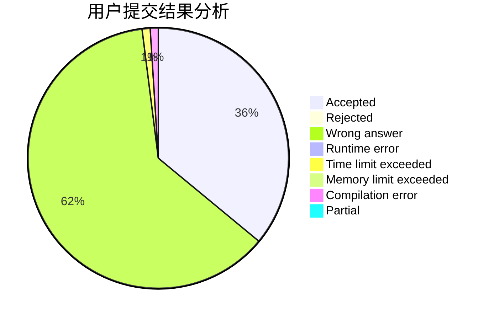
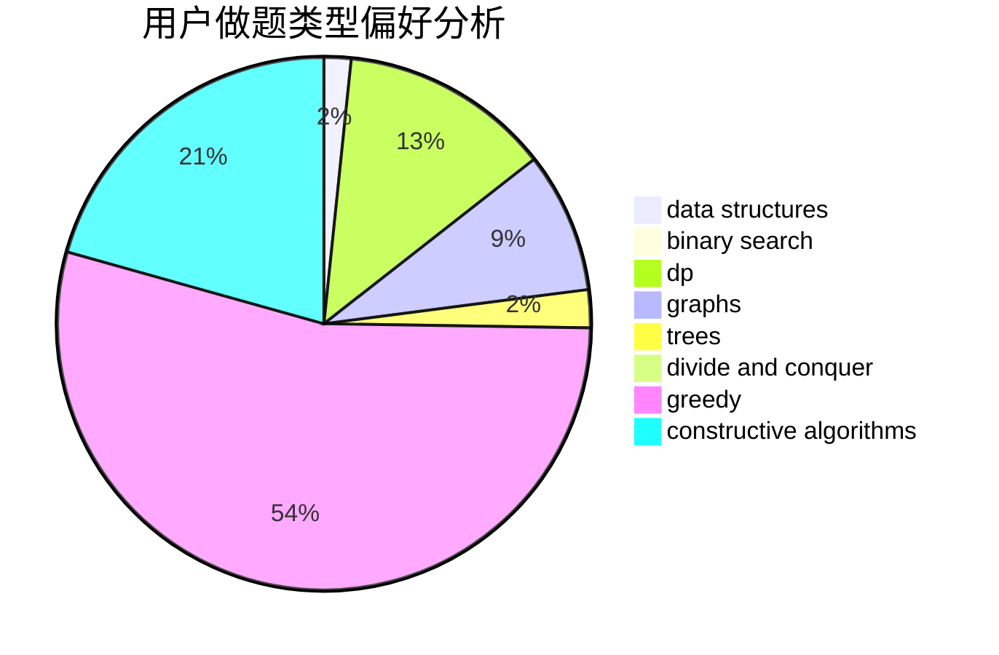
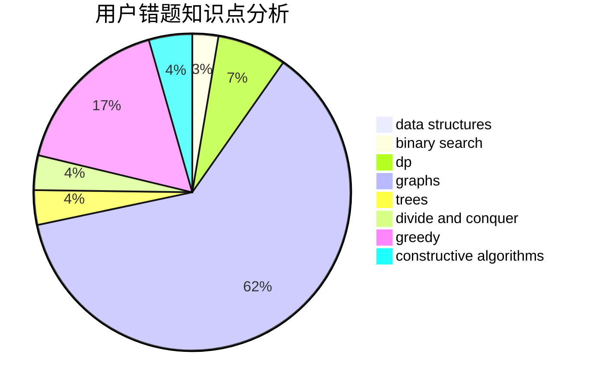

# Monster__Qi

<!-- tabs:start -->

#### **用户提交结果分析**

#### **用户做题类型偏好分析**

#### **用户错题知识点分析**

<!-- tabs:end -->
# 推荐题目
[1513D](https://codeforces.com/contest/1513/problem/D)		constructive algorithms,
                        dsu,
                        graphs,
                        greedy,
                        number theory,
                        sortings		  
[1007C](https://codeforces.com/contest/1007/problem/C)		binary search,
                        interactive		  
[1345B](https://codeforces.com/contest/1345/problem/B)		binary search,
                        brute force,
                        dp,
                        math		  
[1182A](https://codeforces.com/contest/1182/problem/A)		dp,
                        math		  
[1385F](https://codeforces.com/contest/1385/problem/F)		data structures,
                        greedy,
                        implementation,
                        trees		  
[264E](https://codeforces.com/contest/264/problem/E)		data structures,
                        dp		  
[710E](https://codeforces.com/contest/710/problem/E)		dfs and similar,
                        dp		  
[5131](https://codeforces.com/contest/513/problem/1)		dsu,graphs,sortings,trees		  
[404C](https://codeforces.com/contest/404/problem/C)		dfs and similar,
                        graphs,
                        sortings		  
[118C](https://codeforces.com/contest/118/problem/C)		brute force,
                        greedy,
                        sortings,
                        strings		  
