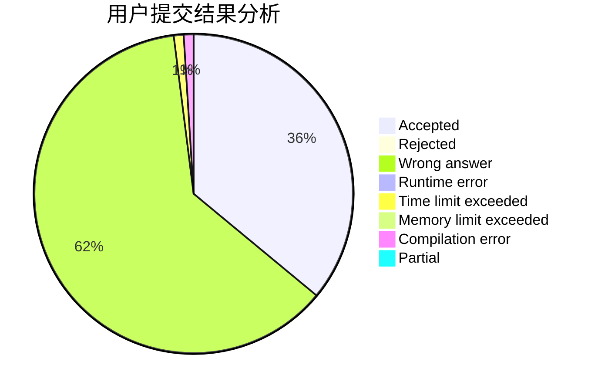
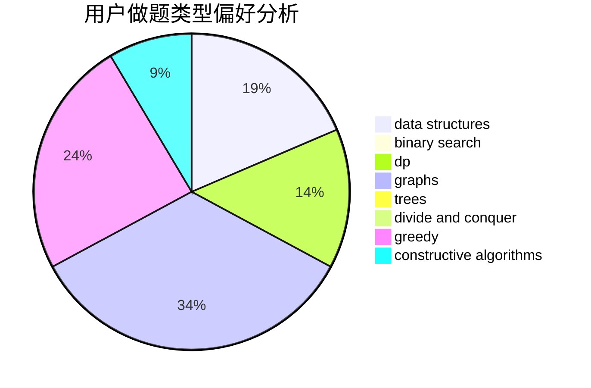
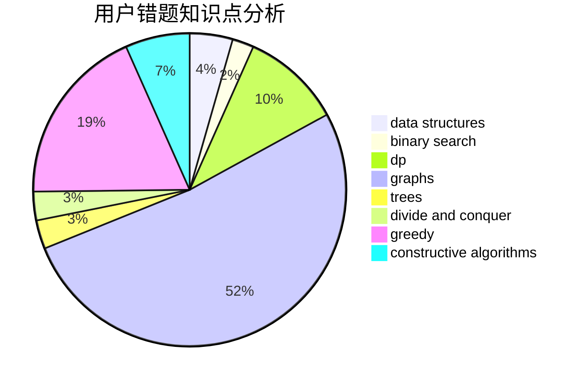

# Monster__Qi

<!-- tabs:start -->

#### **用户提交结果分析**

#### **用户做题类型偏好分析**

#### **用户错题知识点分析**

<!-- tabs:end -->
# 推荐题目
[1504E](https://codeforces.com/contest/1504/problem/E)		dsu,graphs,sortings,trees		  
[1006E](https://codeforces.com/contest/1006/problem/E)		dfs and similar,
                        graphs,
                        trees		  
[1338A](https://codeforces.com/contest/1338/problem/A)		greedy,
                        math		  
[1179B](https://codeforces.com/contest/1179/problem/B)		constructive algorithms		  
[1376B2](https://codeforces.com/contest/1376B/problem/2)		dsu,graphs,sortings,trees		  
[243D](https://codeforces.com/contest/243/problem/D)		data structures,
                        dp,
                        geometry,
                        two pointers		  
[691A](https://codeforces.com/contest/691/problem/A)		implementation		  
[492D](https://codeforces.com/contest/492/problem/D)		binary search,
                        implementation,
                        math,
                        sortings		  
[376A](https://codeforces.com/contest/376/problem/A)		implementation,
                        math		  
[1185G2](https://codeforces.com/contest/1185G/problem/2)		combinatorics,
                        dp		  
