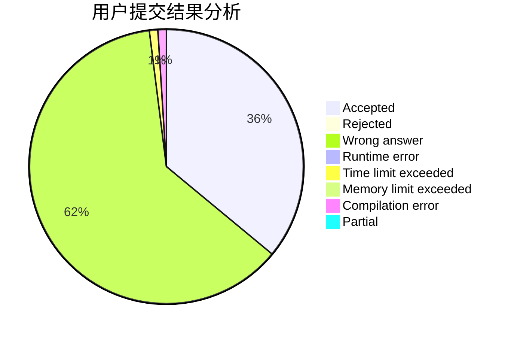
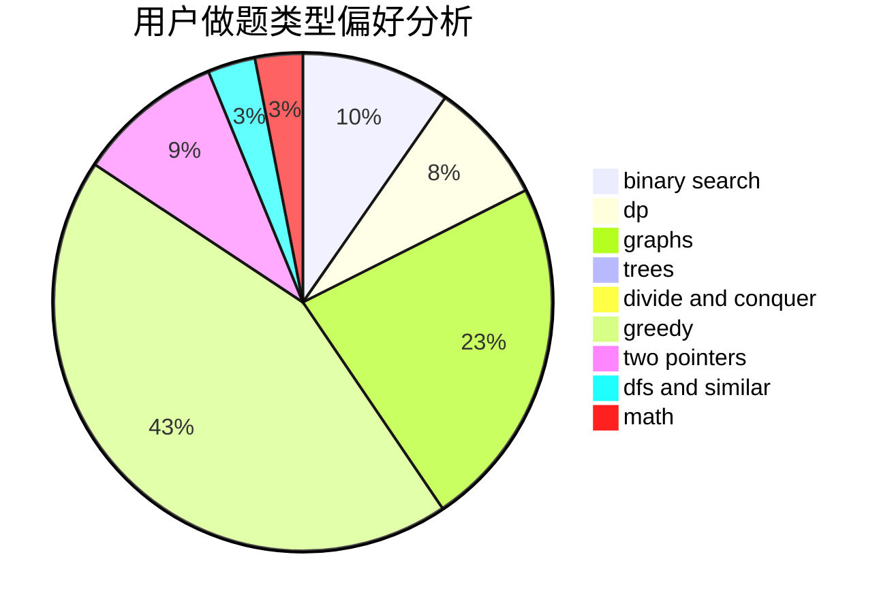

# Monster__Qi

<!-- tabs:start -->

#### **用户提交结果分析**

#### **用户做题类型偏好分析**

<!-- tabs:end -->
# 推荐题目
[1513D](https://codeforces.com/contest/1513/problem/D)
[1007C](https://codeforces.com/contest/1007/problem/C)
[1345B](https://codeforces.com/contest/1345/problem/B)
[1182A](https://codeforces.com/contest/1182/problem/A)
[1385F](https://codeforces.com/contest/1385/problem/F)
[264E](https://codeforces.com/contest/264/problem/E)
[710E](https://codeforces.com/contest/710/problem/E)
[5131](https://codeforces.com/contest/513/problem/1)
[404C](https://codeforces.com/contest/404/problem/C)
[118C](https://codeforces.com/contest/118/problem/C)
