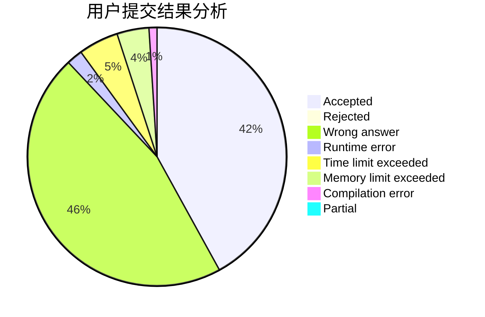
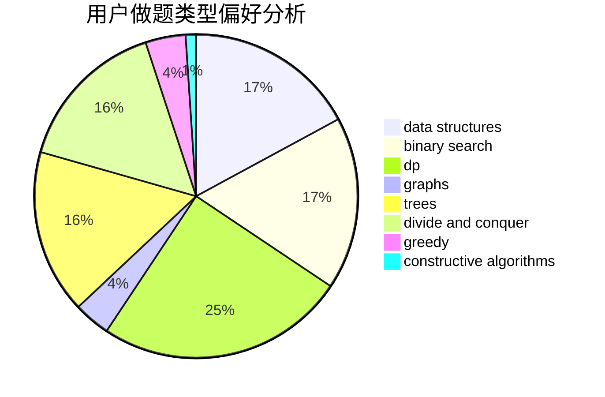
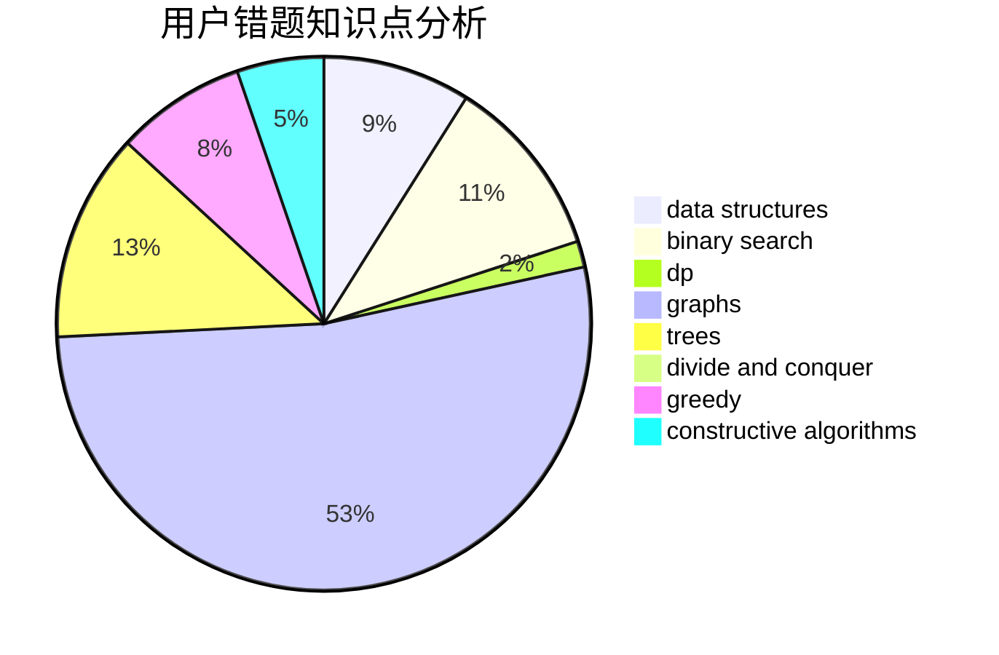

# Moon1125666900
<!-- tabs:start -->
#### **用户提交结果分析**

#### **用户做题类型偏好分析**

#### **用户错题知识点分析**

<!-- tabs:end -->
# 推荐题目
[Two Regular Polygons](http://codeforces.com/problemset/problem/1312/A)		geometry,
                        greedy,
                        math,
                        number theory		  
[Sereja and Sets](http://codeforces.com/problemset/problem/367/D)		bitmasks,
                        dfs and similar		  
[Blown Garland](http://codeforces.com/problemset/problem/758/B)		brute force,
                        implementation,
                        number theory		  
[Kamil and Making a Stream](https://codeforces.com/contest/1230/problem/E)		math,
                        number theory,
                        trees		  
[Not simply beatiful strings](http://codeforces.com/problemset/problem/955/B)		implementation		  
[Painting Eggs](http://codeforces.com/problemset/problem/282/B)		greedy,
                        math		  
[Ilya And The Tree](http://codeforces.com/problemset/problem/842/C)		dfs and similar,
                        graphs,
                        math,
                        number theory,
                        trees		  
[Petya and Exam](http://codeforces.com/problemset/problem/832/B)		implementation,
                        strings		  
[Anti-Palindromize](http://codeforces.com/problemset/problem/884/F)		flows,
                        graphs,
                        greedy		  
[Monitor](http://codeforces.com/problemset/problem/16/C)		binary search,
                        number theory		  
<!-- tabs:start -->
#### **data structures**
[Two Regular Polygons](http://codeforces.com/problemset/problem/958/C3)		data structures,
                        dp		  
[Sereja and Sets](http://codeforces.com/problemset/problem/785/E)		brute force,
                        data structures		  
[Blown Garland](http://codeforces.com/problemset/problem/954/G)		binary search,
                        data structures,
                        greedy,
                        two pointers		  
[Kamil and Making a Stream](http://codeforces.com/problemset/problem/1399/E1)		data structures,
                        dfs and similar,
                        greedy,
                        trees		  
[Not simply beatiful strings](http://codeforces.com/problemset/problem/1492/C)		binary search,
                        data structures,
                        dp,
                        greedy,
                        two pointers		  
[Painting Eggs](http://codeforces.com/problemset/problem/1490/G)		binary search,
                        data structures,
                        math		  
[Ilya And The Tree](http://codeforces.com/problemset/problem/1479/D)		binary search,
                        bitmasks,
                        brute force,
                        data structures,
                        probabilities,
                        trees		  
[Petya and Exam](http://codeforces.com/problemset/problem/1497/A)		brute force,
                        data structures,
                        greedy,
                        sortings		  
[Anti-Palindromize](http://codeforces.com/problemset/problem/1491/C)		brute force,
                        data structures,
                        dp,
                        greedy,
                        implementation		  
[Monitor](http://codeforces.com/problemset/problem/1492/B)		data structures,
                        greedy,
                        math		  
#### **binary search**
[Two Regular Polygons](http://codeforces.com/problemset/problem/16/C)		binary search,
                        number theory		  
[Sereja and Sets](http://codeforces.com/problemset/problem/180/E)		binary search,
                        dp,
                        two pointers		  
[Blown Garland](http://codeforces.com/problemset/problem/954/G)		binary search,
                        data structures,
                        greedy,
                        two pointers		  
[Kamil and Making a Stream](http://codeforces.com/problemset/problem/1492/C)		binary search,
                        data structures,
                        dp,
                        greedy,
                        two pointers		  
[Not simply beatiful strings](http://codeforces.com/problemset/problem/1463/D)		binary search,
                        constructive algorithms,
                        greedy,
                        two pointers		  
[Painting Eggs](http://codeforces.com/problemset/problem/1490/G)		binary search,
                        data structures,
                        math		  
[Ilya And The Tree](http://codeforces.com/problemset/problem/1479/D)		binary search,
                        bitmasks,
                        brute force,
                        data structures,
                        probabilities,
                        trees		  
[Petya and Exam](http://codeforces.com/problemset/problem/1436/E)		binary search,
                        data structures,
                        two pointers		  
[Anti-Palindromize](http://codeforces.com/problemset/problem/1461/D)		binary search,
                        brute force,
                        data structures,
                        divide and conquer,
                        implementation,
                        sortings		  
[Monitor](http://codeforces.com/problemset/problem/1493/C)		binary search,
                        brute force,
                        constructive algorithms,
                        greedy,
                        strings		  
#### **dp**
[Two Regular Polygons](http://codeforces.com/problemset/problem/958/C3)		data structures,
                        dp		  
[Sereja and Sets](http://codeforces.com/problemset/problem/180/E)		binary search,
                        dp,
                        two pointers		  
[Blown Garland](http://codeforces.com/problemset/problem/835/F)		dfs and similar,
                        dp,
                        graphs,
                        trees		  
[Kamil and Making a Stream](http://codeforces.com/problemset/problem/763/A)		dfs and similar,
                        dp,
                        dsu,
                        graphs,
                        implementation,
                        trees		  
[Not simply beatiful strings](http://codeforces.com/problemset/problem/1404/B)		dfs and similar,
                        dp,
                        games,
                        trees		  
[Painting Eggs](http://codeforces.com/problemset/problem/1481/F)		dp,
                        greedy,
                        trees		  
[Ilya And The Tree](http://codeforces.com/problemset/problem/1492/C)		binary search,
                        data structures,
                        dp,
                        greedy,
                        two pointers		  
[Petya and Exam](https://codeforces.com/contest/1457/problem/C)		brute force,
                        dp,
                        implementation		  
[Anti-Palindromize](http://codeforces.com/problemset/problem/1491/C)		brute force,
                        data structures,
                        dp,
                        greedy,
                        implementation		  
[Monitor](http://codeforces.com/problemset/problem/1437/C)		dp,
                        flows,
                        graph matchings,
                        greedy,
                        math,
                        sortings		  
#### **graph**
[Two Regular Polygons](http://codeforces.com/problemset/problem/842/C)		dfs and similar,
                        graphs,
                        math,
                        number theory,
                        trees		  
[Sereja and Sets](http://codeforces.com/problemset/problem/884/F)		flows,
                        graphs,
                        greedy		  
[Blown Garland](http://codeforces.com/problemset/problem/835/F)		dfs and similar,
                        dp,
                        graphs,
                        trees		  
[Kamil and Making a Stream](http://codeforces.com/problemset/problem/1491/G)		constructive algorithms,
                        graphs,
                        math		  
[Not simply beatiful strings](http://codeforces.com/problemset/problem/763/A)		dfs and similar,
                        dp,
                        dsu,
                        graphs,
                        implementation,
                        trees		  
[Painting Eggs](http://codeforces.com/problemset/problem/1487/C)		brute force,
                        constructive algorithms,
                        dfs and similar,
                        graphs,
                        greedy,
                        implementation,
                        math		  
[Ilya And The Tree](http://codeforces.com/problemset/problem/1437/C)		dp,
                        flows,
                        graph matchings,
                        greedy,
                        math,
                        sortings		  
[Petya and Exam](http://codeforces.com/problemset/problem/1470/D)		constructive algorithms,
                        dfs and similar,
                        graph matchings,
                        graphs,
                        greedy		  
[Anti-Palindromize](http://codeforces.com/problemset/problem/1476/C)		dp,
                        graphs,
                        greedy		  
[Monitor](http://codeforces.com/problemset/problem/1304/D)		constructive algorithms,
                        graphs,
                        greedy,
                        two pointers		  
#### **trees**
[Two Regular Polygons](https://codeforces.com/contest/1230/problem/E)		math,
                        number theory,
                        trees		  
[Sereja and Sets](http://codeforces.com/problemset/problem/842/C)		dfs and similar,
                        graphs,
                        math,
                        number theory,
                        trees		  
[Blown Garland](http://codeforces.com/problemset/problem/715/C)		dfs and similar,
                        divide and conquer,
                        dsu,
                        trees		  
[Kamil and Making a Stream](http://codeforces.com/problemset/problem/835/F)		dfs and similar,
                        dp,
                        graphs,
                        trees		  
[Not simply beatiful strings](http://codeforces.com/problemset/problem/1399/E1)		data structures,
                        dfs and similar,
                        greedy,
                        trees		  
[Painting Eggs](http://codeforces.com/problemset/problem/763/A)		dfs and similar,
                        dp,
                        dsu,
                        graphs,
                        implementation,
                        trees		  
[Ilya And The Tree](http://codeforces.com/problemset/problem/1404/B)		dfs and similar,
                        dp,
                        games,
                        trees		  
[Petya and Exam](http://codeforces.com/problemset/problem/1481/F)		dp,
                        greedy,
                        trees		  
[Anti-Palindromize](http://codeforces.com/problemset/problem/1479/D)		binary search,
                        bitmasks,
                        brute force,
                        data structures,
                        probabilities,
                        trees		  
[Monitor](http://codeforces.com/problemset/problem/1511/C)		brute force,
                        data structures,
                        implementation,
                        trees		  
#### **divide and conquer**
[Two Regular Polygons](http://codeforces.com/problemset/problem/715/C)		dfs and similar,
                        divide and conquer,
                        dsu,
                        trees		  
[Sereja and Sets](http://codeforces.com/problemset/problem/1461/D)		binary search,
                        brute force,
                        data structures,
                        divide and conquer,
                        implementation,
                        sortings		  
[Blown Garland](http://codeforces.com/problemset/problem/1466/G)		combinatorics,
                        divide and conquer,
                        hashing,
                        math,
                        string suffix structures,
                        strings		  
[Kamil and Making a Stream](http://codeforces.com/problemset/problem/1490/D)		dfs and similar,
                        divide and conquer,
                        implementation		  
[Not simply beatiful strings](https://codeforces.com/contest/1483/problem/C)		data structures,
                        divide and conquer,
                        dp		  
[Painting Eggs](http://codeforces.com/problemset/problem/1491/E)		brute force,
                        dfs and similar,
                        divide and conquer,
                        number theory,
                        trees		  
[Ilya And The Tree](http://codeforces.com/problemset/problem/1303/G)		data structures,
                        divide and conquer,
                        geometry,
                        trees		  
[Petya and Exam](http://codeforces.com/problemset/problem/1494/D)		constructive algorithms,
                        data structures,
                        dfs and similar,
                        divide and conquer,
                        dsu,
                        greedy,
                        sortings,
                        trees		  
[Anti-Palindromize](http://codeforces.com/problemset/problem/1482/E)		data structures,
                        divide and conquer,
                        dp		  
[Monitor](http://codeforces.com/problemset/problem/566/C)		dfs and similar,
                        divide and conquer,
                        trees		  
#### **greedy**
[Two Regular Polygons](http://codeforces.com/problemset/problem/1312/A)		geometry,
                        greedy,
                        math,
                        number theory		  
[Sereja and Sets](http://codeforces.com/problemset/problem/282/B)		greedy,
                        math		  
[Blown Garland](http://codeforces.com/problemset/problem/884/F)		flows,
                        graphs,
                        greedy		  
[Kamil and Making a Stream](http://codeforces.com/problemset/problem/767/E)		greedy		  
[Not simply beatiful strings](http://codeforces.com/problemset/problem/1204/B)		greedy,
                        math		  
[Painting Eggs](http://codeforces.com/problemset/problem/1375/B)		constructive algorithms,
                        greedy		  
[Ilya And The Tree](http://codeforces.com/problemset/problem/954/G)		binary search,
                        data structures,
                        greedy,
                        two pointers		  
[Petya and Exam](http://codeforces.com/problemset/problem/1399/E1)		data structures,
                        dfs and similar,
                        greedy,
                        trees		  
[Anti-Palindromize](http://codeforces.com/problemset/problem/578/E)		constructive algorithms,
                        greedy		  
[Monitor](https://codeforces.com/contest/1330/problem/C)		constructive algorithms,
                        greedy,
                        implementation,
                        math		  
#### **constructive algorithms**
[Two Regular Polygons](http://codeforces.com/problemset/problem/1375/B)		constructive algorithms,
                        greedy		  
[Sereja and Sets](http://codeforces.com/problemset/problem/1491/G)		constructive algorithms,
                        graphs,
                        math		  
[Blown Garland](http://codeforces.com/problemset/problem/578/E)		constructive algorithms,
                        greedy		  
[Kamil and Making a Stream](http://codeforces.com/problemset/problem/1365/F)		constructive algorithms,
                        implementation,
                        sortings		  
[Not simply beatiful strings](https://codeforces.com/contest/1330/problem/C)		constructive algorithms,
                        greedy,
                        implementation,
                        math		  
[Painting Eggs](http://codeforces.com/problemset/problem/1451/E2)		bitmasks,
                        constructive algorithms,
                        interactive,
                        math		  
[Ilya And The Tree](http://codeforces.com/problemset/problem/1493/A)		constructive algorithms,
                        greedy		  
[Petya and Exam](http://codeforces.com/problemset/problem/1463/D)		binary search,
                        constructive algorithms,
                        greedy,
                        two pointers		  
[Anti-Palindromize](https://codeforces.com/contest/1456/problem/B)		bitmasks,
                        brute force,
                        constructive algorithms		  
[Monitor](http://codeforces.com/problemset/problem/1492/D)		bitmasks,
                        constructive algorithms,
                        greedy,
                        math		  
#### **sortings**
[Two Regular Polygons](http://codeforces.com/problemset/problem/1365/F)		constructive algorithms,
                        implementation,
                        sortings		  
[Sereja and Sets](https://codeforces.com/contest/1496/problem/C)		geometry,
                        greedy,
                        math,
                        sortings		  
[Blown Garland](http://codeforces.com/problemset/problem/1495/A)		geometry,
                        greedy,
                        math,
                        sortings		  
[Kamil and Making a Stream](http://codeforces.com/problemset/problem/1497/A)		brute force,
                        data structures,
                        greedy,
                        sortings		  
[Not simply beatiful strings](http://codeforces.com/problemset/problem/1427/A)		math,
                        sortings		  
[Painting Eggs](http://codeforces.com/problemset/problem/1461/D)		binary search,
                        brute force,
                        data structures,
                        divide and conquer,
                        implementation,
                        sortings		  
[Ilya And The Tree](http://codeforces.com/problemset/problem/1437/C)		dp,
                        flows,
                        graph matchings,
                        greedy,
                        math,
                        sortings		  
[Petya and Exam](http://codeforces.com/problemset/problem/1473/A)		greedy,
                        implementation,
                        math,
                        sortings		  
[Anti-Palindromize](http://codeforces.com/problemset/problem/1486/B)		binary search,
                        geometry,
                        shortest paths,
                        sortings		  
[Monitor](http://codeforces.com/problemset/problem/1480/B)		greedy,
                        implementation,
                        sortings		  
<!-- tabs:end -->
