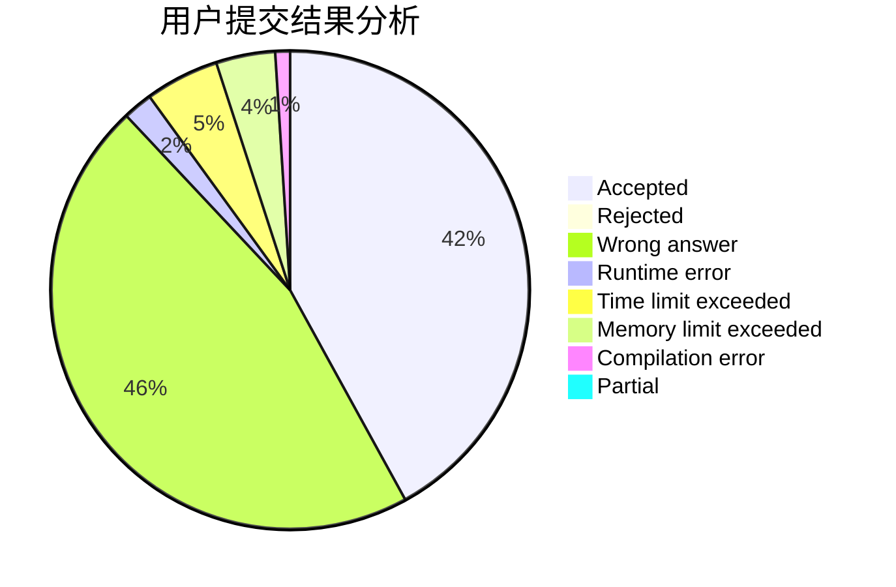
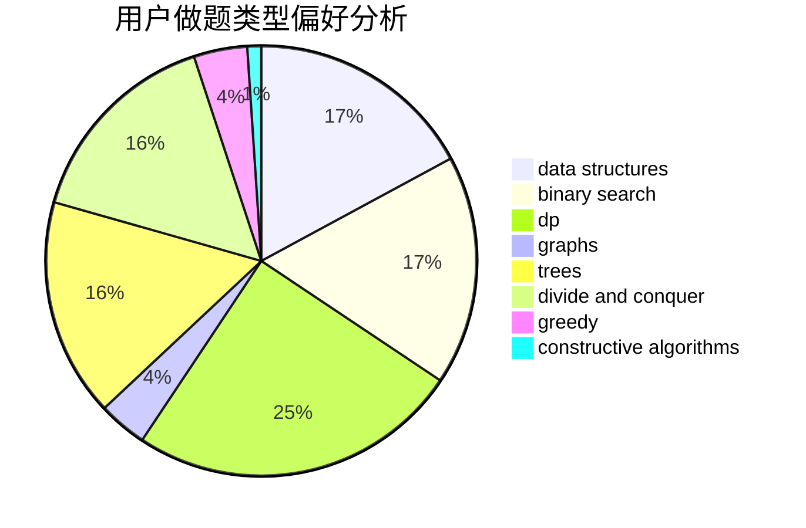
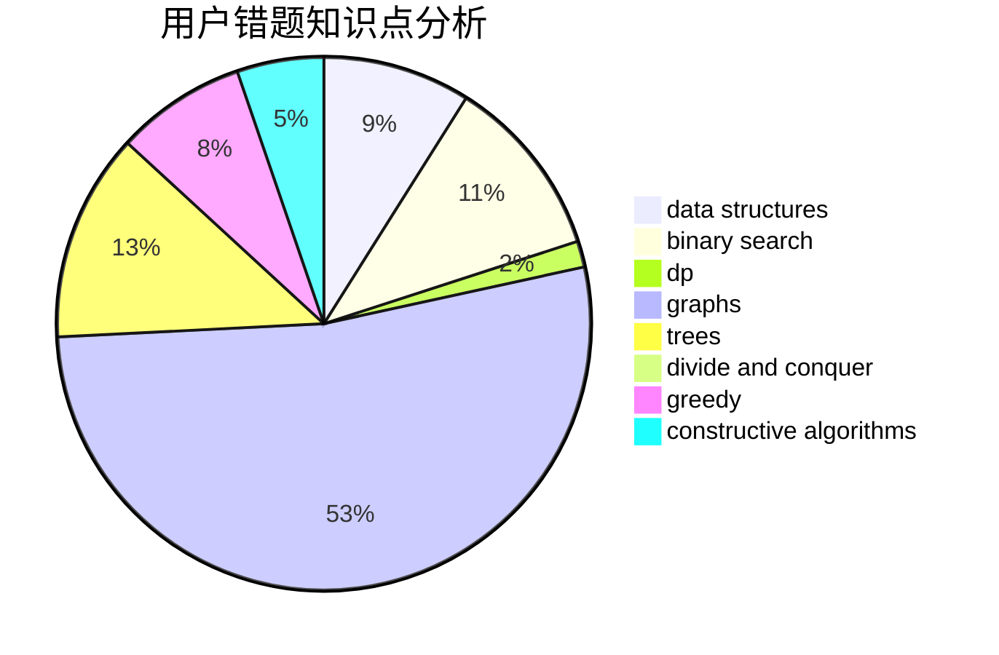

# Moon1125666900

<!-- tabs:start -->

#### **用户提交结果分析**

#### **用户做题类型偏好分析**

#### **用户错题知识点分析**

<!-- tabs:end -->
# 推荐题目
[1491G](https://codeforces.com/contest/1491/problem/G)		constructive algorithms,
                        graphs,
                        math		  
[1204B](https://codeforces.com/contest/1204/problem/B)		greedy,
                        math		  
[835F](https://codeforces.com/contest/835/problem/F)		dfs and similar,
                        dp,
                        graphs,
                        trees		  
[316B1](https://codeforces.com/contest/316B/problem/1)		brute force,
                        dfs and similar		  
[282B](https://codeforces.com/contest/282/problem/B)		greedy,
                        math		  
[236C](https://codeforces.com/contest/236/problem/C)		dsu,graphs,sortings,trees		  
[958C3](https://codeforces.com/contest/958C/problem/3)		data structures,
                        dp		  
[367D](https://codeforces.com/contest/367/problem/D)		bitmasks,
                        dfs and similar		  
[616F](https://codeforces.com/contest/616/problem/F)		string suffix structures,
                        strings		  
[842C](https://codeforces.com/contest/842/problem/C)		dfs and similar,
                        graphs,
                        math,
                        number theory,
                        trees		  
