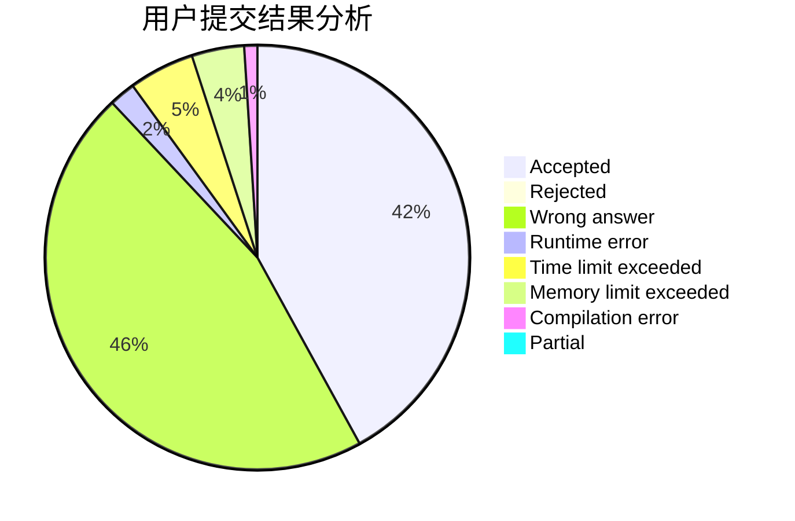
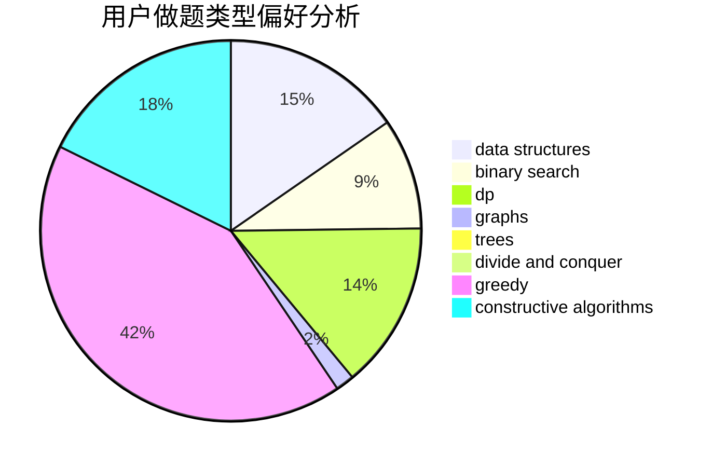
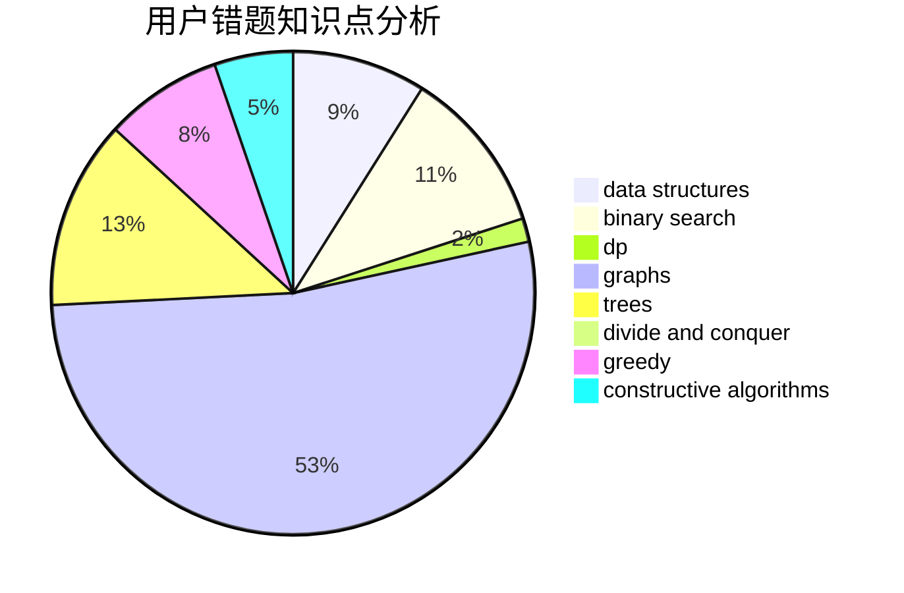

# Moon1125666900

<!-- tabs:start -->

#### **用户提交结果分析**

#### **用户做题类型偏好分析**

#### **用户错题知识点分析**

<!-- tabs:end -->
# 推荐题目
[14D](https://codeforces.com/contest/14/problem/D)		dfs and similar,
                        dp,
                        graphs,
                        shortest paths,
                        trees,
                        two pointers		  
[1208G](https://codeforces.com/contest/1208/problem/G)		greedy,
                        math,
                        number theory		  
[853D](https://codeforces.com/contest/853/problem/D)		binary search,
                        dp,
                        greedy		  
[33C](https://codeforces.com/contest/33/problem/C)		greedy		  
[298D](https://codeforces.com/contest/298/problem/D)		dsu,graphs,sortings,trees		  
[259D](https://codeforces.com/contest/259/problem/D)		dsu,graphs,sortings,trees		  
[97C](https://codeforces.com/contest/97/problem/C)		binary search,
                        graphs,
                        math,
                        shortest paths		  
[398C](https://codeforces.com/contest/398/problem/C)		constructive algorithms		  
[634D](https://codeforces.com/contest/634/problem/D)		dsu,graphs,sortings,trees		  
[861B](https://codeforces.com/contest/861/problem/B)		dsu,graphs,sortings,trees		  
