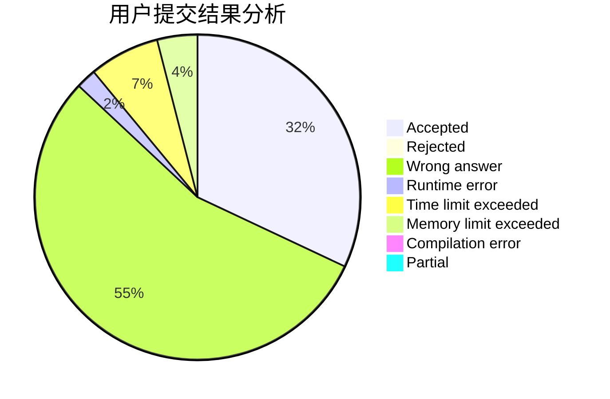
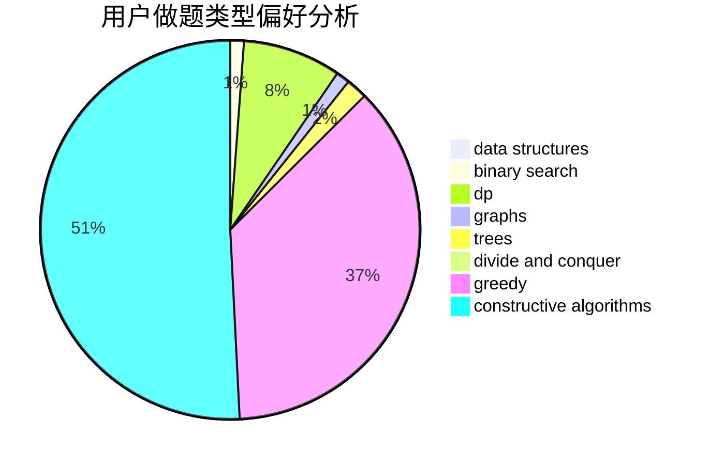
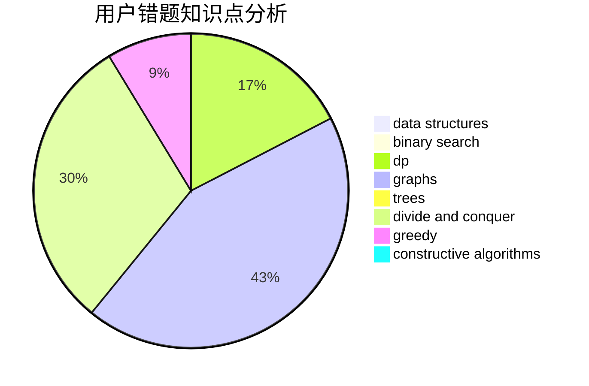

# MorningStar.
<!-- tabs:start -->
#### **用户提交结果分析**

#### **用户做题类型偏好分析**

#### **用户错题知识点分析**

<!-- tabs:end -->
# 推荐题目
[Visible Black Areas](http://codeforces.com/problemset/problem/962/G)		data structures,
                        dsu,
                        geometry,
                        trees		  
[Find String in a Grid](http://codeforces.com/problemset/problem/1252/D)		data structures,
                        dp,
                        strings,
                        trees		  
[Vasya and Templates](https://codeforces.com/contest/1087/problem/E)		greedy,
                        implementation,
                        strings		  
[LCS Again](http://codeforces.com/problemset/problem/578/D)		dp,
                        greedy		  
[Try and Catch](http://codeforces.com/problemset/problem/195/C)		expression parsing,
                        implementation		  
[Restoring Permutation](http://codeforces.com/problemset/problem/1315/C)		greedy		  
[Marbles](http://codeforces.com/problemset/problem/1215/E)		bitmasks,
                        dp		  
[Johny Likes Numbers](http://codeforces.com/problemset/problem/678/A)		implementation,
                        math		  
[RC Kaboom Show](http://codeforces.com/problemset/problem/1359/F)		binary search,
                        brute force,
                        data structures,
                        geometry,
                        math		  
[Appleman and a Game](http://codeforces.com/problemset/problem/461/E)		binary search,
                        shortest paths,
                        strings		  
<!-- tabs:start -->
#### **data structures**
[Visible Black Areas](http://codeforces.com/problemset/problem/962/G)		data structures,
                        dsu,
                        geometry,
                        trees		  
[Find String in a Grid](http://codeforces.com/problemset/problem/1252/D)		data structures,
                        dp,
                        strings,
                        trees		  
[Vasya and Templates](http://codeforces.com/problemset/problem/1359/F)		binary search,
                        brute force,
                        data structures,
                        geometry,
                        math		  
[LCS Again](http://codeforces.com/problemset/problem/38/G)		data structures		  
[Try and Catch](http://codeforces.com/problemset/problem/1265/B)		data structures,
                        implementation,
                        math,
                        two pointers		  
[Restoring Permutation](http://codeforces.com/problemset/problem/1494/E)		constructive algorithms,
                        data structures,
                        graphs,
                        hashing		  
[Marbles](http://codeforces.com/problemset/problem/1492/C)		binary search,
                        data structures,
                        dp,
                        greedy,
                        two pointers		  
[Johny Likes Numbers](http://codeforces.com/problemset/problem/1490/G)		binary search,
                        data structures,
                        math		  
[RC Kaboom Show](http://codeforces.com/problemset/problem/1479/D)		binary search,
                        bitmasks,
                        brute force,
                        data structures,
                        probabilities,
                        trees		  
[Appleman and a Game](http://codeforces.com/problemset/problem/1497/A)		brute force,
                        data structures,
                        greedy,
                        sortings		  
#### **binary search**
[Visible Black Areas](http://codeforces.com/problemset/problem/1359/F)		binary search,
                        brute force,
                        data structures,
                        geometry,
                        math		  
[Find String in a Grid](http://codeforces.com/problemset/problem/461/E)		binary search,
                        shortest paths,
                        strings		  
[Vasya and Templates](http://codeforces.com/problemset/problem/713/E)		binary search,
                        dp		  
[LCS Again](http://codeforces.com/problemset/problem/1238/D)		binary search,
                        combinatorics,
                        dp,
                        strings		  
[Try and Catch](http://codeforces.com/problemset/problem/650/B)		binary search,
                        brute force,
                        dp,
                        two pointers		  
[Restoring Permutation](http://codeforces.com/problemset/problem/51/C)		binary search,
                        greedy		  
[Marbles](http://codeforces.com/problemset/problem/1492/C)		binary search,
                        data structures,
                        dp,
                        greedy,
                        two pointers		  
[Johny Likes Numbers](http://codeforces.com/problemset/problem/1463/D)		binary search,
                        constructive algorithms,
                        greedy,
                        two pointers		  
[RC Kaboom Show](http://codeforces.com/problemset/problem/1490/G)		binary search,
                        data structures,
                        math		  
[Appleman and a Game](http://codeforces.com/problemset/problem/1479/D)		binary search,
                        bitmasks,
                        brute force,
                        data structures,
                        probabilities,
                        trees		  
#### **dp**
[Visible Black Areas](http://codeforces.com/problemset/problem/1252/D)		data structures,
                        dp,
                        strings,
                        trees		  
[Find String in a Grid](http://codeforces.com/problemset/problem/578/D)		dp,
                        greedy		  
[Vasya and Templates](http://codeforces.com/problemset/problem/1215/E)		bitmasks,
                        dp		  
[LCS Again](http://codeforces.com/problemset/problem/713/E)		binary search,
                        dp		  
[Try and Catch](http://codeforces.com/problemset/problem/1238/D)		binary search,
                        combinatorics,
                        dp,
                        strings		  
[Restoring Permutation](https://codeforces.com/contest/1384/problem/E)		bitmasks,
                        dp,
                        graphs,
                        trees		  
[Marbles](http://codeforces.com/problemset/problem/258/B)		brute force,
                        combinatorics,
                        dp		  
[Johny Likes Numbers](http://codeforces.com/problemset/problem/650/B)		binary search,
                        brute force,
                        dp,
                        two pointers		  
[RC Kaboom Show](https://codeforces.com/contest/418/problem/B)		bitmasks,
                        dp,
                        greedy,
                        sortings		  
[Appleman and a Game](http://codeforces.com/problemset/problem/868/D)		bitmasks,
                        brute force,
                        dp,
                        implementation,
                        strings		  
#### **graph**
[Visible Black Areas](https://codeforces.com/contest/1384/problem/E)		bitmasks,
                        dp,
                        graphs,
                        trees		  
[Find String in a Grid](http://codeforces.com/problemset/problem/962/F)		dfs and similar,
                        graphs,
                        trees		  
[Vasya and Templates](http://codeforces.com/problemset/problem/1264/E)		constructive algorithms,
                        flows,
                        graph matchings		  
[LCS Again](http://codeforces.com/problemset/problem/1263/D)		dfs and similar,
                        dsu,
                        graphs		  
[Try and Catch](http://codeforces.com/problemset/problem/1494/E)		constructive algorithms,
                        data structures,
                        graphs,
                        hashing		  
[Restoring Permutation](http://codeforces.com/problemset/problem/22/E)		dfs and similar,
                        graphs,
                        trees		  
[Marbles](http://codeforces.com/problemset/problem/1487/C)		brute force,
                        constructive algorithms,
                        dfs and similar,
                        graphs,
                        greedy,
                        implementation,
                        math		  
[Johny Likes Numbers](http://codeforces.com/problemset/problem/1437/C)		dp,
                        flows,
                        graph matchings,
                        greedy,
                        math,
                        sortings		  
[RC Kaboom Show](http://codeforces.com/problemset/problem/1470/D)		constructive algorithms,
                        dfs and similar,
                        graph matchings,
                        graphs,
                        greedy		  
[Appleman and a Game](http://codeforces.com/problemset/problem/1476/C)		dp,
                        graphs,
                        greedy		  
#### **trees**
[Visible Black Areas](http://codeforces.com/problemset/problem/962/G)		data structures,
                        dsu,
                        geometry,
                        trees		  
[Find String in a Grid](http://codeforces.com/problemset/problem/1252/D)		data structures,
                        dp,
                        strings,
                        trees		  
[Vasya and Templates](https://codeforces.com/contest/1384/problem/E)		bitmasks,
                        dp,
                        graphs,
                        trees		  
[LCS Again](http://codeforces.com/problemset/problem/962/F)		dfs and similar,
                        graphs,
                        trees		  
[Try and Catch](http://codeforces.com/problemset/problem/715/C)		dfs and similar,
                        divide and conquer,
                        dsu,
                        trees		  
[Restoring Permutation](https://codeforces.com/contest/1337/problem/C)		dfs and similar,
                        dp,
                        greedy,
                        sortings,
                        trees		  
[Marbles](http://codeforces.com/problemset/problem/22/E)		dfs and similar,
                        graphs,
                        trees		  
[Johny Likes Numbers](http://codeforces.com/problemset/problem/1479/D)		binary search,
                        bitmasks,
                        brute force,
                        data structures,
                        probabilities,
                        trees		  
[RC Kaboom Show](http://codeforces.com/problemset/problem/1511/C)		brute force,
                        data structures,
                        implementation,
                        trees		  
[Appleman and a Game](http://codeforces.com/problemset/problem/1499/F)		combinatorics,
                        dfs and similar,
                        dp,
                        trees		  
#### **divide and conquer**
[Visible Black Areas](http://codeforces.com/problemset/problem/715/C)		dfs and similar,
                        divide and conquer,
                        dsu,
                        trees		  
[Find String in a Grid](http://codeforces.com/problemset/problem/1461/D)		binary search,
                        brute force,
                        data structures,
                        divide and conquer,
                        implementation,
                        sortings		  
[Vasya and Templates](http://codeforces.com/problemset/problem/1466/G)		combinatorics,
                        divide and conquer,
                        hashing,
                        math,
                        string suffix structures,
                        strings		  
[LCS Again](http://codeforces.com/problemset/problem/1490/D)		dfs and similar,
                        divide and conquer,
                        implementation		  
[Try and Catch](https://codeforces.com/contest/1483/problem/C)		data structures,
                        divide and conquer,
                        dp		  
[Restoring Permutation](http://codeforces.com/problemset/problem/1491/E)		brute force,
                        dfs and similar,
                        divide and conquer,
                        number theory,
                        trees		  
[Marbles](http://codeforces.com/problemset/problem/1303/G)		data structures,
                        divide and conquer,
                        geometry,
                        trees		  
[Johny Likes Numbers](http://codeforces.com/problemset/problem/1494/D)		constructive algorithms,
                        data structures,
                        dfs and similar,
                        divide and conquer,
                        dsu,
                        greedy,
                        sortings,
                        trees		  
[RC Kaboom Show](http://codeforces.com/problemset/problem/1482/E)		data structures,
                        divide and conquer,
                        dp		  
[Appleman and a Game](http://codeforces.com/problemset/problem/566/C)		dfs and similar,
                        divide and conquer,
                        trees		  
#### **greedy**
[Visible Black Areas](https://codeforces.com/contest/1087/problem/E)		greedy,
                        implementation,
                        strings		  
[Find String in a Grid](http://codeforces.com/problemset/problem/578/D)		dp,
                        greedy		  
[Vasya and Templates](http://codeforces.com/problemset/problem/1315/C)		greedy		  
[LCS Again](http://codeforces.com/problemset/problem/814/A)		constructive algorithms,
                        greedy,
                        implementation,
                        sortings		  
[Try and Catch](http://codeforces.com/problemset/problem/1203/D1)		greedy,
                        implementation		  
[Restoring Permutation](https://codeforces.com/contest/1255/problem/E1)		constructive algorithms,
                        greedy,
                        math,
                        number theory,
                        ternary search,
                        two pointers		  
[Marbles](http://codeforces.com/problemset/problem/51/C)		binary search,
                        greedy		  
[Johny Likes Numbers](https://codeforces.com/contest/418/problem/B)		bitmasks,
                        dp,
                        greedy,
                        sortings		  
[RC Kaboom Show](http://codeforces.com/problemset/problem/339/E)		constructive algorithms,
                        dfs and similar,
                        greedy		  
[Appleman and a Game](http://codeforces.com/problemset/problem/1321/A)		greedy		  
#### **constructive algorithms**
[Visible Black Areas](http://codeforces.com/problemset/problem/1109/B)		constructive algorithms,
                        hashing,
                        strings		  
[Find String in a Grid](http://codeforces.com/problemset/problem/814/A)		constructive algorithms,
                        greedy,
                        implementation,
                        sortings		  
[Vasya and Templates](https://codeforces.com/contest/1255/problem/E1)		constructive algorithms,
                        greedy,
                        math,
                        number theory,
                        ternary search,
                        two pointers		  
[LCS Again](http://codeforces.com/problemset/problem/1028/E)		constructive algorithms		  
[Try and Catch](http://codeforces.com/problemset/problem/1131/F)		constructive algorithms,
                        dsu		  
[Restoring Permutation](http://codeforces.com/problemset/problem/1264/E)		constructive algorithms,
                        flows,
                        graph matchings		  
[Marbles](https://codeforces.com/contest/287/problem/C)		constructive algorithms,
                        math		  
[Johny Likes Numbers](http://codeforces.com/problemset/problem/339/E)		constructive algorithms,
                        dfs and similar,
                        greedy		  
[RC Kaboom Show](http://codeforces.com/problemset/problem/1494/E)		constructive algorithms,
                        data structures,
                        graphs,
                        hashing		  
[Appleman and a Game](http://codeforces.com/problemset/problem/1421/C)		constructive algorithms,
                        strings		  
#### **sortings**
[Visible Black Areas](http://codeforces.com/problemset/problem/814/A)		constructive algorithms,
                        greedy,
                        implementation,
                        sortings		  
[Find String in a Grid](https://codeforces.com/contest/418/problem/B)		bitmasks,
                        dp,
                        greedy,
                        sortings		  
[Vasya and Templates](https://codeforces.com/contest/1337/problem/C)		dfs and similar,
                        dp,
                        greedy,
                        sortings,
                        trees		  
[LCS Again](https://codeforces.com/contest/1496/problem/C)		geometry,
                        greedy,
                        math,
                        sortings		  
[Try and Catch](http://codeforces.com/problemset/problem/1495/A)		geometry,
                        greedy,
                        math,
                        sortings		  
[Restoring Permutation](http://codeforces.com/problemset/problem/1497/A)		brute force,
                        data structures,
                        greedy,
                        sortings		  
[Marbles](http://codeforces.com/problemset/problem/1427/A)		math,
                        sortings		  
[Johny Likes Numbers](http://codeforces.com/problemset/problem/1461/D)		binary search,
                        brute force,
                        data structures,
                        divide and conquer,
                        implementation,
                        sortings		  
[RC Kaboom Show](http://codeforces.com/problemset/problem/1437/C)		dp,
                        flows,
                        graph matchings,
                        greedy,
                        math,
                        sortings		  
[Appleman and a Game](http://codeforces.com/problemset/problem/1473/A)		greedy,
                        implementation,
                        math,
                        sortings		  
<!-- tabs:end -->
