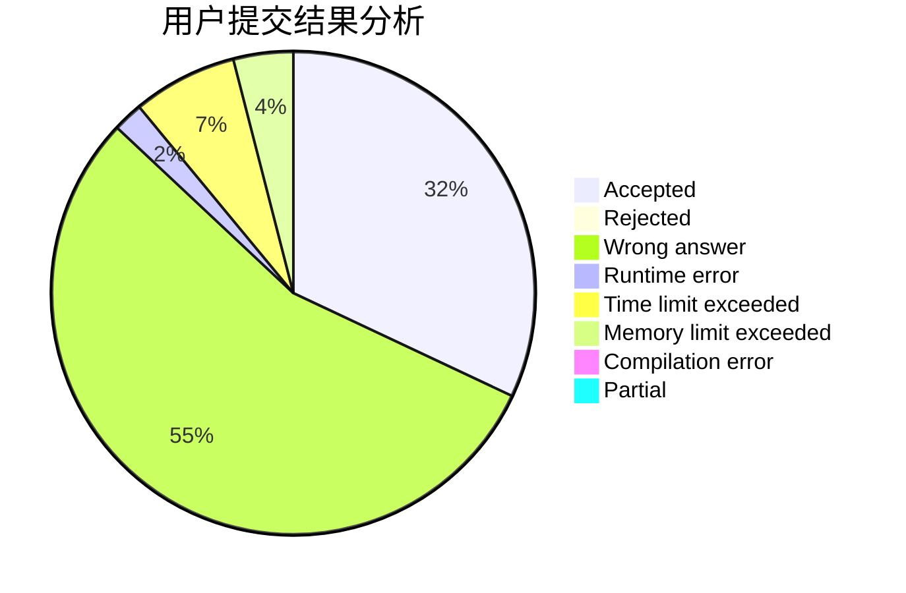
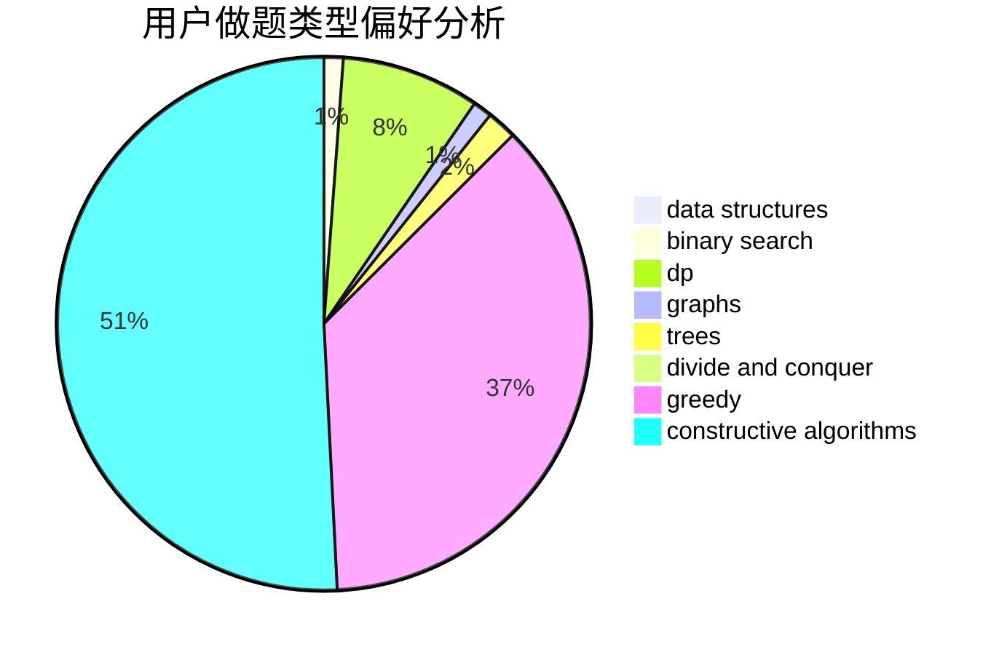
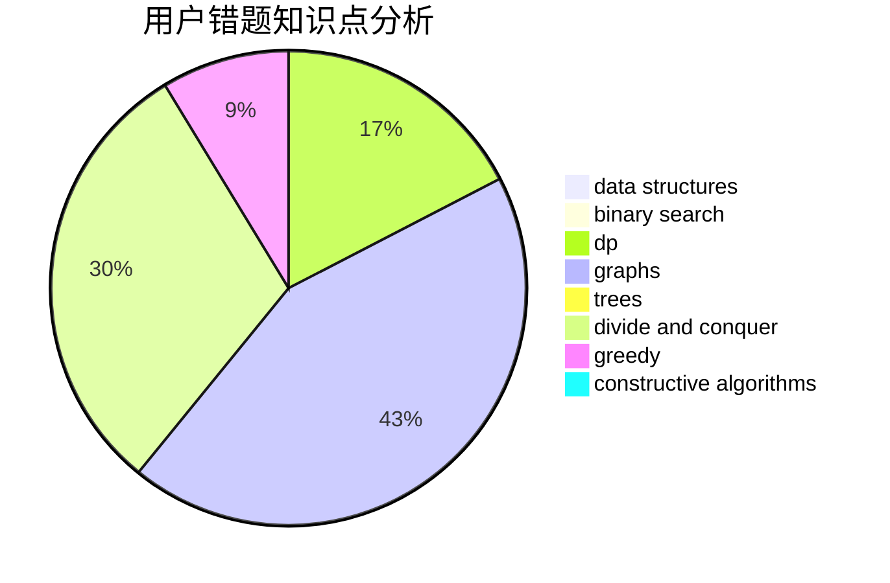

# MorningStar.

<!-- tabs:start -->

#### **用户提交结果分析**

#### **用户做题类型偏好分析**

#### **用户错题知识点分析**

<!-- tabs:end -->
# 推荐题目
[962G](https://codeforces.com/contest/962/problem/G)		data structures,
                        dsu,
                        geometry,
                        trees		  
[1087E](https://codeforces.com/contest/1087/problem/E)		dsu,graphs,sortings,trees		  
[713E](https://codeforces.com/contest/713/problem/E)		binary search,
                        dp		  
[1252D](https://codeforces.com/contest/1252/problem/D)		data structures,
                        dp,
                        strings,
                        trees		  
[962F](https://codeforces.com/contest/962/problem/F)		dfs and similar,
                        graphs,
                        trees		  
[578D](https://codeforces.com/contest/578/problem/D)		dp,
                        greedy		  
[1384E](https://codeforces.com/contest/1384/problem/E)		dsu,graphs,sortings,trees		  
[794B](https://codeforces.com/contest/794/problem/B)		geometry,
                        math		  
[1096B](https://codeforces.com/contest/1096/problem/B)		combinatorics,
                        math,
                        strings		  
[195C](https://codeforces.com/contest/195/problem/C)		expression parsing,
                        implementation		  
