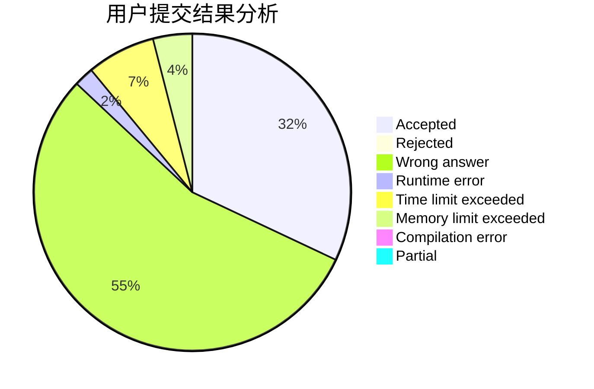
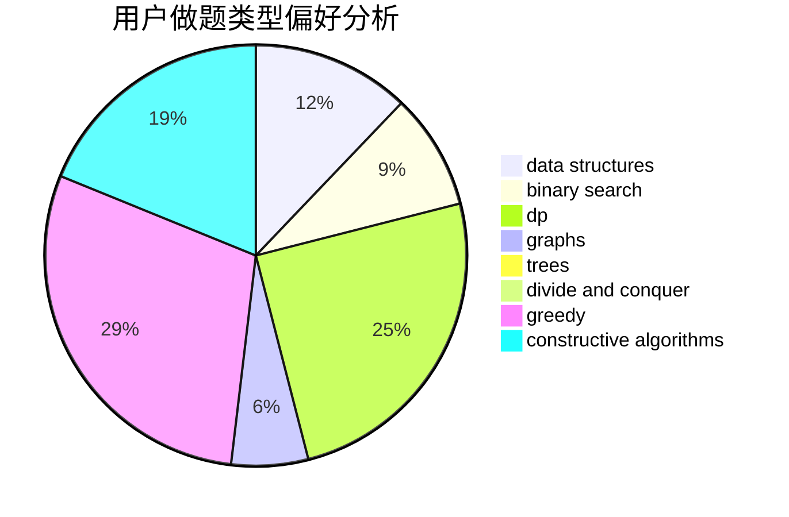
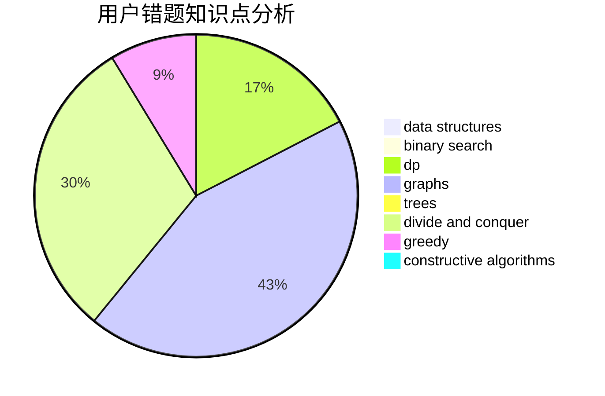

# MorningStar.

<!-- tabs:start -->

#### **用户提交结果分析**

#### **用户做题类型偏好分析**

#### **用户错题知识点分析**

<!-- tabs:end -->
# 推荐题目
[985E](https://codeforces.com/contest/985/problem/E)		binary search,
                        data structures,
                        dp,
                        greedy,
                        two pointers		  
[1088B](https://codeforces.com/contest/1088/problem/B)		implementation,
                        sortings		  
[732E](https://codeforces.com/contest/732/problem/E)		greedy,
                        sortings		  
[1257E](https://codeforces.com/contest/1257/problem/E)		data structures,
                        dp,
                        greedy		  
[985D](https://codeforces.com/contest/985/problem/D)		binary search,
                        constructive algorithms,
                        math		  
[59A](https://codeforces.com/contest/59/problem/A)		implementation,
                        strings		  
[1394E](https://codeforces.com/contest/1394/problem/E)		strings		  
[809C](https://codeforces.com/contest/809/problem/C)		combinatorics,
                        divide and conquer,
                        dp		  
[1096E](https://codeforces.com/contest/1096/problem/E)		combinatorics,
                        dp,
                        math,
                        probabilities		  
[218C](https://codeforces.com/contest/218/problem/C)		dsu,graphs,sortings,trees		  
