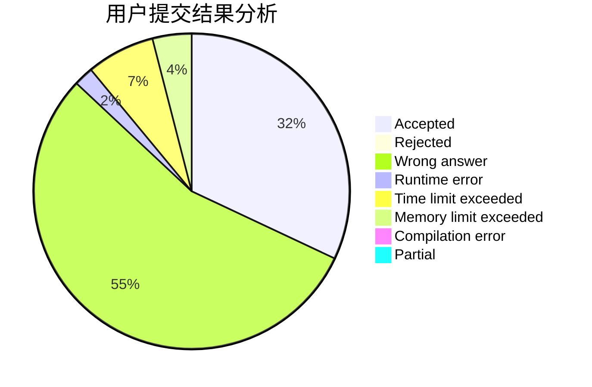
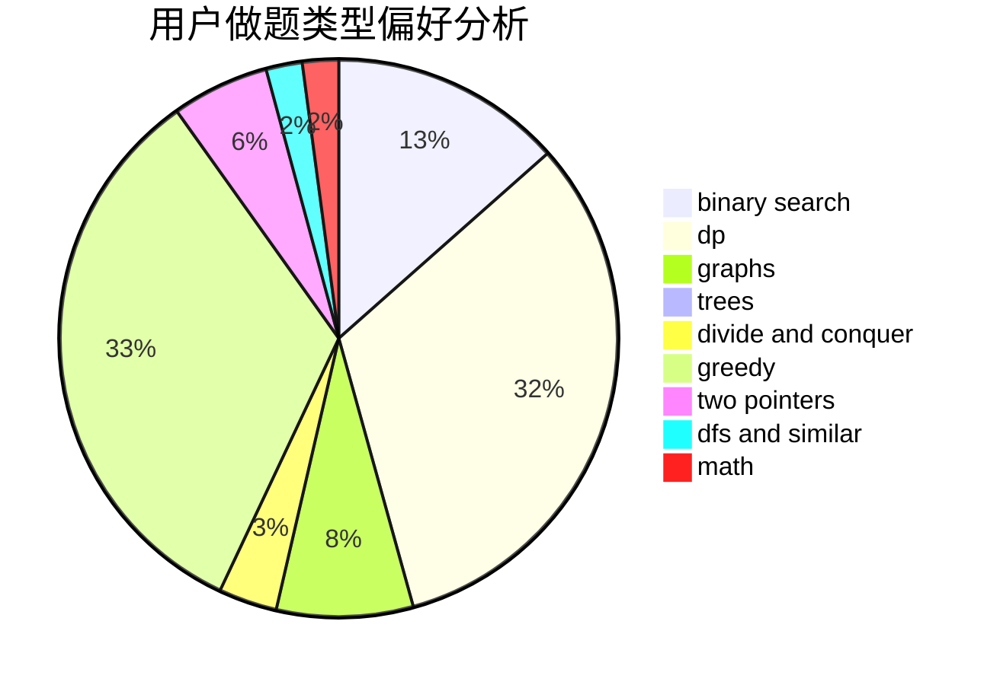

# MorningStar.

<!-- tabs:start -->

#### **用户提交结果分析**

#### **用户做题类型偏好分析**

<!-- tabs:end -->
# 推荐题目
[985E](https://codeforces.com/contest/985/problem/E)
[1088B](https://codeforces.com/contest/1088/problem/B)
[732E](https://codeforces.com/contest/732/problem/E)
[1257E](https://codeforces.com/contest/1257/problem/E)
[985D](https://codeforces.com/contest/985/problem/D)
[59A](https://codeforces.com/contest/59/problem/A)
[1394E](https://codeforces.com/contest/1394/problem/E)
[809C](https://codeforces.com/contest/809/problem/C)
[1096E](https://codeforces.com/contest/1096/problem/E)
[218C](https://codeforces.com/contest/218/problem/C)
