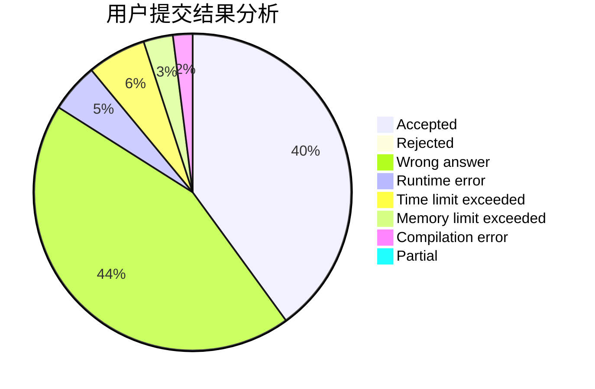
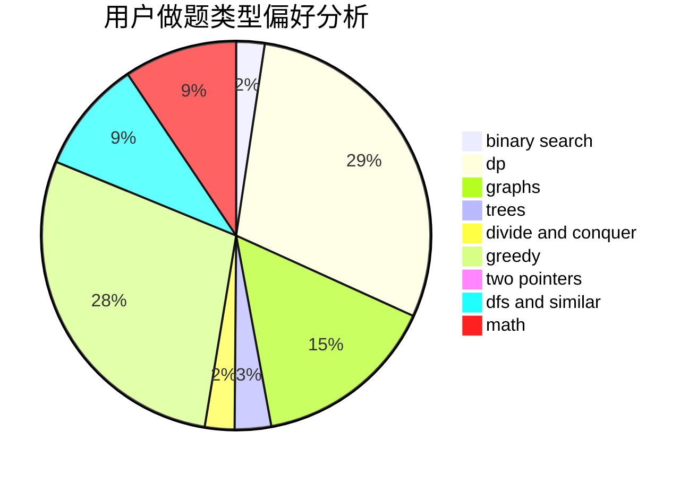

# Mr-leng

<!-- tabs:start -->

#### **用户提交结果分析**

#### **用户做题类型偏好分析**

<!-- tabs:end -->
# 推荐题目
[1415D](https://codeforces.com/contest/1415/problem/D)
[1475G](https://codeforces.com/contest/1475/problem/G)
[1105E](https://codeforces.com/contest/1105/problem/E)
[908B](https://codeforces.com/contest/908/problem/B)
[95B](https://codeforces.com/contest/95/problem/B)
[10B](https://codeforces.com/contest/10/problem/B)
[1372F](https://codeforces.com/contest/1372/problem/F)
[1185D](https://codeforces.com/contest/1185/problem/D)
[356D](https://codeforces.com/contest/356/problem/D)
[433B](https://codeforces.com/contest/433/problem/B)
