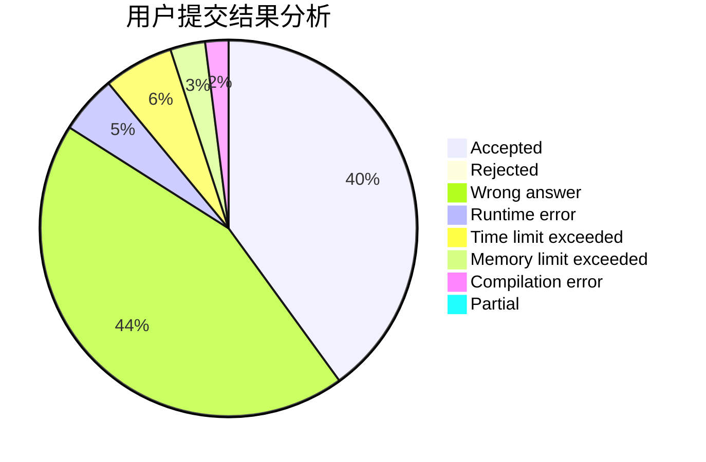
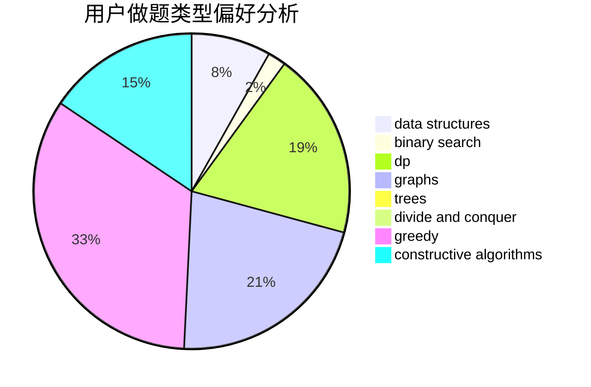
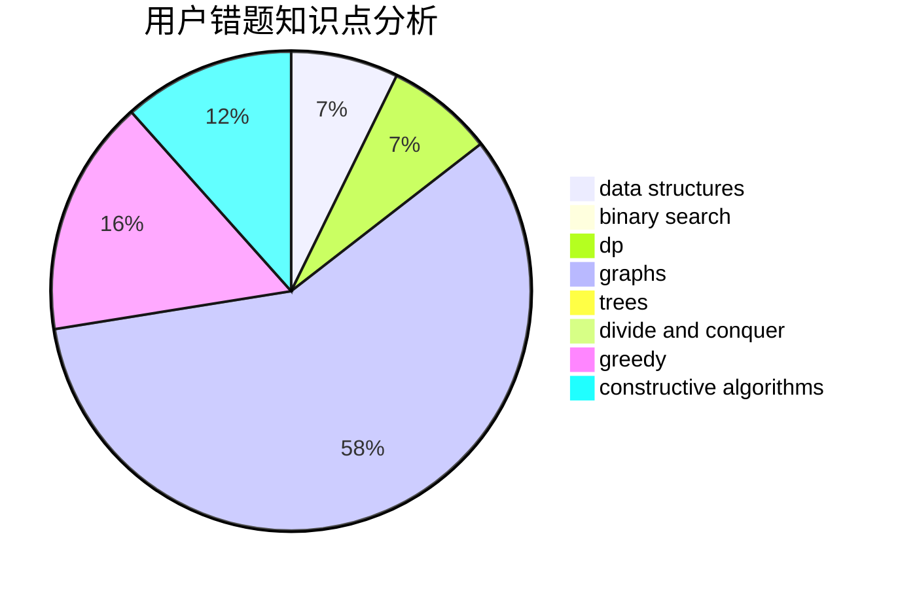

# Mr-leng

<!-- tabs:start -->

#### **用户提交结果分析**

#### **用户做题类型偏好分析**

#### **用户错题知识点分析**

<!-- tabs:end -->
# 推荐题目
[1415D](https://codeforces.com/contest/1415/problem/D)		bitmasks,
                        brute force,
                        constructive algorithms		  
[1475G](https://codeforces.com/contest/1475/problem/G)		dp,
                        math,
                        number theory,
                        sortings		  
[1105E](https://codeforces.com/contest/1105/problem/E)		bitmasks,
                        brute force,
                        dp,
                        meet-in-the-middle		  
[908B](https://codeforces.com/contest/908/problem/B)		brute force,
                        implementation		  
[95B](https://codeforces.com/contest/95/problem/B)		dp,
                        greedy		  
[10B](https://codeforces.com/contest/10/problem/B)		dp,
                        implementation		  
[1372F](https://codeforces.com/contest/1372/problem/F)		binary search,
                        divide and conquer,
                        interactive		  
[1185D](https://codeforces.com/contest/1185/problem/D)		implementation,
                        math		  
[356D](https://codeforces.com/contest/356/problem/D)		bitmasks,
                        constructive algorithms,
                        dp,
                        greedy		  
[433B](https://codeforces.com/contest/433/problem/B)		dp,
                        implementation,
                        sortings		  
