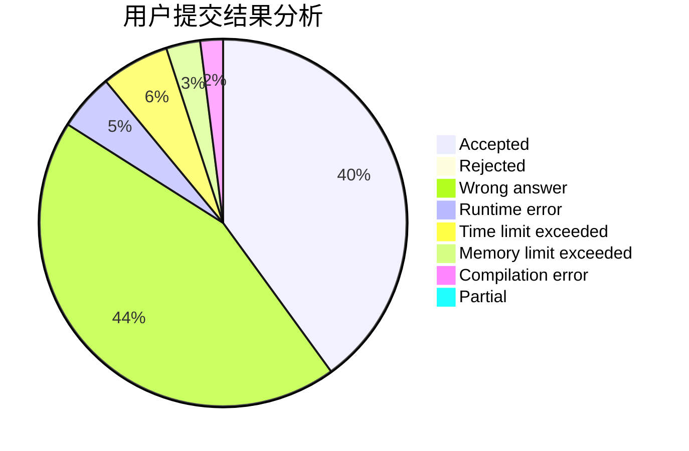
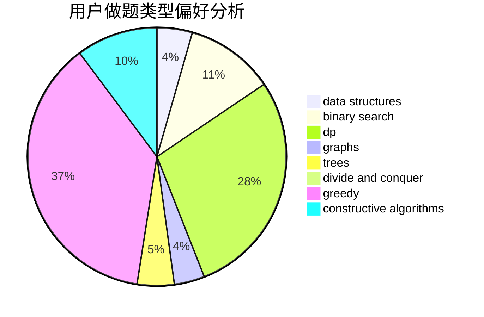
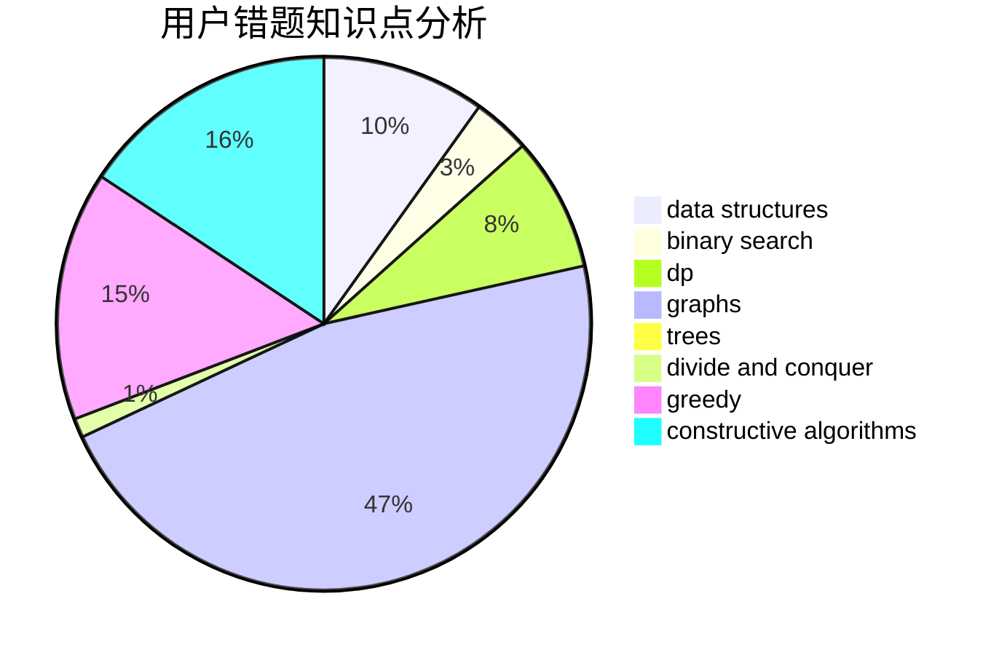

# Mr-leng

<!-- tabs:start -->

#### **用户提交结果分析**

#### **用户做题类型偏好分析**

#### **用户错题知识点分析**

<!-- tabs:end -->
# 推荐题目
[1404B](https://codeforces.com/contest/1404/problem/B)		dfs and similar,
                        dp,
                        games,
                        trees		  
[1468F](https://codeforces.com/contest/1468/problem/F)		geometry,
                        hashing,
                        number theory		  
[1105B](https://codeforces.com/contest/1105/problem/B)		brute force,
                        implementation,
                        strings		  
[888D](https://codeforces.com/contest/888/problem/D)		combinatorics,
                        dp,
                        math		  
[938C](https://codeforces.com/contest/938/problem/C)		binary search,
                        brute force,
                        constructive algorithms		  
[1099F](https://codeforces.com/contest/1099/problem/F)		binary search,
                        data structures,
                        dfs and similar,
                        dp,
                        games,
                        trees		  
[1366A](https://codeforces.com/contest/1366/problem/A)		binary search,
                        greedy,
                        math		  
[1183A](https://codeforces.com/contest/1183/problem/A)		implementation		  
[328A](https://codeforces.com/contest/328/problem/A)		implementation		  
[404C](https://codeforces.com/contest/404/problem/C)		dfs and similar,
                        graphs,
                        sortings		  
