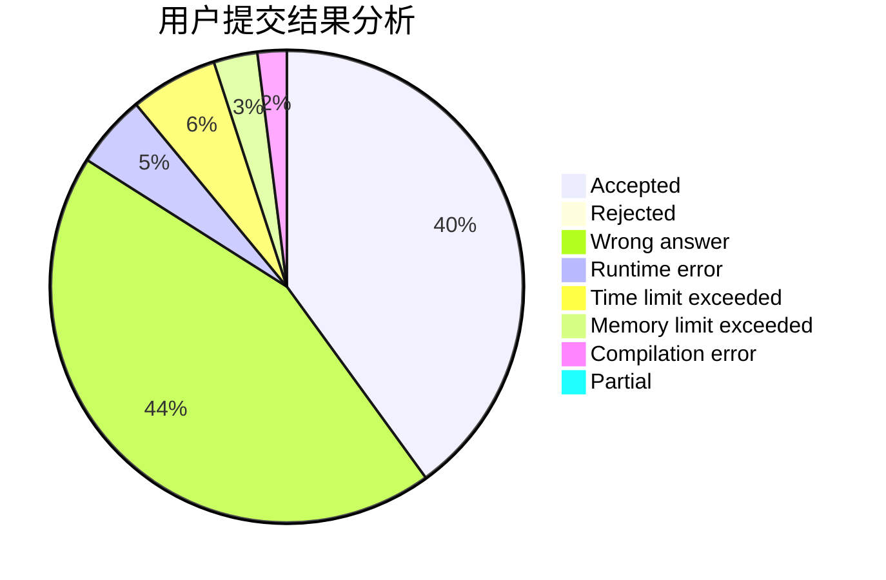
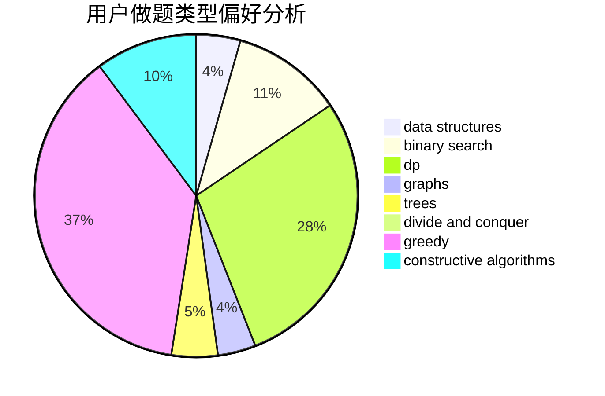
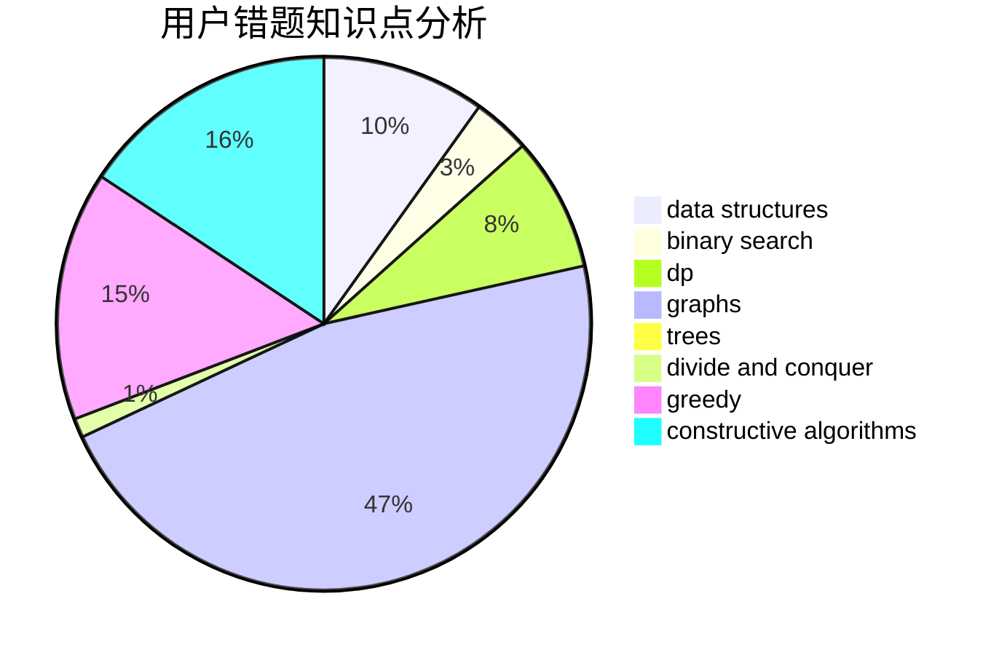

# Mr-leng
<!-- tabs:start -->
#### **用户提交结果分析**

#### **用户做题类型偏好分析**

#### **用户错题知识点分析**

<!-- tabs:end -->
# 推荐题目
[Shovels and Swords](http://codeforces.com/problemset/problem/1366/A)		binary search,
                        greedy,
                        math		  
[Johnny and Grandmaster](https://codeforces.com/contest/1362/problem/E)		greedy,
                        implementation,
                        math,
                        sortings		  
[Touchy-Feely Palindromes](http://codeforces.com/problemset/problem/784/D)		*special problem,
                        implementation		  
[Nearest Interesting Number](http://codeforces.com/problemset/problem/1183/A)		implementation		  
[Maximum Balanced Circle](http://codeforces.com/problemset/problem/1157/F)		constructive algorithms,
                        dp,
                        greedy,
                        two pointers		  
[Zuhair and Strings](http://codeforces.com/problemset/problem/1105/B)		brute force,
                        implementation,
                        strings		  
[Little Robber Girl's Zoo](http://codeforces.com/problemset/problem/686/B)		constructive algorithms,
                        implementation,
                        sortings		  
[Unsolvable](http://codeforces.com/problemset/problem/225/E)		math,
                        number theory		  
[Multiplication Table](http://codeforces.com/problemset/problem/1220/B)		math,
                        number theory		  
[Almost Identity Permutations](http://codeforces.com/problemset/problem/888/D)		combinatorics,
                        dp,
                        math		  
<!-- tabs:start -->
#### **data structures**
[Shovels and Swords](https://codeforces.com/contest/516/problem/C)		data structures		  
[Johnny and Grandmaster](http://codeforces.com/problemset/problem/1140/G)		data structures,
                        divide and conquer,
                        shortest paths,
                        trees		  
[Touchy-Feely Palindromes](http://codeforces.com/problemset/problem/1099/F)		binary search,
                        data structures,
                        dfs and similar,
                        dp,
                        games,
                        trees		  
[Nearest Interesting Number](http://codeforces.com/problemset/problem/400/E)		binary search,
                        bitmasks,
                        data structures		  
[Maximum Balanced Circle](http://codeforces.com/problemset/problem/44/G)		data structures,
                        implementation		  
[Zuhair and Strings](http://codeforces.com/problemset/problem/650/A)		data structures,
                        geometry,
                        math		  
[Little Robber Girl's Zoo](http://codeforces.com/problemset/problem/1373/F)		binary search,
                        constructive algorithms,
                        data structures,
                        greedy		  
[Unsolvable](http://codeforces.com/problemset/problem/1093/G)		bitmasks,
                        data structures		  
[Multiplication Table](http://codeforces.com/problemset/problem/1136/E)		binary search,
                        data structures		  
[Almost Identity Permutations](http://codeforces.com/problemset/problem/603/E)		data structures,
                        divide and conquer,
                        dsu,
                        math,
                        trees		  
#### **binary search**
[Shovels and Swords](http://codeforces.com/problemset/problem/1366/A)		binary search,
                        greedy,
                        math		  
[Johnny and Grandmaster](http://codeforces.com/problemset/problem/938/C)		binary search,
                        brute force,
                        constructive algorithms		  
[Touchy-Feely Palindromes](http://codeforces.com/problemset/problem/1099/F)		binary search,
                        data structures,
                        dfs and similar,
                        dp,
                        games,
                        trees		  
[Nearest Interesting Number](http://codeforces.com/problemset/problem/400/E)		binary search,
                        bitmasks,
                        data structures		  
[Maximum Balanced Circle](http://codeforces.com/problemset/problem/1373/F)		binary search,
                        constructive algorithms,
                        data structures,
                        greedy		  
[Zuhair and Strings](http://codeforces.com/problemset/problem/1136/E)		binary search,
                        data structures		  
[Little Robber Girl's Zoo](http://codeforces.com/problemset/problem/1348/D)		binary search,
                        constructive algorithms,
                        greedy,
                        implementation,
                        math		  
[Unsolvable](http://codeforces.com/problemset/problem/1486/C2)		binary search,
                        interactive		  
[Multiplication Table](http://codeforces.com/problemset/problem/1492/C)		binary search,
                        data structures,
                        dp,
                        greedy,
                        two pointers		  
[Almost Identity Permutations](http://codeforces.com/problemset/problem/1463/D)		binary search,
                        constructive algorithms,
                        greedy,
                        two pointers		  
#### **dp**
[Shovels and Swords](http://codeforces.com/problemset/problem/1157/F)		constructive algorithms,
                        dp,
                        greedy,
                        two pointers		  
[Johnny and Grandmaster](http://codeforces.com/problemset/problem/888/D)		combinatorics,
                        dp,
                        math		  
[Touchy-Feely Palindromes](http://codeforces.com/problemset/problem/78/C)		dp,
                        games,
                        number theory		  
[Nearest Interesting Number](http://codeforces.com/problemset/problem/1428/G2)		dp,
                        greedy		  
[Maximum Balanced Circle](https://codeforces.com/contest/512/problem/B)		bitmasks,
                        brute force,
                        dp,
                        math		  
[Zuhair and Strings](http://codeforces.com/problemset/problem/1099/F)		binary search,
                        data structures,
                        dfs and similar,
                        dp,
                        games,
                        trees		  
[Little Robber Girl's Zoo](http://codeforces.com/problemset/problem/1032/F)		dp,
                        trees		  
[Unsolvable](http://codeforces.com/problemset/problem/1040/B)		dp,
                        greedy,
                        math		  
[Multiplication Table](http://codeforces.com/problemset/problem/1307/C)		brute force,
                        dp,
                        math,
                        strings		  
[Almost Identity Permutations](https://codeforces.com/contest/1150/problem/D)		dp,
                        implementation,
                        strings		  
#### **graph**
[Shovels and Swords](http://codeforces.com/problemset/problem/404/C)		dfs and similar,
                        graphs,
                        sortings		  
[Johnny and Grandmaster](http://codeforces.com/problemset/problem/723/D)		dfs and similar,
                        dsu,
                        graphs,
                        greedy,
                        implementation		  
[Touchy-Feely Palindromes](http://codeforces.com/problemset/problem/1487/C)		brute force,
                        constructive algorithms,
                        dfs and similar,
                        graphs,
                        greedy,
                        implementation,
                        math		  
[Nearest Interesting Number](http://codeforces.com/problemset/problem/1437/C)		dp,
                        flows,
                        graph matchings,
                        greedy,
                        math,
                        sortings		  
[Maximum Balanced Circle](http://codeforces.com/problemset/problem/1470/D)		constructive algorithms,
                        dfs and similar,
                        graph matchings,
                        graphs,
                        greedy		  
[Zuhair and Strings](http://codeforces.com/problemset/problem/1476/C)		dp,
                        graphs,
                        greedy		  
[Little Robber Girl's Zoo](http://codeforces.com/problemset/problem/1304/D)		constructive algorithms,
                        graphs,
                        greedy,
                        two pointers		  
[Unsolvable](http://codeforces.com/problemset/problem/1475/C)		combinatorics,
                        graphs,
                        math		  
[Multiplication Table](http://codeforces.com/problemset/problem/553/E)		dp,
                        fft,
                        graphs,
                        math,
                        probabilities		  
[Almost Identity Permutations](http://codeforces.com/problemset/problem/1495/C)		constructive algorithms,
                        graphs		  
#### **trees**
[Shovels and Swords](http://codeforces.com/problemset/problem/1140/G)		data structures,
                        divide and conquer,
                        shortest paths,
                        trees		  
[Johnny and Grandmaster](http://codeforces.com/problemset/problem/1099/F)		binary search,
                        data structures,
                        dfs and similar,
                        dp,
                        games,
                        trees		  
[Touchy-Feely Palindromes](http://codeforces.com/problemset/problem/1032/F)		dp,
                        trees		  
[Nearest Interesting Number](http://codeforces.com/problemset/problem/603/E)		data structures,
                        divide and conquer,
                        dsu,
                        math,
                        trees		  
[Maximum Balanced Circle](http://codeforces.com/problemset/problem/1118/F1)		dfs and similar,
                        trees		  
[Zuhair and Strings](http://codeforces.com/problemset/problem/1401/D)		dfs and similar,
                        dp,
                        greedy,
                        implementation,
                        math,
                        number theory,
                        sortings,
                        trees		  
[Little Robber Girl's Zoo](http://codeforces.com/problemset/problem/1404/B)		dfs and similar,
                        dp,
                        games,
                        trees		  
[Unsolvable](http://codeforces.com/problemset/problem/1479/D)		binary search,
                        bitmasks,
                        brute force,
                        data structures,
                        probabilities,
                        trees		  
[Multiplication Table](http://codeforces.com/problemset/problem/1511/C)		brute force,
                        data structures,
                        implementation,
                        trees		  
[Almost Identity Permutations](http://codeforces.com/problemset/problem/1499/F)		combinatorics,
                        dfs and similar,
                        dp,
                        trees		  
#### **divide and conquer**
[Shovels and Swords](http://codeforces.com/problemset/problem/1140/G)		data structures,
                        divide and conquer,
                        shortest paths,
                        trees		  
[Johnny and Grandmaster](http://codeforces.com/problemset/problem/603/E)		data structures,
                        divide and conquer,
                        dsu,
                        math,
                        trees		  
[Touchy-Feely Palindromes](http://codeforces.com/problemset/problem/662/C)		bitmasks,
                        brute force,
                        divide and conquer,
                        dp,
                        fft,
                        math		  
[Nearest Interesting Number](http://codeforces.com/problemset/problem/1461/D)		binary search,
                        brute force,
                        data structures,
                        divide and conquer,
                        implementation,
                        sortings		  
[Maximum Balanced Circle](http://codeforces.com/problemset/problem/1466/G)		combinatorics,
                        divide and conquer,
                        hashing,
                        math,
                        string suffix structures,
                        strings		  
[Zuhair and Strings](http://codeforces.com/problemset/problem/1490/D)		dfs and similar,
                        divide and conquer,
                        implementation		  
[Little Robber Girl's Zoo](https://codeforces.com/contest/1483/problem/C)		data structures,
                        divide and conquer,
                        dp		  
[Unsolvable](http://codeforces.com/problemset/problem/1491/E)		brute force,
                        dfs and similar,
                        divide and conquer,
                        number theory,
                        trees		  
[Multiplication Table](http://codeforces.com/problemset/problem/1303/G)		data structures,
                        divide and conquer,
                        geometry,
                        trees		  
[Almost Identity Permutations](http://codeforces.com/problemset/problem/1494/D)		constructive algorithms,
                        data structures,
                        dfs and similar,
                        divide and conquer,
                        dsu,
                        greedy,
                        sortings,
                        trees		  
#### **greedy**
[Shovels and Swords](http://codeforces.com/problemset/problem/1366/A)		binary search,
                        greedy,
                        math		  
[Johnny and Grandmaster](https://codeforces.com/contest/1362/problem/E)		greedy,
                        implementation,
                        math,
                        sortings		  
[Touchy-Feely Palindromes](http://codeforces.com/problemset/problem/1157/F)		constructive algorithms,
                        dp,
                        greedy,
                        two pointers		  
[Nearest Interesting Number](http://codeforces.com/problemset/problem/1428/G2)		dp,
                        greedy		  
[Maximum Balanced Circle](https://codeforces.com/contest/606/problem/C)		constructive algorithms,
                        greedy		  
[Zuhair and Strings](http://codeforces.com/problemset/problem/1040/B)		dp,
                        greedy,
                        math		  
[Little Robber Girl's Zoo](http://codeforces.com/problemset/problem/1141/F1)		greedy		  
[Unsolvable](http://codeforces.com/problemset/problem/701/A)		greedy,
                        implementation		  
[Multiplication Table](http://codeforces.com/problemset/problem/1373/F)		binary search,
                        constructive algorithms,
                        data structures,
                        greedy		  
[Almost Identity Permutations](http://codeforces.com/problemset/problem/723/D)		dfs and similar,
                        dsu,
                        graphs,
                        greedy,
                        implementation		  
#### **constructive algorithms**
[Shovels and Swords](http://codeforces.com/problemset/problem/1157/F)		constructive algorithms,
                        dp,
                        greedy,
                        two pointers		  
[Johnny and Grandmaster](http://codeforces.com/problemset/problem/686/B)		constructive algorithms,
                        implementation,
                        sortings		  
[Touchy-Feely Palindromes](http://codeforces.com/problemset/problem/938/C)		binary search,
                        brute force,
                        constructive algorithms		  
[Nearest Interesting Number](https://codeforces.com/contest/606/problem/C)		constructive algorithms,
                        greedy		  
[Maximum Balanced Circle](http://codeforces.com/problemset/problem/1373/F)		binary search,
                        constructive algorithms,
                        data structures,
                        greedy		  
[Zuhair and Strings](http://codeforces.com/problemset/problem/727/C)		constructive algorithms,
                        interactive,
                        math		  
[Little Robber Girl's Zoo](http://codeforces.com/problemset/problem/271/E)		constructive algorithms,
                        math,
                        number theory		  
[Unsolvable](http://codeforces.com/problemset/problem/1348/D)		binary search,
                        constructive algorithms,
                        greedy,
                        implementation,
                        math		  
[Multiplication Table](http://codeforces.com/problemset/problem/1405/B)		constructive algorithms,
                        implementation		  
[Almost Identity Permutations](http://codeforces.com/problemset/problem/1493/A)		constructive algorithms,
                        greedy		  
#### **sortings**
[Shovels and Swords](https://codeforces.com/contest/1362/problem/E)		greedy,
                        implementation,
                        math,
                        sortings		  
[Johnny and Grandmaster](http://codeforces.com/problemset/problem/686/B)		constructive algorithms,
                        implementation,
                        sortings		  
[Touchy-Feely Palindromes](http://codeforces.com/problemset/problem/404/C)		dfs and similar,
                        graphs,
                        sortings		  
[Nearest Interesting Number](http://codeforces.com/problemset/problem/1061/B)		greedy,
                        implementation,
                        sortings		  
[Maximum Balanced Circle](http://codeforces.com/problemset/problem/1401/D)		dfs and similar,
                        dp,
                        greedy,
                        implementation,
                        math,
                        number theory,
                        sortings,
                        trees		  
[Zuhair and Strings](http://codeforces.com/problemset/problem/1165/E)		greedy,
                        math,
                        sortings		  
[Little Robber Girl's Zoo](https://codeforces.com/contest/1496/problem/C)		geometry,
                        greedy,
                        math,
                        sortings		  
[Unsolvable](http://codeforces.com/problemset/problem/1495/A)		geometry,
                        greedy,
                        math,
                        sortings		  
[Multiplication Table](http://codeforces.com/problemset/problem/1497/A)		brute force,
                        data structures,
                        greedy,
                        sortings		  
[Almost Identity Permutations](http://codeforces.com/problemset/problem/1427/A)		math,
                        sortings		  
<!-- tabs:end -->
