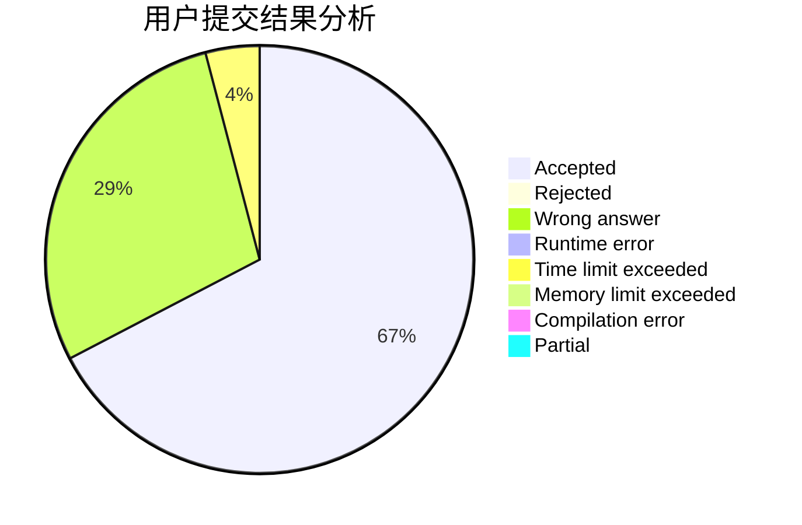
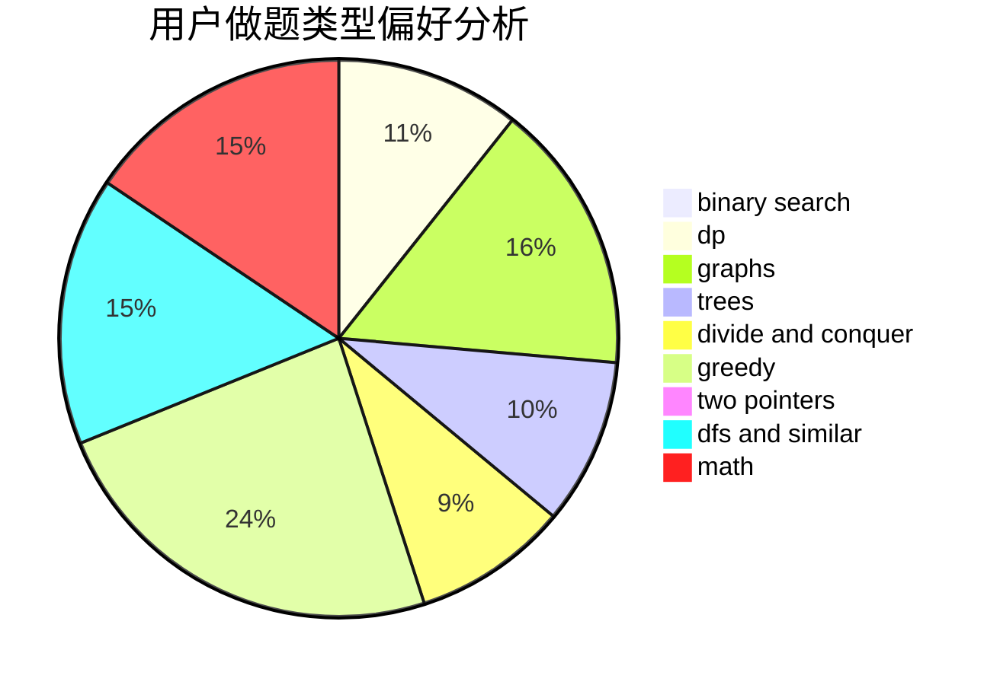

# Mr.fengshou

<!-- tabs:start -->

#### **用户提交结果分析**

#### **用户做题类型偏好分析**

<!-- tabs:end -->
# 推荐题目
[1294F](https://codeforces.com/contest/1294/problem/F)
[1284F](https://codeforces.com/contest/1284/problem/F)
[901C](https://codeforces.com/contest/901/problem/C)
[1079B](https://codeforces.com/contest/1079/problem/B)
[128C](https://codeforces.com/contest/128/problem/C)
[1470D](https://codeforces.com/contest/1470/problem/D)
[875A](https://codeforces.com/contest/875/problem/A)
[11302](https://codeforces.com/contest/1130/problem/2)
[609B](https://codeforces.com/contest/609/problem/B)
[737A](https://codeforces.com/contest/737/problem/A)
