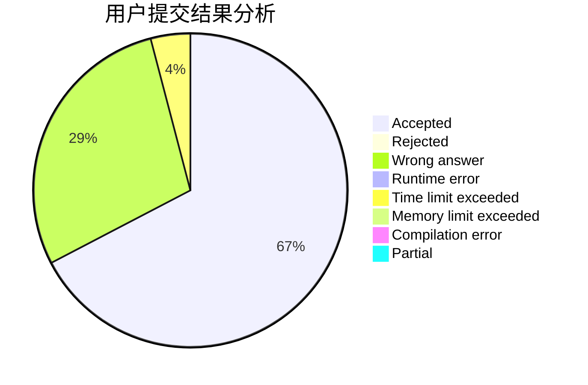
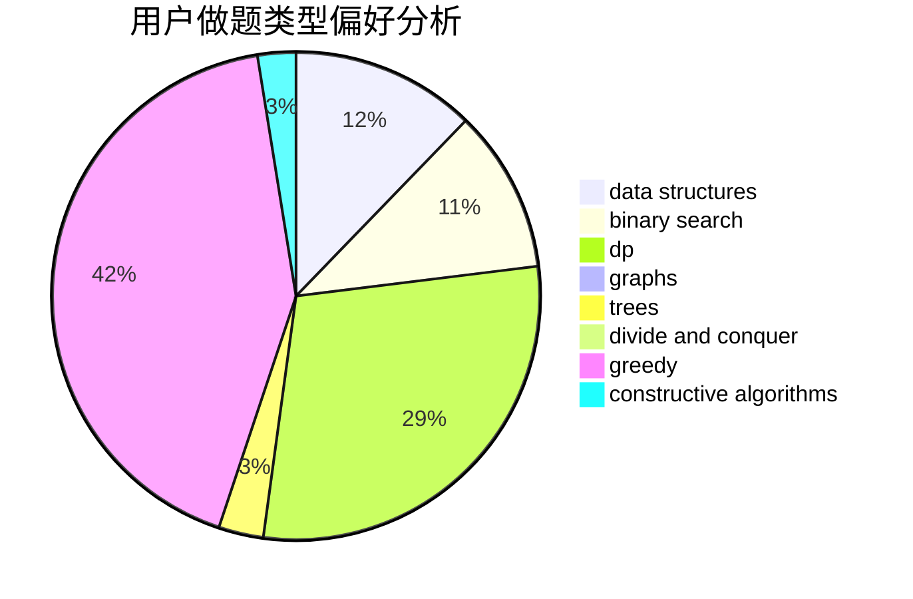

# Mr.fengshou
<!-- tabs:start -->
#### **用户提交结果分析**

#### **用户做题类型偏好分析**

#### **用户错题知识点分析**

<!-- tabs:end -->
# 推荐题目
[Communism](http://codeforces.com/problemset/problem/1450/G)		bitmasks,
                        dp,
                        trees		  
[Trash Problem](http://codeforces.com/problemset/problem/1418/D)		data structures,
                        implementation		  
[Photo Processing](http://codeforces.com/problemset/problem/883/I)		binary search,
                        dp		  
[Nagini](http://codeforces.com/problemset/problem/855/F)		binary search,
                        data structures		  
[Cow Program](http://codeforces.com/problemset/problem/283/B)		dfs and similar,
                        dp,
                        graphs		  
[Optimal Point](http://codeforces.com/problemset/problem/685/C)		binary search,
                        math		  
[Chattering](https://codeforces.com/contest/1078/problem/D)		nan		  
[Secret Letters](http://codeforces.com/problemset/problem/1120/F)		data structures,
                        dp,
                        greedy		  
[Garland](https://codeforces.com/contest/1287/problem/C)		dp,
                        greedy,
                        sortings		  
[The Cake Is a Lie](http://codeforces.com/problemset/problem/1282/E)		constructive algorithms,
                        data structures,
                        dfs and similar,
                        graphs		  
<!-- tabs:start -->
#### **data structures**
[Communism](http://codeforces.com/problemset/problem/1418/D)		data structures,
                        implementation		  
[Trash Problem](http://codeforces.com/problemset/problem/855/F)		binary search,
                        data structures		  
[Photo Processing](http://codeforces.com/problemset/problem/1120/F)		data structures,
                        dp,
                        greedy		  
[Nagini](http://codeforces.com/problemset/problem/1282/E)		constructive algorithms,
                        data structures,
                        dfs and similar,
                        graphs		  
[Cow Program](http://codeforces.com/problemset/problem/1423/G)		data structures		  
[Optimal Point](http://codeforces.com/problemset/problem/1278/D)		data structures,
                        dsu,
                        graphs,
                        trees		  
[Chattering](http://codeforces.com/problemset/problem/748/D)		constructive algorithms,
                        data structures,
                        greedy		  
[Secret Letters](http://codeforces.com/problemset/problem/1492/C)		binary search,
                        data structures,
                        dp,
                        greedy,
                        two pointers		  
[Garland](http://codeforces.com/problemset/problem/1490/G)		binary search,
                        data structures,
                        math		  
[The Cake Is a Lie](http://codeforces.com/problemset/problem/1479/D)		binary search,
                        bitmasks,
                        brute force,
                        data structures,
                        probabilities,
                        trees		  
#### **binary search**
[Communism](http://codeforces.com/problemset/problem/883/I)		binary search,
                        dp		  
[Trash Problem](http://codeforces.com/problemset/problem/855/F)		binary search,
                        data structures		  
[Photo Processing](http://codeforces.com/problemset/problem/685/C)		binary search,
                        math		  
[Nagini](http://codeforces.com/problemset/problem/1102/F)		binary search,
                        bitmasks,
                        brute force,
                        dp,
                        graphs		  
[Cow Program](http://codeforces.com/problemset/problem/1492/C)		binary search,
                        data structures,
                        dp,
                        greedy,
                        two pointers		  
[Optimal Point](http://codeforces.com/problemset/problem/1463/D)		binary search,
                        constructive algorithms,
                        greedy,
                        two pointers		  
[Chattering](http://codeforces.com/problemset/problem/1490/G)		binary search,
                        data structures,
                        math		  
[Secret Letters](http://codeforces.com/problemset/problem/1479/D)		binary search,
                        bitmasks,
                        brute force,
                        data structures,
                        probabilities,
                        trees		  
[Garland](http://codeforces.com/problemset/problem/1436/E)		binary search,
                        data structures,
                        two pointers		  
[The Cake Is a Lie](http://codeforces.com/problemset/problem/1461/D)		binary search,
                        brute force,
                        data structures,
                        divide and conquer,
                        implementation,
                        sortings		  
#### **dp**
[Communism](http://codeforces.com/problemset/problem/1450/G)		bitmasks,
                        dp,
                        trees		  
[Trash Problem](http://codeforces.com/problemset/problem/883/I)		binary search,
                        dp		  
[Photo Processing](http://codeforces.com/problemset/problem/283/B)		dfs and similar,
                        dp,
                        graphs		  
[Nagini](http://codeforces.com/problemset/problem/1120/F)		data structures,
                        dp,
                        greedy		  
[Cow Program](https://codeforces.com/contest/1287/problem/C)		dp,
                        greedy,
                        sortings		  
[Optimal Point](http://codeforces.com/problemset/problem/513/G1)		brute force,
                        dfs and similar,
                        dp,
                        meet-in-the-middle		  
[Chattering](http://codeforces.com/problemset/problem/1102/F)		binary search,
                        bitmasks,
                        brute force,
                        dp,
                        graphs		  
[Secret Letters](https://codeforces.com/contest/1173/problem/D)		combinatorics,
                        dfs and similar,
                        dp,
                        trees		  
[Garland](http://codeforces.com/problemset/problem/518/D)		combinatorics,
                        dp,
                        math,
                        probabilities		  
[The Cake Is a Lie](http://codeforces.com/problemset/problem/868/D)		bitmasks,
                        brute force,
                        dp,
                        implementation,
                        strings		  
#### **graph**
[Communism](http://codeforces.com/problemset/problem/283/B)		dfs and similar,
                        dp,
                        graphs		  
[Trash Problem](http://codeforces.com/problemset/problem/1282/E)		constructive algorithms,
                        data structures,
                        dfs and similar,
                        graphs		  
[Photo Processing](http://codeforces.com/problemset/problem/1102/F)		binary search,
                        bitmasks,
                        brute force,
                        dp,
                        graphs		  
[Nagini](http://codeforces.com/problemset/problem/1340/E)		graphs,
                        interactive,
                        probabilities		  
[Cow Program](http://codeforces.com/problemset/problem/1278/D)		data structures,
                        dsu,
                        graphs,
                        trees		  
[Optimal Point](http://codeforces.com/problemset/problem/193/A)		constructive algorithms,
                        graphs,
                        trees		  
[Chattering](http://codeforces.com/problemset/problem/1487/C)		brute force,
                        constructive algorithms,
                        dfs and similar,
                        graphs,
                        greedy,
                        implementation,
                        math		  
[Secret Letters](http://codeforces.com/problemset/problem/1437/C)		dp,
                        flows,
                        graph matchings,
                        greedy,
                        math,
                        sortings		  
[Garland](http://codeforces.com/problemset/problem/1470/D)		constructive algorithms,
                        dfs and similar,
                        graph matchings,
                        graphs,
                        greedy		  
[The Cake Is a Lie](http://codeforces.com/problemset/problem/1476/C)		dp,
                        graphs,
                        greedy		  
#### **trees**
[Communism](http://codeforces.com/problemset/problem/1450/G)		bitmasks,
                        dp,
                        trees		  
[Trash Problem](https://codeforces.com/contest/1189/problem/D2)		constructive algorithms,
                        dfs and similar,
                        implementation,
                        trees		  
[Photo Processing](http://codeforces.com/problemset/problem/1278/D)		data structures,
                        dsu,
                        graphs,
                        trees		  
[Nagini](https://codeforces.com/contest/1173/problem/D)		combinatorics,
                        dfs and similar,
                        dp,
                        trees		  
[Cow Program](http://codeforces.com/problemset/problem/193/A)		constructive algorithms,
                        graphs,
                        trees		  
[Optimal Point](http://codeforces.com/problemset/problem/1479/D)		binary search,
                        bitmasks,
                        brute force,
                        data structures,
                        probabilities,
                        trees		  
[Chattering](http://codeforces.com/problemset/problem/1511/C)		brute force,
                        data structures,
                        implementation,
                        trees		  
[Secret Letters](http://codeforces.com/problemset/problem/1499/F)		combinatorics,
                        dfs and similar,
                        dp,
                        trees		  
[Garland](http://codeforces.com/problemset/problem/1491/E)		brute force,
                        dfs and similar,
                        divide and conquer,
                        number theory,
                        trees		  
[The Cake Is a Lie](http://codeforces.com/problemset/problem/1466/D)		data structures,
                        greedy,
                        sortings,
                        trees		  
#### **divide and conquer**
[Communism](http://codeforces.com/problemset/problem/1461/D)		binary search,
                        brute force,
                        data structures,
                        divide and conquer,
                        implementation,
                        sortings		  
[Trash Problem](http://codeforces.com/problemset/problem/1466/G)		combinatorics,
                        divide and conquer,
                        hashing,
                        math,
                        string suffix structures,
                        strings		  
[Photo Processing](http://codeforces.com/problemset/problem/1490/D)		dfs and similar,
                        divide and conquer,
                        implementation		  
[Nagini](https://codeforces.com/contest/1483/problem/C)		data structures,
                        divide and conquer,
                        dp		  
[Cow Program](http://codeforces.com/problemset/problem/1491/E)		brute force,
                        dfs and similar,
                        divide and conquer,
                        number theory,
                        trees		  
[Optimal Point](http://codeforces.com/problemset/problem/1303/G)		data structures,
                        divide and conquer,
                        geometry,
                        trees		  
[Chattering](http://codeforces.com/problemset/problem/1494/D)		constructive algorithms,
                        data structures,
                        dfs and similar,
                        divide and conquer,
                        dsu,
                        greedy,
                        sortings,
                        trees		  
[Secret Letters](http://codeforces.com/problemset/problem/1482/E)		data structures,
                        divide and conquer,
                        dp		  
[Garland](http://codeforces.com/problemset/problem/566/C)		dfs and similar,
                        divide and conquer,
                        trees		  
[The Cake Is a Lie](http://codeforces.com/problemset/problem/1428/F)		binary search,
                        data structures,
                        divide and conquer,
                        dp,
                        two pointers		  
#### **greedy**
[Communism](http://codeforces.com/problemset/problem/1120/F)		data structures,
                        dp,
                        greedy		  
[Trash Problem](https://codeforces.com/contest/1287/problem/C)		dp,
                        greedy,
                        sortings		  
[Photo Processing](http://codeforces.com/problemset/problem/912/C)		brute force,
                        greedy,
                        sortings		  
[Nagini](http://codeforces.com/problemset/problem/58/A)		greedy,
                        strings		  
[Cow Program](http://codeforces.com/problemset/problem/1209/C)		constructive algorithms,
                        greedy,
                        implementation		  
[Optimal Point](http://codeforces.com/problemset/problem/748/D)		constructive algorithms,
                        data structures,
                        greedy		  
[Chattering](http://codeforces.com/problemset/problem/1433/C)		constructive algorithms,
                        greedy		  
[Secret Letters](http://codeforces.com/problemset/problem/1492/C)		binary search,
                        data structures,
                        dp,
                        greedy,
                        two pointers		  
[Garland](https://codeforces.com/contest/1496/problem/C)		geometry,
                        greedy,
                        math,
                        sortings		  
[The Cake Is a Lie](http://codeforces.com/problemset/problem/1493/A)		constructive algorithms,
                        greedy		  
#### **constructive algorithms**
[Communism](http://codeforces.com/problemset/problem/1282/E)		constructive algorithms,
                        data structures,
                        dfs and similar,
                        graphs		  
[Trash Problem](https://codeforces.com/contest/1189/problem/D2)		constructive algorithms,
                        dfs and similar,
                        implementation,
                        trees		  
[Photo Processing](http://codeforces.com/problemset/problem/347/A)		constructive algorithms,
                        implementation,
                        sortings		  
[Nagini](http://codeforces.com/problemset/problem/1209/C)		constructive algorithms,
                        greedy,
                        implementation		  
[Cow Program](http://codeforces.com/problemset/problem/748/D)		constructive algorithms,
                        data structures,
                        greedy		  
[Optimal Point](http://codeforces.com/problemset/problem/1433/C)		constructive algorithms,
                        greedy		  
[Chattering](http://codeforces.com/problemset/problem/193/A)		constructive algorithms,
                        graphs,
                        trees		  
[Secret Letters](http://codeforces.com/problemset/problem/1493/A)		constructive algorithms,
                        greedy		  
[Garland](http://codeforces.com/problemset/problem/1463/D)		binary search,
                        constructive algorithms,
                        greedy,
                        two pointers		  
[The Cake Is a Lie](https://codeforces.com/contest/1456/problem/B)		bitmasks,
                        brute force,
                        constructive algorithms		  
#### **sortings**
[Communism](https://codeforces.com/contest/1287/problem/C)		dp,
                        greedy,
                        sortings		  
[Trash Problem](http://codeforces.com/problemset/problem/912/C)		brute force,
                        greedy,
                        sortings		  
[Photo Processing](http://codeforces.com/problemset/problem/347/A)		constructive algorithms,
                        implementation,
                        sortings		  
[Nagini](https://codeforces.com/contest/1496/problem/C)		geometry,
                        greedy,
                        math,
                        sortings		  
[Cow Program](http://codeforces.com/problemset/problem/1495/A)		geometry,
                        greedy,
                        math,
                        sortings		  
[Optimal Point](http://codeforces.com/problemset/problem/1497/A)		brute force,
                        data structures,
                        greedy,
                        sortings		  
[Chattering](http://codeforces.com/problemset/problem/1427/A)		math,
                        sortings		  
[Secret Letters](http://codeforces.com/problemset/problem/1461/D)		binary search,
                        brute force,
                        data structures,
                        divide and conquer,
                        implementation,
                        sortings		  
[Garland](http://codeforces.com/problemset/problem/1437/C)		dp,
                        flows,
                        graph matchings,
                        greedy,
                        math,
                        sortings		  
[The Cake Is a Lie](http://codeforces.com/problemset/problem/1473/A)		greedy,
                        implementation,
                        math,
                        sortings		  
<!-- tabs:end -->
