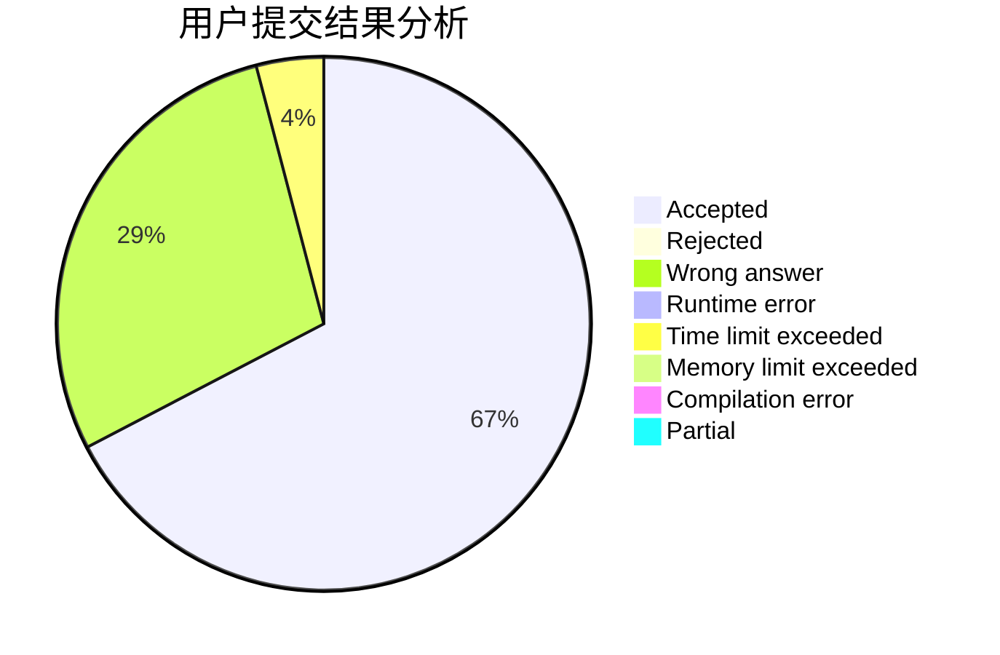
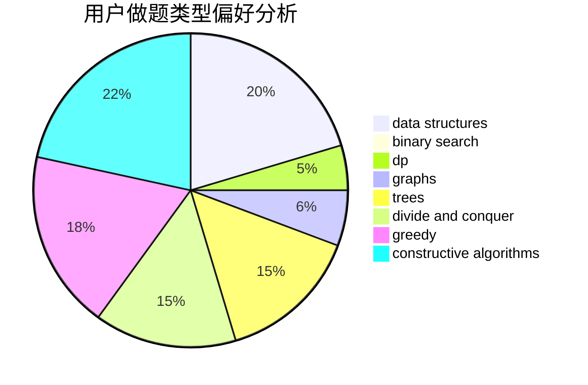

# Mr.fengshou

<!-- tabs:start -->

#### **用户提交结果分析**

#### **用户做题类型偏好分析**

#### **用户错题知识点分析**

<!-- tabs:end -->
# 推荐题目
[1294F](https://codeforces.com/contest/1294/problem/F)		dfs and similar,
                        dp,
                        greedy,
                        trees		  
[1284F](https://codeforces.com/contest/1284/problem/F)		data structures,
                        graph matchings,
                        graphs,
                        math,
                        trees		  
[901C](https://codeforces.com/contest/901/problem/C)		binary search,
                        data structures,
                        dfs and similar,
                        dsu,
                        graphs,
                        two pointers		  
[1079B](https://codeforces.com/contest/1079/problem/B)		dsu,graphs,sortings,trees		  
[128C](https://codeforces.com/contest/128/problem/C)		combinatorics,
                        dp		  
[1470D](https://codeforces.com/contest/1470/problem/D)		constructive algorithms,
                        dfs and similar,
                        graph matchings,
                        graphs,
                        greedy		  
[875A](https://codeforces.com/contest/875/problem/A)		brute force,
                        math		  
[11302](https://codeforces.com/contest/1130/problem/2)		dsu,graphs,sortings,trees		  
[609B](https://codeforces.com/contest/609/problem/B)		constructive algorithms,
                        implementation		  
[737A](https://codeforces.com/contest/737/problem/A)		dsu,graphs,sortings,trees		  
