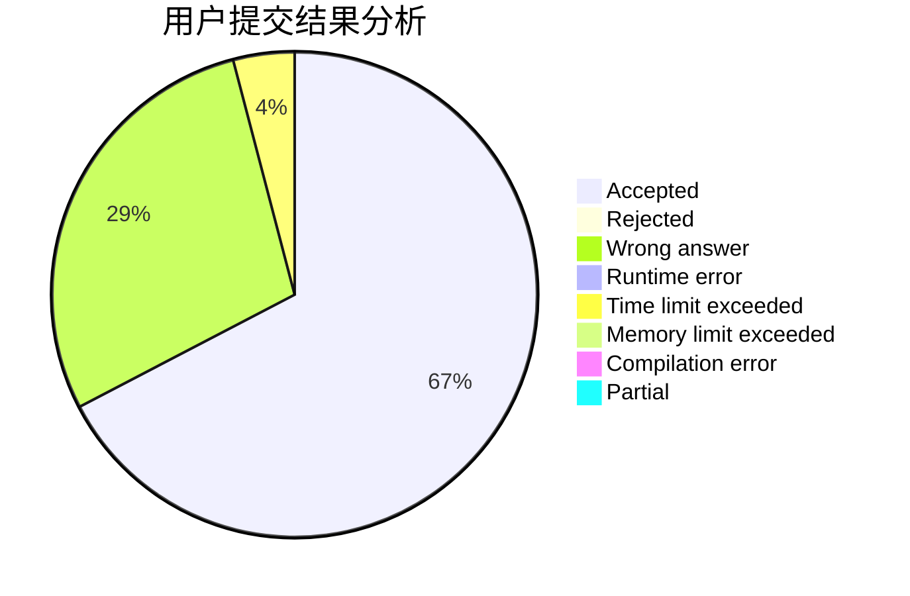
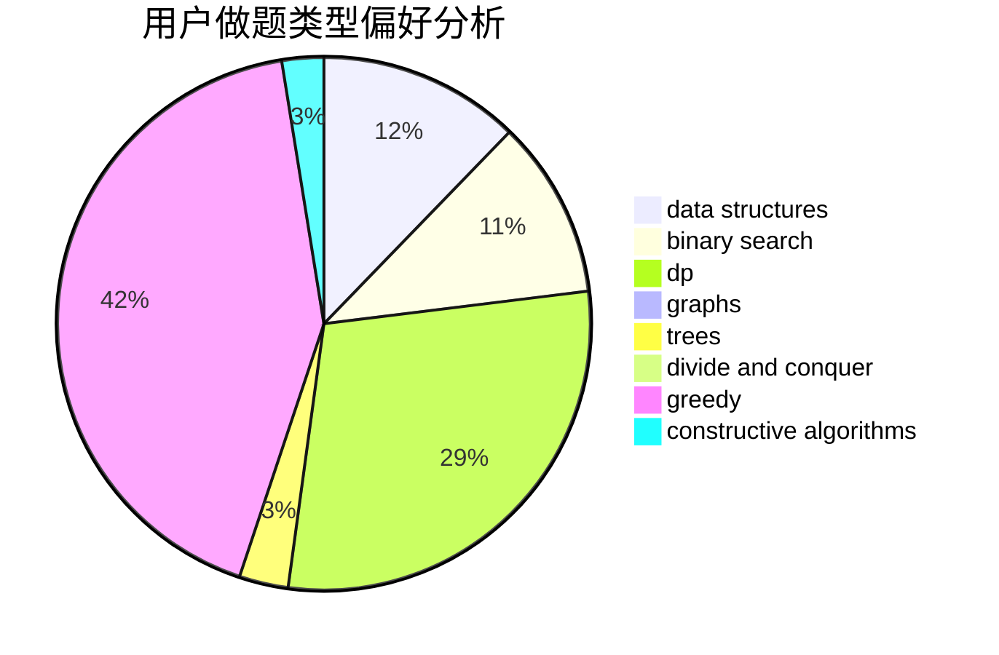

# Mr.fengshou

<!-- tabs:start -->

#### **用户提交结果分析**

#### **用户做题类型偏好分析**

#### **用户错题知识点分析**

<!-- tabs:end -->
# 推荐题目
[1287C](https://codeforces.com/contest/1287/problem/C)		dsu,graphs,sortings,trees		  
[1278D](https://codeforces.com/contest/1278/problem/D)		data structures,
                        dsu,
                        graphs,
                        trees		  
[883I](https://codeforces.com/contest/883/problem/I)		binary search,
                        dp		  
[1078D](https://codeforces.com/contest/1078/problem/D)		dsu,graphs,sortings,trees		  
[1282E](https://codeforces.com/contest/1282/problem/E)		constructive algorithms,
                        data structures,
                        dfs and similar,
                        graphs		  
[1463C](https://codeforces.com/contest/1463/problem/C)		implementation		  
[855F](https://codeforces.com/contest/855/problem/F)		binary search,
                        data structures		  
[1120F](https://codeforces.com/contest/1120/problem/F)		data structures,
                        dp,
                        greedy		  
[58A](https://codeforces.com/contest/58/problem/A)		greedy,
                        strings		  
[71A](https://codeforces.com/contest/71/problem/A)		strings		  
