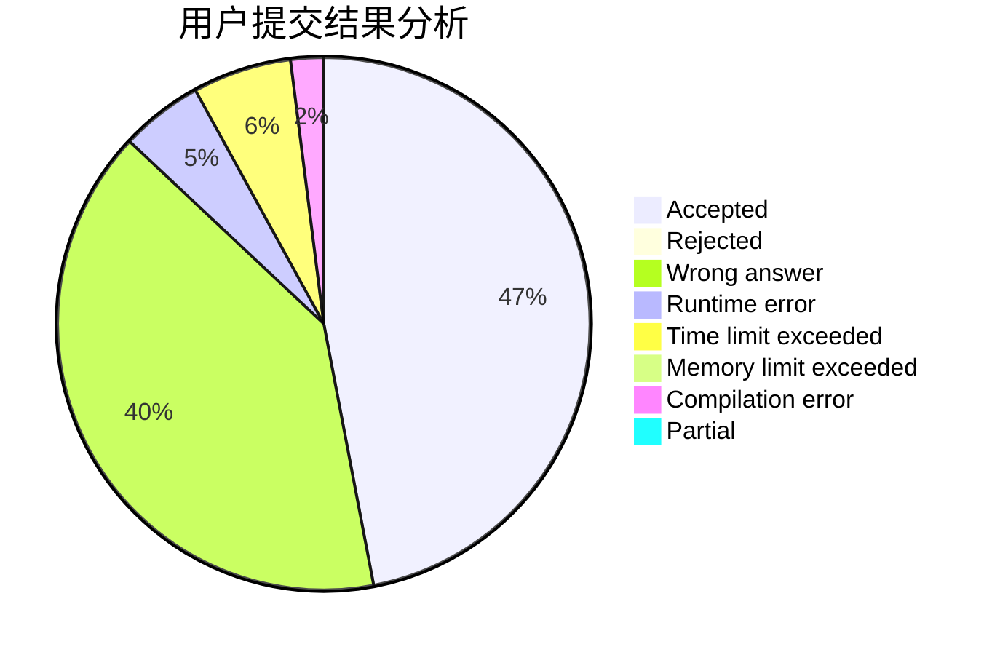
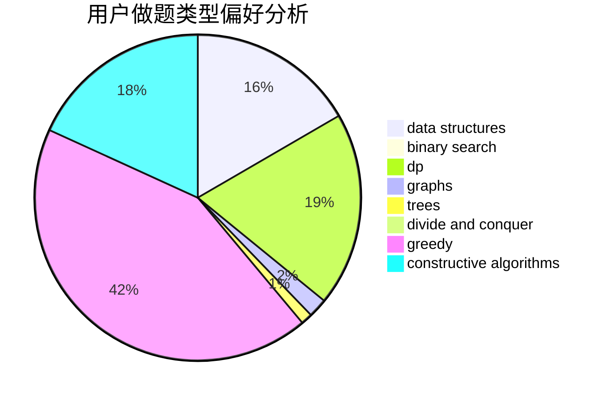

# MrMirotic

<!-- tabs:start -->

#### **用户提交结果分析**

#### **用户做题类型偏好分析**

#### **用户错题知识点分析**

<!-- tabs:end -->
# 推荐题目
[1504A](https://codeforces.com/contest/1504/problem/A)		constructive algorithms,
                        strings		  
[1070H](https://codeforces.com/contest/1070/problem/H)		brute force,
                        implementation		  
[1303A](https://codeforces.com/contest/1303/problem/A)		implementation,
                        strings		  
[1311A](https://codeforces.com/contest/1311/problem/A)		greedy,
                        implementation,
                        math		  
[288E](https://codeforces.com/contest/288/problem/E)		dp,
                        implementation,
                        math		  
[937A](https://codeforces.com/contest/937/problem/A)		implementation,
                        sortings		  
[295A](https://codeforces.com/contest/295/problem/A)		data structures,
                        implementation		  
[840D](https://codeforces.com/contest/840/problem/D)		data structures,
                        probabilities		  
[357B](https://codeforces.com/contest/357/problem/B)		constructive algorithms,
                        implementation		  
[808F](https://codeforces.com/contest/808/problem/F)		binary search,
                        flows,
                        graphs		  
