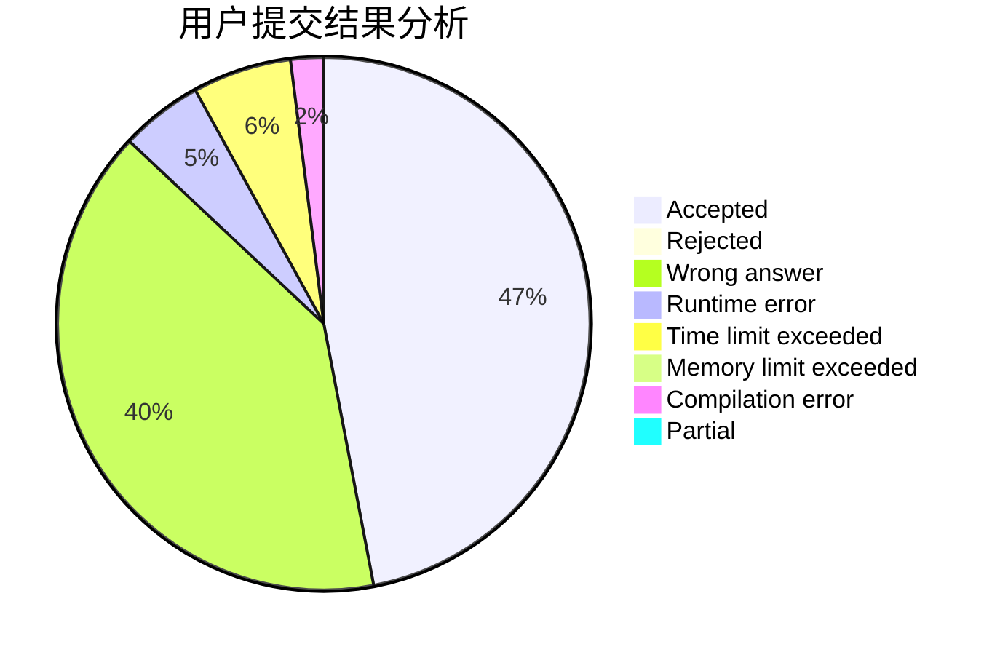
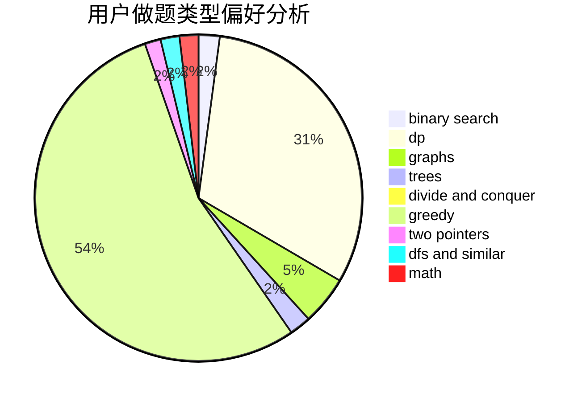

# MrMirotic

<!-- tabs:start -->

#### **用户提交结果分析**

#### **用户做题类型偏好分析**

<!-- tabs:end -->
# 推荐题目
[1504A](https://codeforces.com/contest/1504/problem/A)
[1070H](https://codeforces.com/contest/1070/problem/H)
[1303A](https://codeforces.com/contest/1303/problem/A)
[1311A](https://codeforces.com/contest/1311/problem/A)
[288E](https://codeforces.com/contest/288/problem/E)
[937A](https://codeforces.com/contest/937/problem/A)
[295A](https://codeforces.com/contest/295/problem/A)
[840D](https://codeforces.com/contest/840/problem/D)
[357B](https://codeforces.com/contest/357/problem/B)
[808F](https://codeforces.com/contest/808/problem/F)
