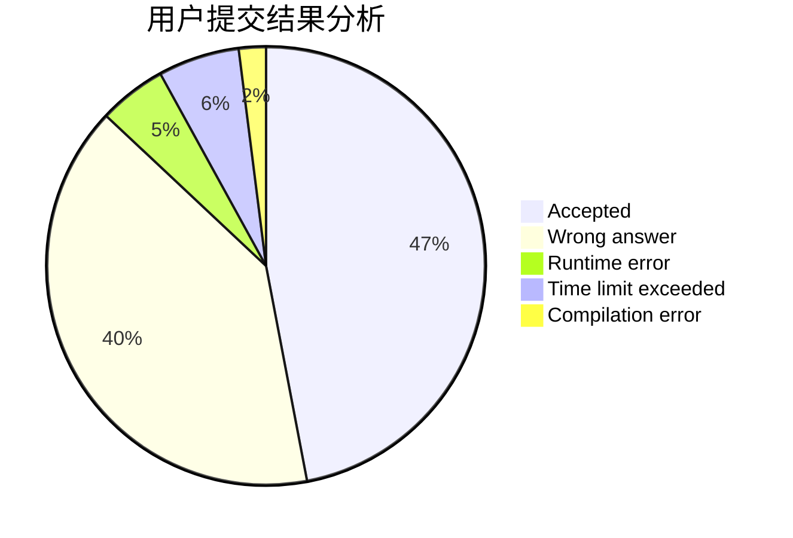
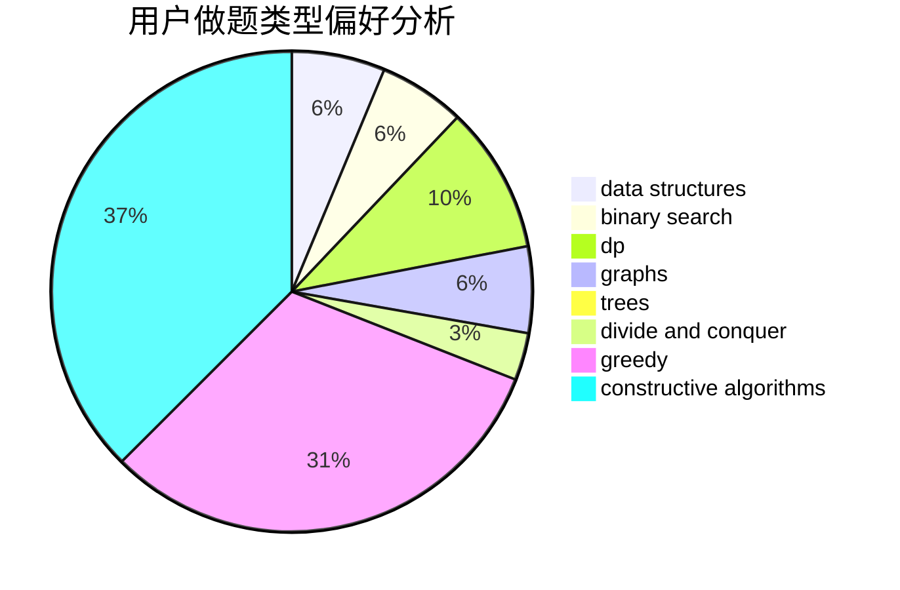

# MrMirotic
<!-- tabs:start -->
#### **用户提交结果分析**

#### **用户做题类型偏好分析**

#### **用户错题知识点分析**

<!-- tabs:end -->
# 推荐题目
[Time to Run](http://codeforces.com/problemset/problem/1301/D)		constructive algorithms,
                        graphs,
                        implementation		  
[Getting Deals Done](http://codeforces.com/problemset/problem/1070/E)		binary search,
                        data structures		  
[Evil](http://codeforces.com/problemset/problem/329/E)		math		  
[Tournament](http://codeforces.com/problemset/problem/27/B)		bitmasks,
                        brute force,
                        dfs and similar,
                        greedy		  
[Mister B and PR Shifts](https://codeforces.com/contest/820/problem/D)		data structures,
                        implementation,
                        math		  
[Two Regular Polygons](http://codeforces.com/problemset/problem/1312/A)		geometry,
                        greedy,
                        math,
                        number theory		  
[Letter](http://codeforces.com/problemset/problem/180/C)		dp		  
[Dima and Horses](http://codeforces.com/problemset/problem/272/E)		combinatorics,
                        constructive algorithms,
                        graphs		  
[Presents in Bankopolis](http://codeforces.com/problemset/problem/793/D)		dp,
                        graphs,
                        shortest paths		  
[Mass Change Queries](http://codeforces.com/problemset/problem/911/G)		data structures		  
<!-- tabs:start -->
#### **data structures**
[Getting Deals Done](http://codeforces.com/problemset/problem/1070/E)		binary search,
                        data structures		  
[Mister B and PR Shifts](https://codeforces.com/contest/820/problem/D)		data structures,
                        implementation,
                        math		  
[Mass Change Queries](http://codeforces.com/problemset/problem/911/G)		data structures		  
[Permutation Separation](http://codeforces.com/problemset/problem/1295/E)		data structures,
                        divide and conquer		  
[Alyona and a tree](http://codeforces.com/problemset/problem/739/B)		binary search,
                        data structures,
                        dfs and similar,
                        graphs,
                        trees		  
[Duff is Mad](http://codeforces.com/problemset/problem/587/F)		data structures,
                        strings		  
[Jamie and Tree](http://codeforces.com/problemset/problem/916/E)		data structures,
                        trees		  
[The Potion of Great Power](http://codeforces.com/problemset/problem/1403/A)		*special problem,
                        2-sat,
                        binary search,
                        data structures,
                        graphs,
                        interactive,
                        sortings,
                        two pointers		  
[Two Types of Spells](http://codeforces.com/problemset/problem/1398/E)		binary search,
                        data structures,
                        greedy,
                        implementation,
                        math,
                        sortings		  
[Tourists](http://codeforces.com/problemset/problem/487/E)		data structures,
                        dfs and similar,
                        graphs,
                        trees		  
#### **binary search**
[Getting Deals Done](http://codeforces.com/problemset/problem/1070/E)		binary search,
                        data structures		  
[Alyona and a tree](http://codeforces.com/problemset/problem/739/B)		binary search,
                        data structures,
                        dfs and similar,
                        graphs,
                        trees		  
[The Potion of Great Power](http://codeforces.com/problemset/problem/1403/A)		*special problem,
                        2-sat,
                        binary search,
                        data structures,
                        graphs,
                        interactive,
                        sortings,
                        two pointers		  
[Guessing the Greatest (hard version)](http://codeforces.com/problemset/problem/1486/C2)		binary search,
                        interactive		  
[Two Types of Spells](http://codeforces.com/problemset/problem/1398/E)		binary search,
                        data structures,
                        greedy,
                        implementation,
                        math,
                        sortings		  
[The hat](https://codeforces.com/contest/1020/problem/D)		binary search,
                        interactive		  
[Black, White and Grey Tree](http://codeforces.com/problemset/problem/1442/E)		binary search,
                        constructive algorithms,
                        dfs and similar,
                        dp,
                        greedy,
                        trees		  
[Maximum width](http://codeforces.com/problemset/problem/1492/C)		binary search,
                        data structures,
                        dp,
                        greedy,
                        two pointers		  
[Pairs](http://codeforces.com/problemset/problem/1463/D)		binary search,
                        constructive algorithms,
                        greedy,
                        two pointers		  
[Old Floppy Drive](http://codeforces.com/problemset/problem/1490/G)		binary search,
                        data structures,
                        math		  
#### **dp**
[Letter](http://codeforces.com/problemset/problem/180/C)		dp		  
[Presents in Bankopolis](http://codeforces.com/problemset/problem/793/D)		dp,
                        graphs,
                        shortest paths		  
[Birds](http://codeforces.com/problemset/problem/922/E)		dp		  
[Sonya and Problem Wihtout a Legend](http://codeforces.com/problemset/problem/713/C)		dp,
                        sortings		  
[Restaurant](http://codeforces.com/problemset/problem/597/B)		dp,
                        greedy,
                        sortings		  
[String Transformation 2](https://codeforces.com/contest/1384/problem/E)		bitmasks,
                        dp,
                        graphs,
                        trees		  
[Add One](http://codeforces.com/problemset/problem/1513/C)		dp,
                        matrices		  
[Yet Another Problem On a Subsequence](http://codeforces.com/problemset/problem/1000/D)		combinatorics,
                        dp		  
[Bicolorings](http://codeforces.com/problemset/problem/1051/D)		bitmasks,
                        dp		  
[Generate a String](http://codeforces.com/problemset/problem/710/E)		dfs and similar,
                        dp		  
#### **graph**
[Time to Run](http://codeforces.com/problemset/problem/1301/D)		constructive algorithms,
                        graphs,
                        implementation		  
[Dima and Horses](http://codeforces.com/problemset/problem/272/E)		combinatorics,
                        constructive algorithms,
                        graphs		  
[Presents in Bankopolis](http://codeforces.com/problemset/problem/793/D)		dp,
                        graphs,
                        shortest paths		  
[Alyona and a tree](http://codeforces.com/problemset/problem/739/B)		binary search,
                        data structures,
                        dfs and similar,
                        graphs,
                        trees		  
[Swiper, no swiping!](http://codeforces.com/problemset/problem/1239/F)		graphs,
                        implementation		  
[Bear and Forgotten Tree 3](http://codeforces.com/problemset/problem/639/B)		constructive algorithms,
                        graphs,
                        trees		  
[Sereja and the Arrangement of Numbers](http://codeforces.com/problemset/problem/367/C)		graphs,
                        greedy,
                        sortings		  
[Directing Edges](http://codeforces.com/problemset/problem/1385/E)		constructive algorithms,
                        dfs and similar,
                        graphs		  
[String Transformation 2](https://codeforces.com/contest/1384/problem/E)		bitmasks,
                        dp,
                        graphs,
                        trees		  
[The Potion of Great Power](http://codeforces.com/problemset/problem/1403/A)		*special problem,
                        2-sat,
                        binary search,
                        data structures,
                        graphs,
                        interactive,
                        sortings,
                        two pointers		  
#### **trees**
[Alyona and a tree](http://codeforces.com/problemset/problem/739/B)		binary search,
                        data structures,
                        dfs and similar,
                        graphs,
                        trees		  
[Bear and Forgotten Tree 3](http://codeforces.com/problemset/problem/639/B)		constructive algorithms,
                        graphs,
                        trees		  
[String Transformation 2](https://codeforces.com/contest/1384/problem/E)		bitmasks,
                        dp,
                        graphs,
                        trees		  
[Jamie and Tree](http://codeforces.com/problemset/problem/916/E)		data structures,
                        trees		  
[Ehab and Path-etic MEXs](http://codeforces.com/problemset/problem/1325/C)		constructive algorithms,
                        dfs and similar,
                        greedy,
                        trees		  
[Tourists](http://codeforces.com/problemset/problem/487/E)		data structures,
                        dfs and similar,
                        graphs,
                        trees		  
[Black, White and Grey Tree](http://codeforces.com/problemset/problem/1442/E)		binary search,
                        constructive algorithms,
                        dfs and similar,
                        dp,
                        greedy,
                        trees		  
[Policeman and a Tree](http://codeforces.com/problemset/problem/868/E)		dp,
                        graphs,
                        trees		  
[Odd Mineral Resource](http://codeforces.com/problemset/problem/1479/D)		binary search,
                        bitmasks,
                        brute force,
                        data structures,
                        probabilities,
                        trees		  
[Yet Another Card Deck](http://codeforces.com/problemset/problem/1511/C)		brute force,
                        data structures,
                        implementation,
                        trees		  
#### **divide and conquer**
[Permutation Separation](http://codeforces.com/problemset/problem/1295/E)		data structures,
                        divide and conquer		  
[Divide and Summarize](http://codeforces.com/problemset/problem/1461/D)		binary search,
                        brute force,
                        data structures,
                        divide and conquer,
                        implementation,
                        sortings		  
[Song of the Sirens](http://codeforces.com/problemset/problem/1466/G)		combinatorics,
                        divide and conquer,
                        hashing,
                        math,
                        string suffix structures,
                        strings		  
[Permutation Transformation](http://codeforces.com/problemset/problem/1490/D)		dfs and similar,
                        divide and conquer,
                        implementation		  
[Skyline Photo](https://codeforces.com/contest/1483/problem/C)		data structures,
                        divide and conquer,
                        dp		  
[Fib-tree](http://codeforces.com/problemset/problem/1491/E)		brute force,
                        dfs and similar,
                        divide and conquer,
                        number theory,
                        trees		  
[Sum of Prefix Sums](http://codeforces.com/problemset/problem/1303/G)		data structures,
                        divide and conquer,
                        geometry,
                        trees		  
[Dogeforces](http://codeforces.com/problemset/problem/1494/D)		constructive algorithms,
                        data structures,
                        dfs and similar,
                        divide and conquer,
                        dsu,
                        greedy,
                        sortings,
                        trees		  
[Logistical Questions](http://codeforces.com/problemset/problem/566/C)		dfs and similar,
                        divide and conquer,
                        trees		  
[Fruit Sequences](http://codeforces.com/problemset/problem/1428/F)		binary search,
                        data structures,
                        divide and conquer,
                        dp,
                        two pointers		  
#### **greedy**
[Tournament](http://codeforces.com/problemset/problem/27/B)		bitmasks,
                        brute force,
                        dfs and similar,
                        greedy		  
[Two Regular Polygons](http://codeforces.com/problemset/problem/1312/A)		geometry,
                        greedy,
                        math,
                        number theory		  
[Subway Innovation](http://codeforces.com/problemset/problem/371/E)		greedy,
                        math,
                        two pointers		  
[Sereja and the Arrangement of Numbers](http://codeforces.com/problemset/problem/367/C)		graphs,
                        greedy,
                        sortings		  
[Restaurant](http://codeforces.com/problemset/problem/597/B)		dp,
                        greedy,
                        sortings		  
[Change-free](http://codeforces.com/problemset/problem/767/E)		greedy		  
[Ehab and Path-etic MEXs](http://codeforces.com/problemset/problem/1325/C)		constructive algorithms,
                        dfs and similar,
                        greedy,
                        trees		  
[Paths and Trees](http://codeforces.com/problemset/problem/545/E)		graphs,
                        greedy,
                        shortest paths		  
[Diamond Miner](http://codeforces.com/problemset/problem/1495/A)		geometry,
                        greedy,
                        math,
                        sortings		  
[Letters Rearranging](http://codeforces.com/problemset/problem/1093/B)		constructive algorithms,
                        greedy,
                        sortings,
                        strings		  
#### **constructive algorithms**
[Time to Run](http://codeforces.com/problemset/problem/1301/D)		constructive algorithms,
                        graphs,
                        implementation		  
[Dima and Horses](http://codeforces.com/problemset/problem/272/E)		combinatorics,
                        constructive algorithms,
                        graphs		  
[Oranges and Apples](http://codeforces.com/problemset/problem/23/C)		constructive algorithms,
                        sortings		  
[Bear and Forgotten Tree 3](http://codeforces.com/problemset/problem/639/B)		constructive algorithms,
                        graphs,
                        trees		  
[Directing Edges](http://codeforces.com/problemset/problem/1385/E)		constructive algorithms,
                        dfs and similar,
                        graphs		  
[Ehab and Path-etic MEXs](http://codeforces.com/problemset/problem/1325/C)		constructive algorithms,
                        dfs and similar,
                        greedy,
                        trees		  
[Strange town](http://codeforces.com/problemset/problem/42/D)		constructive algorithms,
                        math		  
[Four Stones](http://codeforces.com/problemset/problem/1276/E)		constructive algorithms		  
[Letters Rearranging](http://codeforces.com/problemset/problem/1093/B)		constructive algorithms,
                        greedy,
                        sortings,
                        strings		  
[Bear and Prime 100](http://codeforces.com/problemset/problem/679/A)		constructive algorithms,
                        interactive,
                        math		  
#### **sortings**
[Oranges and Apples](http://codeforces.com/problemset/problem/23/C)		constructive algorithms,
                        sortings		  
[Sonya and Problem Wihtout a Legend](http://codeforces.com/problemset/problem/713/C)		dp,
                        sortings		  
[Sereja and the Arrangement of Numbers](http://codeforces.com/problemset/problem/367/C)		graphs,
                        greedy,
                        sortings		  
[Restaurant](http://codeforces.com/problemset/problem/597/B)		dp,
                        greedy,
                        sortings		  
[The Potion of Great Power](http://codeforces.com/problemset/problem/1403/A)		*special problem,
                        2-sat,
                        binary search,
                        data structures,
                        graphs,
                        interactive,
                        sortings,
                        two pointers		  
[MP3](http://codeforces.com/problemset/problem/1198/A)		sortings,
                        two pointers		  
[Diamond Miner](http://codeforces.com/problemset/problem/1495/A)		geometry,
                        greedy,
                        math,
                        sortings		  
[Letters Rearranging](http://codeforces.com/problemset/problem/1093/B)		constructive algorithms,
                        greedy,
                        sortings,
                        strings		  
[Two Types of Spells](http://codeforces.com/problemset/problem/1398/E)		binary search,
                        data structures,
                        greedy,
                        implementation,
                        math,
                        sortings		  
[Meximization](http://codeforces.com/problemset/problem/1497/A)		brute force,
                        data structures,
                        greedy,
                        sortings		  
<!-- tabs:end -->
