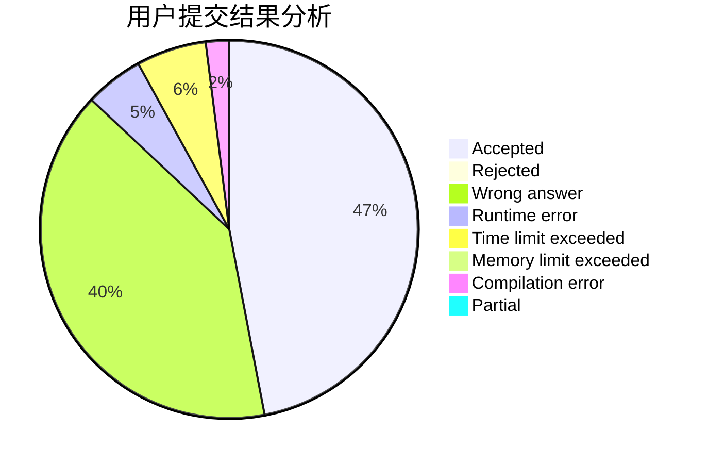
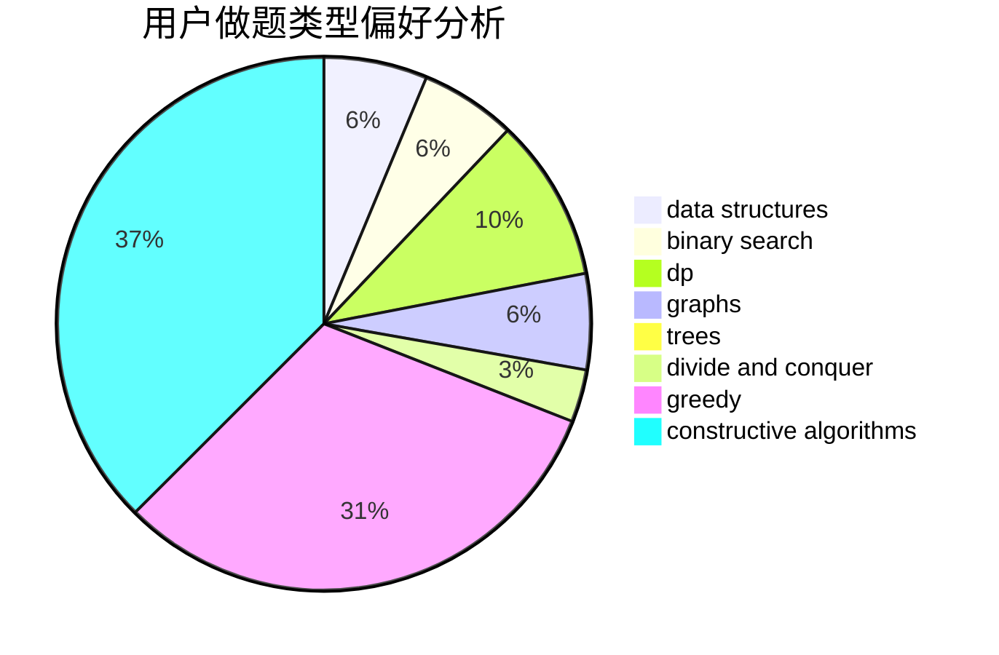

# MrMirotic

<!-- tabs:start -->

#### **用户提交结果分析**

#### **用户做题类型偏好分析**

#### **用户错题知识点分析**

<!-- tabs:end -->
# 推荐题目
[1495A](https://codeforces.com/contest/1495/problem/A)		geometry,
                        greedy,
                        math,
                        sortings		  
[1070E](https://codeforces.com/contest/1070/problem/E)		binary search,
                        data structures		  
[1295E](https://codeforces.com/contest/1295/problem/E)		data structures,
                        divide and conquer		  
[1301D](https://codeforces.com/contest/1301/problem/D)		constructive algorithms,
                        graphs,
                        implementation		  
[272E](https://codeforces.com/contest/272/problem/E)		combinatorics,
                        constructive algorithms,
                        graphs		  
[916E](https://codeforces.com/contest/916/problem/E)		data structures,
                        trees		  
[27B](https://codeforces.com/contest/27/problem/B)		bitmasks,
                        brute force,
                        dfs and similar,
                        greedy		  
[820D](https://codeforces.com/contest/820/problem/D)		dsu,graphs,sortings,trees		  
[329E](https://codeforces.com/contest/329/problem/E)		math		  
[793D](https://codeforces.com/contest/793/problem/D)		dp,
                        graphs,
                        shortest paths		  
